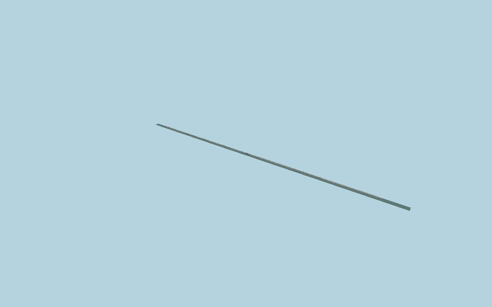

# Mahatma Gandhi Setu

Current twin steel through-truss decks, individually modeled I-section Warren diagonals with staggered chord nodes and inclined end posts, roof cross-bracing, gusset plates and bolt heads, retained concrete shafts and short modified heads, bearings, floor beams, outer walkways, railings, lights and shorter half-through end spans.

## Evidence

- [Primary reference](https://afcons.com/surface-transport/)
- [Primary reference](https://www.urbanmobilityindia.in/Upload/Conference/e8222e42-1693-4523-aef3-1e4347f64fd4.pdf#page=28)
- [Primary reference](https://www.cecr.in/construction-chemicals-materials-2/case-study-rehabilitation-of-mahatma-gandhi-setu)
- [Primary reference](https://afcons.com/wp-content/uploads/2026/01/Full-Afcons-Annual-Report-2023_0.pdf)
- [Primary reference](https://commons.wikimedia.org/wiki/File:GandhiSetuPatnaRevamped.png)
- [Primary reference](https://www.openstreetmap.org/way/28736579)
- [Primary reference](https://www.openstreetmap.org/way/44695500)

Published dimensions and reconstruction assumptions are separated in spec.json. Source photos were consulted; no photos or third-party geometry are embedded. Map plan attribution: © OpenStreetMap contributors, ODbL-1.0.

## Source

999896 triangles; 79157176 bytes; 4 material groups. SHA256: sha256:c747e96103381b1889a21f1f81cc018e55b11d44e0035d28812bafca939dbcb4.

Shared surfaces (concrete_plain, metal_painted) are loaded through the central library; any transparent materials use local PBR parameters. Axis and provisional vertical datum are in spec.json.

Regenerate with node packages/worldgen/scripts/generate-researched-bridges.mjs --ids=N0020; append --check to verify. Import and capture through the standard next-1000 scripts. Geometry validation does not substitute for current-frame visual review.

## Reconstruction limits

- This source models the2022 replacement steel crossing; the separate southern curved concrete approach and later parallel extradosed bridge are outside this asset.
- Riverbed and floodplain foundation levels, detailed panel count and member sizes require further review.
- Moving traffic, temporary construction rigs and maintenance scaffolds are excluded.
