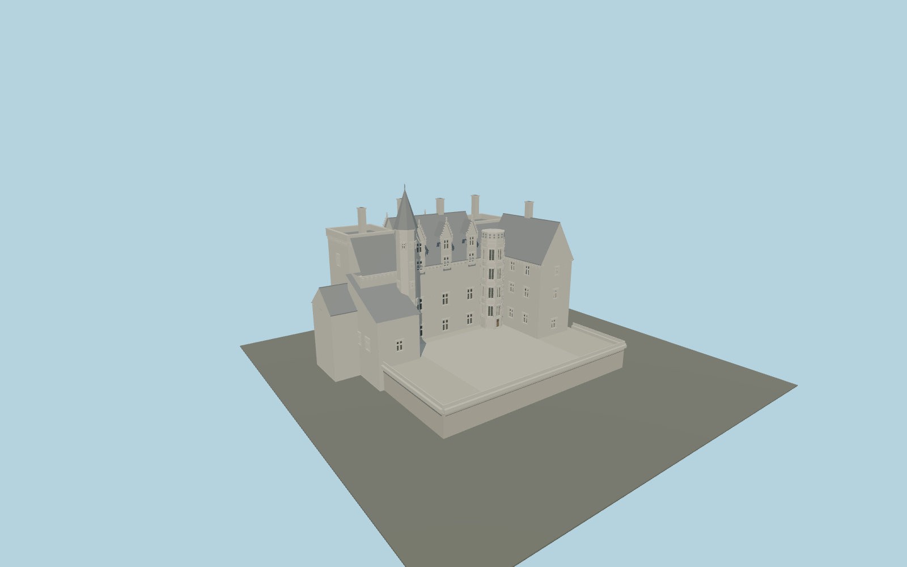

# Château de Montsoreau

Tuffeau Loire castle with river-facing square terrace towers, asymmetric return wings, four northern and three courtyard Gothic dormers, slate roofs, machicolations, western pointed stair roof and eastern Renaissance stair with slate-disc balustrade.

## Evidence and reconstruction

Published dimensions and reconstructed details are separated in spec.json. Primary references:

- [Reference](https://gertrude.paysdelaloire.fr/dossier/IA49009670)
- [Reference](https://www.chateau-montsoreau.com/wordpress/fr/100-chateau-100-contemporain/le-chateau/)
- [Reference](https://pop.culture.gouv.fr/notice/merimee/IA49009670)
- [Reference](https://www.openstreetmap.org/way/175416989)

No third-party geometry, photograph or bitmap texture is embedded. Shared surface graphs come from the central library; vertex tints carry model colors. Glazing uses PBR materials; transparent surfaces are declared per model.

## Model and axes

40,797 triangles; 80,655 vertices; 7 material groups; 3,397,240 bytes. Native bounds: -31.600, 0.000, -27.150 to 21.550, 38.400, 18.050. Source hash: `sha256:240687e26cd3d6e3a759349ef19141ddba00b69ab800da659c8723431dc23a5f`.

{"up":"+Y","longitudinal":"+X east along the signed cached precinct frame","front":"-Z toward the Loire; +Z toward the courtyard","origin":"Cached precinct rectangle center at provisional road/base datum"}

Preview only: correct castle identity and signed river/courtyard axis; real terrain and surveyed elevations remain pending.

## Reproduce

Run `node packages/worldgen/scripts/generate-signature-towers.mjs --ids=N0236` (or add `--check`). The generator preserves manually edited masters by checking their baseline hashes. Import through the standard authored-model workflow with optimization disabled; then capture all QA cameras, including shared-surface views.

## Pending work

- Maximum fidelity is pending: the Renaissance stair figurative panels, medallions, deer and putti are not sculpted; candelabra and Gothic crockets are reconstructed relief.
- No measured plan or section was inspected. The historical Salleron reference is an exterior view. Owner terrace height has an unresolved datum, so all vertical dimensions remain provisional.
- Roof junctions, occupied plan subdivisions, window positions and retaining-wall limits are estimates from exterior views inside an OSM precinct boundary. Physical terrain, moat, road and surrounding village are not part of this asset.
- Current square towers have flat terraces; historical pavilion roofs are deliberately not reconstructed. No interior rooms, movable shutters or engineering certification.
- Original geometry and shared limestone, raw limestone, slate, wood and painted-metal surfaces. Reference photographs are linked only; no copied images or per-model texture bitmaps.

This bundle contains source geometry, not a claim of maximum-fidelity completion. Hash-bound visual acceptance is recorded separately after capture inspection.
