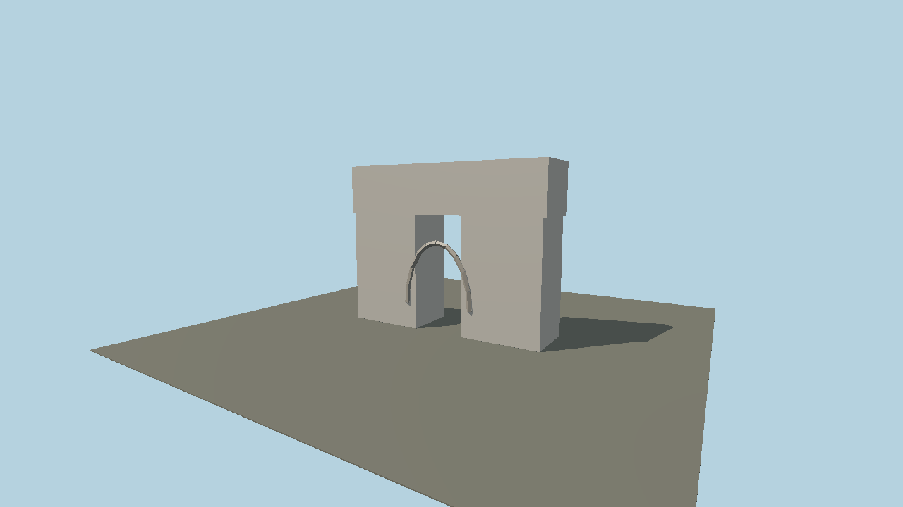

# Arc de Triomphe, Paris — B09 structure asset

Original stylized geometry generated from the [100-structure plan](../../../../../../../examples/world-explorer/STRUCTURE-EXPANSION-PLAN.md) by `packages/worldgen/scripts/generate-structure-catalog.mjs`. Visual brief: Monumental arched mass.

Provisional dimensions: 60 × 50 × 58 meters (X × Y × Z). These dimensions are artistic working values and require measured terrain/footprint alignment before geographic placement. +Y is up; the model is centered at ground or water datum. The runtime asset ID is `molen.worldgen.structure.b09_arc_de_triomphe_paris`.

Source: `spec.json`, `models/source.glb`; the imported runtime GLB and sidecar are under `content/worldgen/assets/places/u0/u09/b09_arc_de_triomphe_paris`. `source.json` pins the source hash. There are no third-party meshes, bitmap textures or texture-generation prompts. The preview is rendered by Molen from `scene.json`.

Rebuild and re-import from the repository root using `node packages/worldgen/scripts/generate-structure-catalog.mjs` and `node packages/worldgen/scripts/import-structure-catalog.mjs`. Verify with `node packages/worldgen/scripts/generate-structure-catalog.mjs --check`, `node scripts/check-source-bundles.mjs`, and `molen asset inspect molen.worldgen.structure.b09_arc_de_triomphe_paris --project content/worldgen/project.json --verify`.

Site anchor, exact facade detail, LOD and collision refinement remain to be completed before in-place Earth-viewer release.
