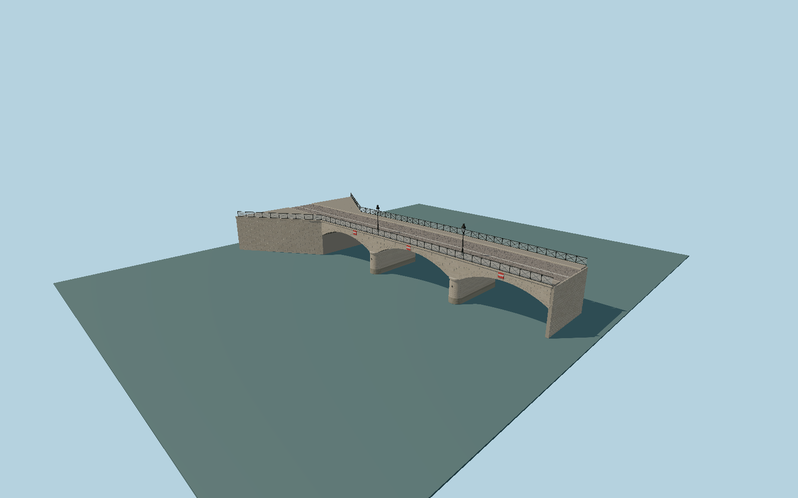

# Pont de l'Archeveche

Three shallow circular limestone vaults with radial ashlar and stone soffits, tapered rounded cutwaters and mooring rings, coursed flared mainland approach, crowned cobbled deck and stone curbs, post-2016 glazed crossed-iron parapets, mapped ornamental lanterns and direction-specific river signs.

## Evidence

- [Primary reference](https://books.google.com/books?id=fnI5AAAAcAAJ&pg=PA174)
- [Primary reference](https://books.google.com/books?id=fnI5AAAAcAAJ&pg=PA175)
- [Primary reference](https://www.afgc.asso.fr/history-heritage/pont-de-larcheveche-a-paris/)
- [Primary reference](https://www.paris.fr/pages/a-la-decouverte-des-ponts-parisiens-les-plus-romantiques-18806)
- [Primary reference](https://commons.wikimedia.org/wiki/File:Pont_Archev%C3%AAch%C3%A9_-_Paris_IV_(FR75)_-_2021-06-05_-_1.jpg)
- [Primary reference](https://commons.wikimedia.org/wiki/File:Pont_de_l%27Archev%C3%AAch%C3%A9,_Paris_June_2019.jpg)
- [Primary reference](https://www.openstreetmap.org/way/78329745)

Published dimensions and reconstruction assumptions are separated in spec.json. Source photos were consulted; no photos or third-party geometry are embedded. Map plan attribution: © OpenStreetMap contributors, ODbL-1.0.

## Source

436496 triangles; 36532656 bytes; 6 material groups. SHA256: sha256:bac45c0846ccf6d06e912e7a7efa7bdb0ec6b336be3c8d55f9bffb1579271b24.

Shared surfaces (stone_limestone_raw, metal_painted, stone_granite) are loaded through the central library; any transparent materials use local PBR parameters. Axis and provisional vertical datum are in spec.json.

Regenerate with node packages/worldgen/scripts/generate-researched-bridges.mjs --ids=N0019; append --check to verify. Import and capture through the standard next-1000 scripts. Geometry validation does not substitute for current-frame visual review.

## Reconstruction limits

- Current permanent bridge geometry; temporary street works and movable furnishings are omitted.
- Arch ring thickness, coursing and lantern member dimensions are original photo reconstruction, not a scan.
- The declared NGF-IGN69 origin and bank joins use independent IGN terrain and road evidence. Submerged foundation depth remains reconstructed; water elevation is not bathymetry.
- The separate public clock and island streetlight stand beyond this model footprint and are not duplicated within it.
