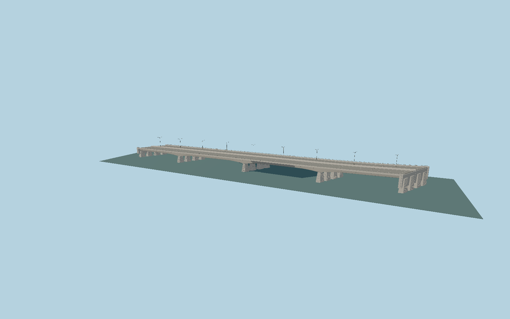

# Pont Aval

The Seine crossing of the western Paris périphérique: four unequal skew spans, paired carriageways carried by four separately haunched concrete box girders, ribbed independent piers, precast cornices and eight lanes.

## Evidence

- [Primary reference](https://www.afgc.asso.fr/?p=39706)
- [Primary reference](https://www.afgc.asso.fr/app/uploads/2023/06/HistoireAdminPontsParis_Prade-1982b.pdf)
- [Primary reference](https://www.paris.fr/pages/paris-et-ses-ponts-toute-une-histoire-7466)
- [Primary reference](https://commons.wikimedia.org/wiki/File:P1080253_Paris_XVI_pont_aval_rwk.JPG)
- [Primary reference](https://commons.wikimedia.org/wiki/File:P1080254_Paris_XVI_pont_aval_rwk.JPG)
- [Primary reference](https://www.openstreetmap.org/way/433835333)
- [Primary reference](https://data.geopf.fr/altimetrie/resources/ign_rge_alti_wld)
- [Primary reference](https://data.geopf.fr/annexes/ressources/documentation/DC_RGEALTI_2-0.pdf)
- [Primary reference](https://geoservices.ign.fr/sites/default/files/2021-11/DC_BDTOPO_3-0_1.pdf)

Published dimensions and reconstruction assumptions are separated in spec.json. Source photos were consulted; no photos or third-party geometry are embedded. Map plan attribution: © OpenStreetMap contributors, ODbL-1.0.

## Source

248848 triangles; 19727620 bytes; 6 material groups. SHA256: sha256:3da4f5a93971a2d32898f6a3fc877163b9ea273f2369b630e42b364a6926f022.

Shared surfaces (concrete_plain, stone_granite, metal_painted, metal_stainless) are loaded through the central library; any transparent materials use local PBR parameters. Axis and provisional vertical datum are in spec.json.

Regenerate with node packages/worldgen/scripts/generate-researched-bridges.mjs --ids=N0026; append --check to verify. Import and capture through the standard next-1000 scripts. Geometry validation does not substitute for current-frame visual review.

## Reconstruction limits

- The absolute placement is consistent with current IGN NGF-IGN69 terrain/water and BD TOPO3D road evidence. Hosts using a different height reference need a datum conversion; official road coordinates have2.5m stated altitude accuracy.
- The exterior reflects photographs and available aerial; changes to traffic markings or lamps since those images require current reference verification.
- The crossing ends at its abutments; adjacent elevated motorway ramps remain separate map-driven structures.
