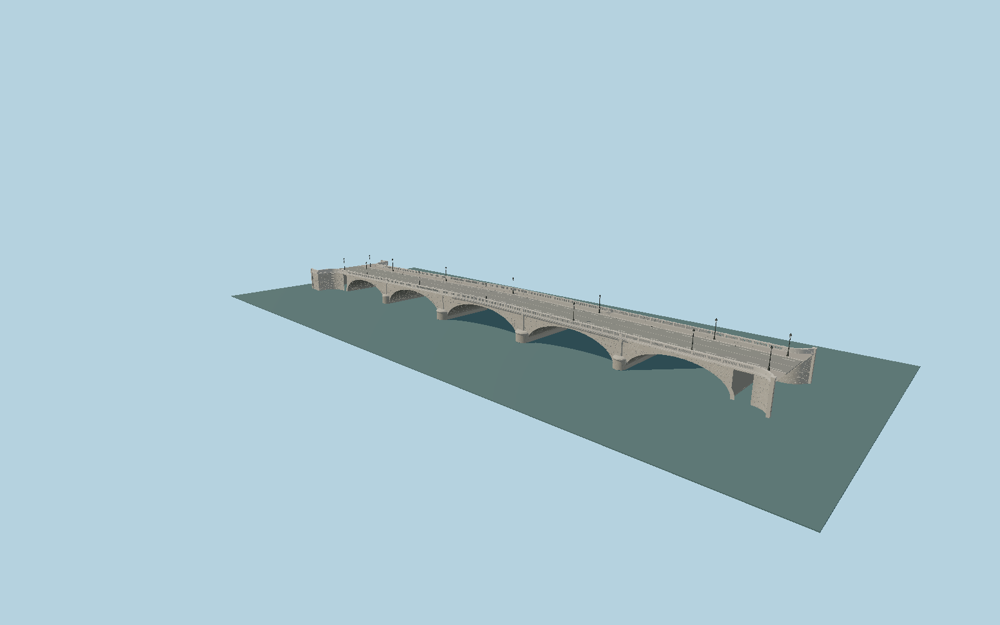

# Pont de Tolbiac

Five unequal limestone vaults, round cutwaters with low caps and narrow pilasters, ashlar spandrels, radial voussoirs and coursed soffits, dentil cornices and genuinely open capsule-slot stone balustrades.

## Evidence

- [Primary reference](https://www.afgc.asso.fr/history-heritage/pont-de-tolbiac-a-paris/)
- [Primary reference](https://www.afgc.asso.fr/app/uploads/2023/06/HistoireAdminPontsParis_Prade-1982b.pdf)
- [Primary reference](https://upload.wikimedia.org/wikipedia/commons/d/de/Grandes_vo%C3%BBtes_%28IA_grandesvoutes56sejo%29.pdf)
- [Primary reference](https://commons.wikimedia.org/wiki/File:Pont_Tolbiac_-_Paris_XII_(FR75)_-_2026-06-06_-_1.jpg)
- [Primary reference](https://commons.wikimedia.org/wiki/File:Paris_Pont_de_Tolbiac_bridge_railing_downstream_close_up.jpg)
- [Primary reference](https://www.openstreetmap.org/way/183626421)

Published dimensions and reconstruction assumptions are separated in spec.json. Source photos were consulted; no photographs or third-party architecture meshes are embedded. Memorial and name lettering uses the installed Gentilis typeface by J. Victor Gaultney and Annie Olsen, copyright SIL International2003–2008, under SIL Open Font License1.1. See FONT-LICENSE.txt. No per-model bitmap lettering texture is loaded. Map plan attribution: © OpenStreetMap contributors, ODbL-1.0.

## Source

795350 triangles; 70423420 bytes; 7 material groups. SHA256: sha256:8f43406598941c2e31ba98195cd7417ae886a3eb6a554b3c5a1bbff4b7bf1d0b.

Shared surfaces (stone_limestone_raw, stone_limestone_weathered, metal_painted, metal_bronze_cast) are loaded through the central library; any transparent materials use local PBR parameters. Axis and provisional vertical datum are in spec.json.

Regenerate with node packages/worldgen/scripts/generate-researched-bridges.mjs --ids=N0028; append --check to verify. Import and capture through the standard next-1000 scripts. Geometry validation does not substitute for current-frame visual review.

## Reconstruction limits

- Nominal168m length conflicts with the mapped pier spacing and published clear spans; retain both rather than hiding the discrepancy.
- Quay stairways outside the recorded bridge footprint are not part of this asset. Exact current street-sign positions and memorial panel dimensions are reconstructed from photographs, not surveyed.
- Current terrain-fit captures must approve the IGN-supported vertical placement; river surface height varies.
