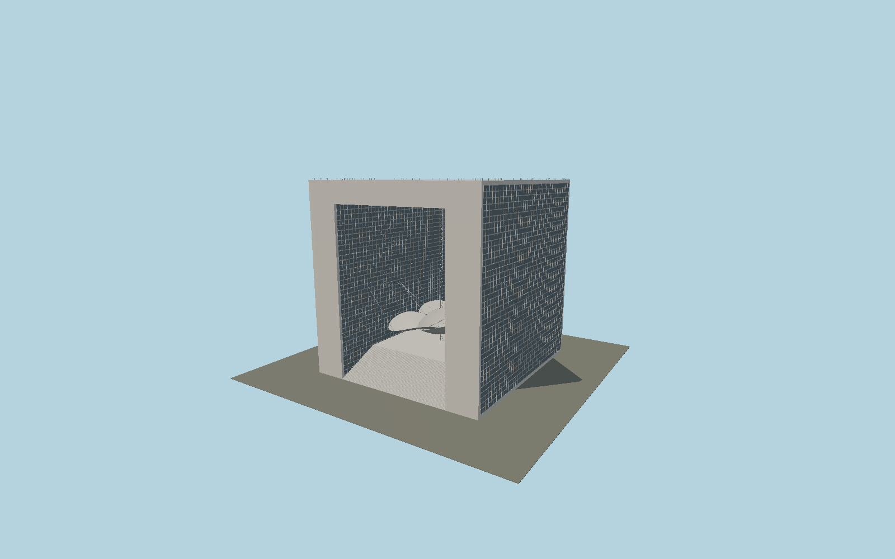

# Grande Arche

A real open monumental granite cube with office glazing on both piers, jointed white stone end frames, raised terrace and broad stair, four external glass elevators and a suspended three-lobed fabric cloud.

## Evidence and reconstruction

Published dimensions and reconstructed details are separated in spec.json. Primary references:

- [Reference](https://pop.culture.gouv.fr/notice/merimee/ACR0000683)
- [Reference](https://www.parisladefense.com/en/district/towers-buildings/grande-arche)

No third-party geometry, photograph or bitmap texture is embedded. Shared surface graphs come from the central library; vertex tints carry model colors. Glass is an opaque PBR approximation.

## Model and axes

371,160 triangles; 811,536 vertices; 4 material groups; 32,860,496 bytes. Native bounds: -53.570, 0.000, -56.025 to 53.570, 111.728, 56.025. Source hash: `sha256:012f2c50532cb77006680045fad39ba9b4dd24804d595b376b738fefd82c84e9`.

{"up":"+Y","longitudinal":"+Z along the published 112 m depth","front":"+Z toward the southeast historic axis","origin":"Ground-level center of exact-QID mapped footprint frame"}

The geographic proposal uses exact-QID OpenStreetMap evidence. Map-derived orientation and estimated architectural details require real-site visual review; preview eligibility is distinct from geographic/fidelity approval. Map attribution: © OpenStreetMap contributors, ODbL-1.0.

## Reproduce

Run `node packages/worldgen/scripts/generate-signature-towers.mjs --ids=N0147` (or add `--check`). The generator preserves manually edited masters by checking their baseline hashes. Import through the standard authored-model workflow with optimization disabled; then capture all QA cameras, including shared-surface views.

## Pending work

- Exterior geometry uses published overall dimensions and map evidence; panel subdivision, connection dimensions and local entrance details are reconstructed. Glazing uses opaque PBR with explicit geometry; no copied facade photograph is embedded.
- Cloud membrane shape, opening dimensions, stair count and elevator car elevations are exterior approximations. The internal mural is not reproduced.

This bundle contains source geometry, not a claim of maximum-fidelity completion. Hash-bound visual acceptance is recorded separately after capture inspection.
