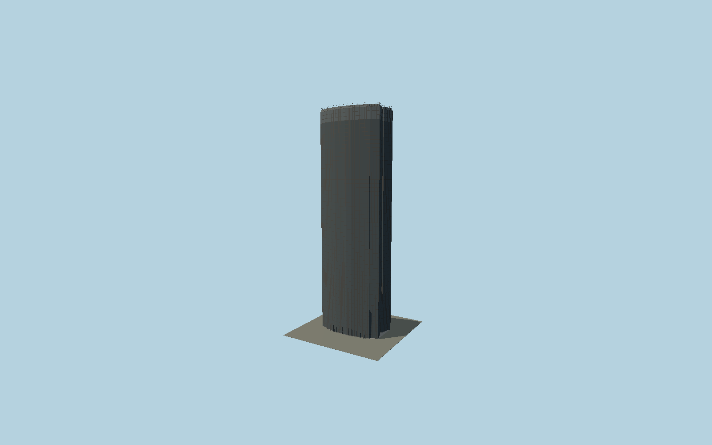

# Montparnasse Tower

The pre-renovation dark Montparnasse silhouette follows its mapped bowed long facades and recessed ends, with 59-storey facade bands, closely spaced dark mullions, observation glazing, rooftop parapets, railings and service enclosure.

## Evidence and reconstruction

Published dimensions and reconstructed details are separated in spec.json. Primary references:

- [Reference](https://www.tourmontparnasse56.com/fr/la-tour-montparnasse-en-chiffres/)
- [Reference](https://www.paris.fr/pages/la-tour-montparnasse-fete-ses-50-ans-24034)

No third-party geometry, photograph or bitmap texture is embedded. Shared surface graphs come from the central library; vertex tints carry model colors. Glazing uses PBR materials; transparent surfaces are declared per model.

## Model and axes

89,632 triangles; 265,992 vertices; 3 material groups; 10,653,672 bytes. Native bounds: -30.955, 0.000, -19.579 to 30.955, 210.027, 19.579. Source hash: `sha256:79fafbad74c3fca55d148fd5a97314d90027cfb9c14ce5e3ee99cbaa29c059d2`.

{"up":"+Y","longitudinal":"+X along the mapped building long axis","front":"+Z","origin":"Ground-level center of exact-QID mapped footprint frame"}

The geographic proposal uses exact-QID OpenStreetMap evidence. Map-derived orientation and estimated architectural details require real-site visual review; preview eligibility is distinct from geographic/fidelity approval. Map attribution: © OpenStreetMap contributors, ODbL-1.0.

## Reproduce

Run `node packages/worldgen/scripts/generate-signature-towers.mjs --ids=N0151` (or add `--check`). The generator preserves manually edited masters by checking their baseline hashes. Import through the standard authored-model workflow with optimization disabled; then capture all QA cameras, including shared-surface views.

## Pending work

- Exterior geometry uses published overall dimensions and map evidence; panel subdivision, connection dimensions and local entrance details are reconstructed. Glazing uses opaque PBR with explicit geometry; no copied facade photograph is embedded.
- The source intentionally records the established dark exterior, not the planned future renovation. Roof equipment and observation terrace fittings are simplified from their visible envelope.

This bundle contains source geometry, not a claim of maximum-fidelity completion. Hash-bound visual acceptance is recorded separately after capture inspection.
