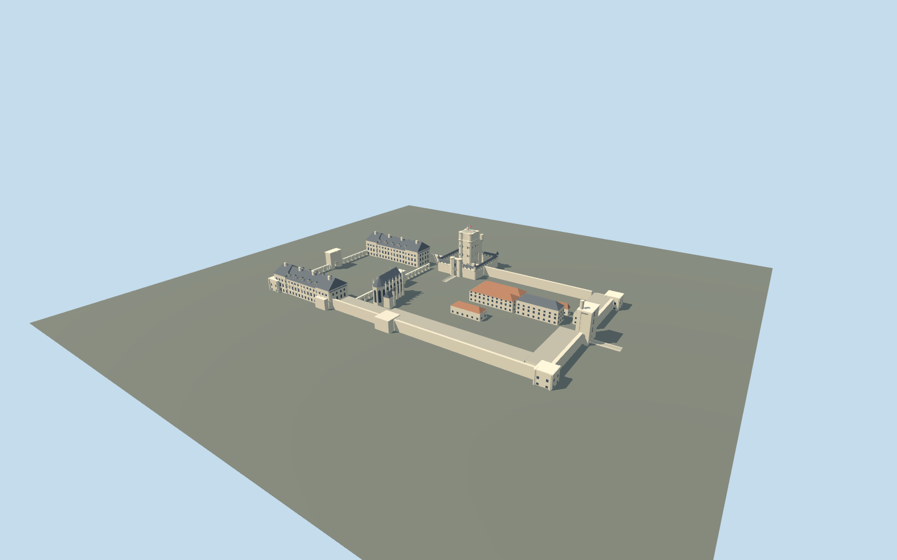

# Château de Vincennes

Present-day Vincennes compound: round-cornered tall keep and covered chemise, Gothic Sainte-Chapelle, Tour du Village, reduced enceinte towers, paired royal pavilions and open courts.

## Evidence and reconstruction

Published dimensions and reconstructed details are separated in spec.json. Primary references:

- [Reference](https://www.chateau-de-vincennes.fr/en/discover/una-fortaleza-real)
- [Reference](https://www.chateau-de-vincennes.fr/enseignants/mediatheque-espace-enseignant/fiche-de-visite)
- [Reference](https://www.chateau-de-vincennes.fr/en/discover/history-of-the-chateau-de-vincennes)
- [Reference](https://www.openstreetmap.org/way/23032971)
- [Reference](https://www.data.gouv.fr/datasets/bd-topo-r)

No third-party geometry, photograph or bitmap texture is embedded. Shared surface graphs come from the central library; vertex tints carry model colors. Glazing uses PBR materials; transparent surfaces are declared per model.

## Model and axes

12,218 triangles; 29,894 vertices; 5 material groups; 1,225,900 bytes. Native bounds: -175.300, -6.000, -105.970 to 202.000, 59.000, 114.000. Source hash: `sha256:592f1d5e9c9b8943b3abe4f766ad797cff9cb5a18a0edc4d259167bd114b894f`.

{"up":"+Y","longitudinal":"+X north toward Tour du Village","front":"+Z east across the main court","origin":"OSM compound center; court Y=0, moat wall bases Y=-6m"}

The outer OSM polygon includes the grounds and moat. IGN components locate the keep, chapel, gate and pavilions separately. Court Y=0 and moat walls -6m require real-site terrain review. No full-footprint replacement while inactive.

## Reproduce

Run `node packages/worldgen/scripts/generate-signature-towers.mjs --ids=N0265` (or add `--check`). The generator preserves manually edited masters by checking their baseline hashes. Import through the standard authored-model workflow with optimization disabled; then capture all QA cameras, including shared-surface views.

## Pending work

- IGN aggregate shapes require reconstructed partitions and roof heights; individual windows, porticoes and turrets are simplified.
- Exterior-only reconstruction; glass is opaque PBR and no public interiors are implied.
- Moat depth, real terrain seating, camera-motion shimmer and physical-device performance remain unmeasured.

This bundle follows the medium-fi standard. Medium-fi appearance and geographic fit are reviewed separately. Hash-bound visual acceptance is recorded separately after capture inspection.

## Additional geographic data

© OpenStreetMap contributors, ODbL-1.0; © IGN BD TOPO, Licence Ouverte 2.0, retrieved 2026-10-07. Official CMN references are linked evidence only.
