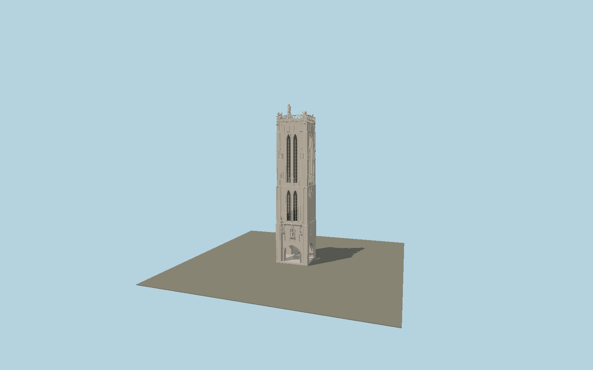

# Saint-Jacques Tower

Flamboyant Gothic Paris bell tower with long paired lancets, dense carved tracery, stepped corner buttresses, nineteen facade saints, open parapet, gargoyles, four evangelist symbols and the raised northwest pilgrim statue.

## Identity and geometry

Catalog N0569, [Q1431547](https://www.wikidata.org/wiki/Q1431547). City of Paris terrace elevation and facade statue dimensions establish vertical scale; the exact OSM footprint constrains plan. Primary exterior photographs determine the two long lancet stages, carved blind tracery and stepped corner buttresses. The raised statue and pedestal extend above the 54 m terrace.

Exact mapped tower centroid, pavement contact Y=0. +Z is the south facade; the elevated Saint James occupies the northwest (−X,−Z) corner; +Y is up. The geographic proposal identifies its anchor and orientation evidence separately from remaining terrain and azimuth uncertainty.

Source facts and measured references are recorded in spec.json. References: [1](https://www.paris.fr/pages/sept-choses-a-savoir-sur-la-tour-saint-jacques-23432), [2](https://parisjetaime.com/culture/tour-saint-jacques-p993), [3](https://www.openstreetmap.org/way/20326709). Reference pages and images are not redistributed.

## Original source and shared materials

Geometry is authored in `packages/worldgen/scripts/gothic-heritage-tower-models.mjs`. Shared material graphs with metric repeat UV0 and original vertex tints; GLB PBR fallback remains self-contained. No per-model texture duplication. No third-party mesh or photograph is embedded.

162,896 triangles; 334,508 vertices; 5 material groups; 14,000,204 source bytes. Source hash: `sha256:26de985b9b96b4c8de839e7be4e8445103ae01b2e395bc93f39f25c6f11a9426`. Geometry validation checks finite Float32 coordinates, indices, triangle area and winding before export.

Regenerate with `node packages/worldgen/scripts/generate-heritage-towers.mjs N0569`; add `--check` for reproducibility. The generator refuses to overwrite a master whose hash differs from source.json. Import uses `--no-optimize` to preserve facade recesses.

## Remaining detail and review

- Facade saints, animals and relief tracery are original polygonal sculptures preserving their architectural positions and silhouettes; they are not casts of individual artworks.
- The 54 m terrace is published; minor crown pedestal elevations are scaled from city photographs. Temporary closure and scaffolding are omitted from the permanent exterior.
- Near/far visual QA, shared-material inspection and maximum-fidelity approval remain pending.

Named near/far cameras are included for lit visual review. A valid export is not maximum-fidelity certification.
