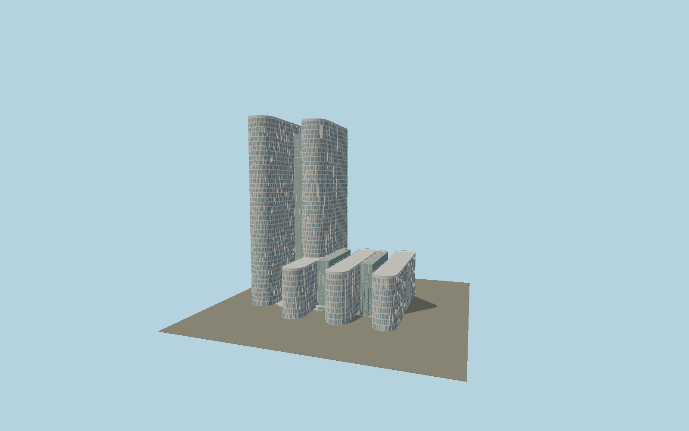

# Cœur Défense

The staggered pair of rounded 161 m office blades, shared lift link, three lower round-ended blocks, glazed public atrium, white floor bands, varied sun blinds, roof screens and entrance canopy.

## Identity and geometry

Catalog N0573, [Q2349903](https://www.wikidata.org/wiki/Q2349903). Structural engineer Terrell gives two 41-storey 161 m towers and three nine-storey blocks. The district planning authority supplies current exterior photos and the 40 m low-block height. The architectural study describes 23×80 m parallel staggered blades and a 44 m atrium. Exact tower-part polygons provide the two actual rounded plans and positions.

Exact-QID ground-platform center; the two individually mapped tower outlines keep their measured offsets. +Z is the three rounded low-building ends on the esplanade; twin towers occupy the northwest side; +Y is up. The geographic proposal identifies its anchor and orientation evidence separately from remaining terrain and azimuth uncertainty.

Source facts and measured references are recorded in spec.json. References: [1](https://www.terrellgroup.net/en/immeuble-coeur-defense/), [2](https://www.parisladefense.com/fr/territoire/tours-batiments/coeur-defense), [3](https://resp.editionsparentheses.com/IMG/pdf/P263_DEFENSE_VOL1_EXTRAITS.pdf), [4](https://www.openstreetmap.org/relation/3071676), [5](https://www.openstreetmap.org/way/1158726203), [6](https://www.openstreetmap.org/way/1158726204). Reference pages and images are not redistributed.

## Original source and shared materials

Geometry is authored in `packages/worldgen/scripts/next-heritage-tower-more-models.mjs`. Shared material graphs with metric repeat UV0 and original vertex tints; GLB PBR fallback remains self-contained. No per-model texture duplication. No third-party mesh or photograph is embedded.

319,436 triangles; 640,608 vertices; 3 material groups; 26,256,864 source bytes. Source hash: `sha256:bf1b1cd08df3523a05830242669ab4254502b0f594ffe197d6d38756c216a60a`. Geometry validation checks finite Float32 coordinates, indices, triangle area and winding before export.

Regenerate with `node packages/worldgen/scripts/generate-heritage-towers.mjs N0573`; add `--check` for reproducibility. The generator refuses to overwrite a master whose hash differs from source.json. Import uses `--no-optimize` to preserve facade recesses.

## Remaining detail and review

- Facade blinds use a deterministic distribution informed by current photographs; their moment-to-moment open/closed positions are not fixed architectural facts. Small roof equipment and the atrium roof trusses are reconstructed at exterior viewing scale.
- Glazing is original tinted PBR geometry; reusable painted-metal and concrete surfaces supply structural texture without per-model images. Interior offices are not part of this exterior asset.
- Near/far visual QA, shared-material inspection and maximum-fidelity approval remain pending.

Named near/far cameras are included for lit visual review. A valid export is not maximum-fidelity certification.
