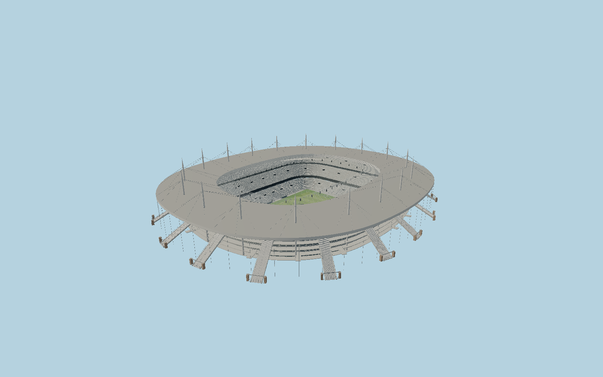

# Stade de France — N0685

French national stadium with the true rounded elliptical suspended disc roof, eighteen mapped slender pointed masts and cable fans, concentric underside joints, transparent inner halo, eighteen monumental external stairs, intermediate access bridges, glazed concourses, three pale blue-gray seating tiers, opposite giant screens and the actual sunken football pitch.

## Identity and evidence

Exact catalog identity **Q13205**. Source facts: `{"basis":"The current operator describes18masts61m high,18 monumental stairs and three-tier modular seating. The French Ministry heritage survey directly records1.6m mast diameter, three-tier capacities and pitch11m below natural ground; its42m roof-over-pitch datum yields a31m soffit. The6ha metal roof, glass inner halo and photographed concentric underside are modeled independently. Exact OSM pitch, metal/glass polygons and18mapped mast centers determine plan. Stairs, seat rows, gates and concourse intervals are proportioned from architect and heritage photographs."}`. The source specification keeps published dimensions separate from reconstructed details.

- https://www.stadefrance.com/en/stadium/our-history
- https://pop.culture.gouv.fr/notice/merimee/ACR0001671
- https://www.scau.com/fr/project/stade-de-france
- https://www.openstreetmap.org/way/64003104
- https://www.openstreetmap.org/way/23608423

Primary photographs and plans inform original mesh geometry only. No reference pixels or downloaded model are embedded. OpenStreetMap derived geometry is attributed to contributors, ODbL1.0.

## Authored geometry and materials

911,098 triangles, 1,759,684 vertices, 8 surface groups; 74,286,180 source bytes. SHA-256: `sha256:72003d9d3176ca15e7b5e85f225956d4c4d7c9db3ad3a2f487eb160fb1928ced`. Actual bounds: -147.920, -11.020, -171.567 to 148.865, 61.000, 168.835 m.

Shared canonical material graphs with metric UV repeats in extras.molenSurface; portable glTF PBR factors and vertex colors remain. Dark recesses/lantern panels retain local fallback materials. Shared references: `matgraph:molen.worldgen.material.brick` (1.92 × 0.9 m), `matgraph:molen.worldgen.material.metal_standing_seam` (2.5 × 3 m), `matgraph:molen.worldgen.material.metal_painted` (2 × 2 m), `matgraph:molen.worldgen.material.concrete_plain` (2 × 2 m). Model-native axes: {"up":"+Y","front":"+Z","origin":"Mapped pitch center; nativeY0 is natural forecourt and the field liesY-11. Native+Z follows the mapped south-southeast goal axis."}.

## Placement proposal

Exact mapped pitch center and long axis control+Z south-southeast; eighteen mapped mast centers and separately mapped metal/glass roof loops establish north/south exterior placement. The architect site plan corroborates the axis. Terrain contact uses the published relative forecourt/pitch datum, not a geodetic survey. Proposed anchor 2.360129925, 48.924457475 (longitude, latitude), heading 0.18712760259944397 radians. Elevation policy: **terrain-contact**. See qa.json for the geographic review status and scope; this placement proposal does not claim surveyed site accuracy. Native ground and pitch datums follow the individual geographic proposal; depressed bowls require their declared terrain cutout.

## Limitations and review

- Static football configuration: lower retractable tier covers the track; event seating motion and changing advertisements are not modeled. The published61m mast dimension and1.6m shaft diameter are preserved; taper and connection rings are photo reconstructions. Roof top at35m and soffit31m reconcile published46m/42m roof-to-pitch descriptions; detailed metal fabrication and exact spectator inventory are not claimed. Stairs, gates and concourse bay sizes follow references but are not shop drawings. Current pale seating is modeled without transient event color overlays.

Portable capture is intentionally ground-free to inspect the sunken field. Geographic shared review must exercise the declared terrain cutout and restoration.

Near/far fixtures are in `spec.qaCameras`. Float32 finite geometry, triangle degeneracy and winding are checked by the generator. The hash-bound qa.json and capture reports record the scope and status of rendering, shared-material, exterior-fidelity and geographic reviews.

Regenerate with `node packages/worldgen/scripts/generate-stadium-models.mjs --ids=N0685`; add `--check` for reproducibility. Editable component recipes are registered by the imports and study list in `packages/worldgen/scripts/generate-stadium-models.mjs`. The generator protects artist-edited master hashes and preserves import/capture/shared-capture/QA documents.
