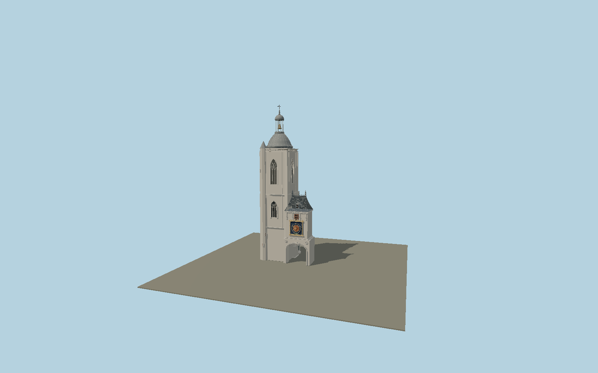

# Gros-Horloge

Rouen’s complete landmark ensemble: a true lowered street arch with carved pastoral soffit and arms of Rouen; two raised Renaissance dials with Roman numerals, 24 sun rays, single lamb-tipped hour hands, lunar globes and weekday reliefs; metal-panel pavilion roof with dormers and ornate crest; adjoining buttressed Gothic belfry, tracery windows, ribbed dome and open bell lantern; original loggia/workshop and Rococo fountain.

## Identity and geometry

Catalog N0612, [Q3116957](https://www.wikidata.org/wiki/Q3116957). The state museum’s physical arch cast records 7.44 m width, 4.61 m depth and approximately 6.70 m height. The clock-conservation study records 2.50 m dials and 0.30 m lunar spheres. Rouen magazine 536 (March 2024) places the restored dome timber support at 31 m; the lantern/finial is proportionally reconstructed to approximately 43 m from primary exterior photographs and the municipal cutaway. The 76 m figure in the educational booklet is inconsistent with this primary restoration datum and is not used. OSM exact-identity footprints fix the pavilion and adjoining belfry in the street; the original BnF multi-level survey separates the arch, belfry, loggia, rear stair turret and fountain. Intermediate facade levels and ornament are reconstructed proportions, not a survey.

Center of the exact mapped clock-pavilion footprint, Y=0 at the public street. Native +Z east-southeast along the street toward the cathedral; +X north-northeast across the pavilion; +Y is up. The geographic proposal identifies its anchor and orientation evidence separately from remaining terrain and azimuth uncertainty.

Source facts and measured references are recorded in spec.json. References: [1](https://rouen.fr/gros-horloge), [2](https://rouen.fr/sites/default/files/legacy/rm536_0.pdf), [3](https://rouen.fr/sites/default/files/cm/2024-12-19/22-8ann.pdf), [4](https://www.citedelarchitecture.fr/fr/oeuvre/arche-du-pavillon-dit-du-gros-horloge), [5](https://gallica.bnf.fr/ark:/12148/btv1b10050434r), [6](https://pop.culture.gouv.fr/notice/merimee/IA00021886), [7](https://www.patrimoine-horloge.fr/as-rouen.html), [8](https://www.openstreetmap.org/way/63205872), [9](https://www.openstreetmap.org/way/63206189). Reference pages and images are not redistributed.

## Original source and shared materials

Geometry is authored in `packages/worldgen/scripts/gros-horloge-model.mjs`. Shared material graphs with metric repeat UV0 and original vertex tints; GLB PBR fallback remains self-contained. No per-model texture duplication. No third-party mesh or photograph is embedded.

353,490 triangles; 714,650 vertices; 7 material groups; 29,973,376 source bytes. Source hash: `sha256:bfaf997a5c72b99f75a4de96ec09955e43981fe10d0f39b70f979244548bbafc`. Geometry validation checks finite Float32 coordinates, indices, triangle area and winding before export.

Regenerate with `node packages/worldgen/scripts/generate-heritage-towers.mjs N0612`; add `--check` for reproducibility. The generator refuses to overwrite a master whose hash differs from source.json. Import uses `--no-optimize` to preserve facade recesses.

## Remaining detail and review

- The architecture is a detailed original polygonal reconstruction. Carved angels, lambs, pastoral figures and the fountain group preserve placement and silhouette without claiming exact restoration-grade sculpture; no invented inscription text is added.
- The two clock faces are static at ten o’clock. Lunar hemispheres and the weekday cart are illustrative exterior states, not a live astronomical clock simulation.
- The 31 m dome-support datum is primary; approximately 43 m finial height and intermediate levels are proportional reconstruction. The adjacent historic town hall/apartment blocks are separate buildings and are intentionally excluded.
- Near/far visual QA, shared-material inspection and maximum-fidelity approval remain pending.

Named near/far cameras are included for lit visual review. A valid export is not maximum-fidelity certification.
