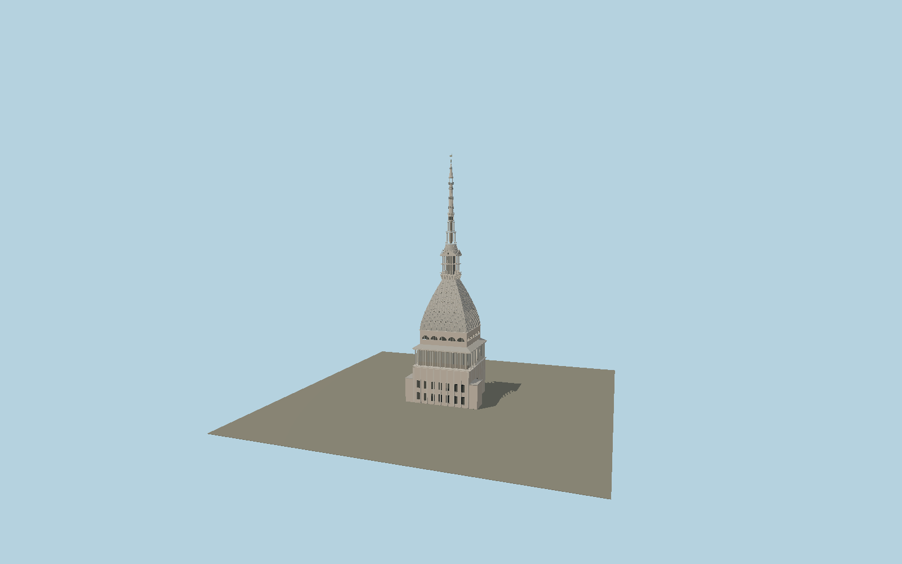

# Mole Antonelliana

Turin’s immense pavilion cupola with parallel granite ribs and roof lights, lower colonnade and temple portico, measured double-order tempietto, concentric circular galleries, tapering octagonal spire and the present star.

## Identity and geometry

Catalog N0565, [Q201902](https://www.wikidata.org/wiki/Q201902). City present height; museum terrace and cupola route; 1890 contemporary engineering dimensions and plate constrain the upper architecture. The former terminal statue is replaced with the modern star visible in museum photographs. OSM controls the asymmetric lower plan.

OSM footprint rectangle center at nominal exterior ground; main cupola centered on the tower axis. −Z is the projecting entrance portico / Via Montebello side; +Z has the broad rear wings; +Y is up. The geographic proposal identifies its anchor and orientation evidence separately from remaining terrain and azimuth uncertainty.

Source facts and measured references are recorded in spec.json. References: [1](https://www.comune.torino.it/vivere-comune/luoghi/mole-antonelliana), [2](https://www.museocinema.it/en/mole-antonelliana), [3](https://digit.biblio.polito.it/4554/1/01_ING.CIV.%20ART_IND_1890_GEN.pdf), [4](https://www.openstreetmap.org/way/83111423). Reference pages and images are not redistributed.

## Original source and shared materials

Geometry is authored in `packages/worldgen/scripts/next-heritage-tower-models.mjs`. Shared material graphs with metric repeat UV0 and original vertex tints; GLB PBR fallback remains self-contained. No per-model texture duplication. No third-party mesh or photograph is embedded.

253,101 triangles; 499,127 vertices; 4 material groups; 20,509,432 source bytes. Source hash: `sha256:ffd3b110bfa28d1aa41c1bdaa890d6ddfdb781cf8b025e7cdcba398622017f01`. Geometry validation checks finite Float32 coordinates, indices, triangle area and winding before export.

Regenerate with `node packages/worldgen/scripts/generate-heritage-towers.mjs N0565`; add `--check` for reproducibility. The generator refuses to overwrite a master whose hash differs from source.json. Import uses `--no-optimize` to preserve facade recesses.

## Remaining detail and review

- Lower facade floor heights and exact glazing subdivisions are fitted to museum exterior photography. The measured upper structure is reconstructed with simplified capitals and scroll brackets.
- Roof ribs and 18 circular roof lights per side follow the contemporary engineering account; irregular restoration patches and individual iron fittings are simplified.
- The nineteenth-century plate supplies structural dimensions but the present star and modern glazing follow museum photographs. Tiny carved figures and allegorical pediment sculpture are represented only by their architectural surrounds.
- Near/far visual QA, shared-material inspection and maximum-fidelity approval remain pending.

Named near/far cameras are included for lit visual review. A valid export is not maximum-fidelity certification.
