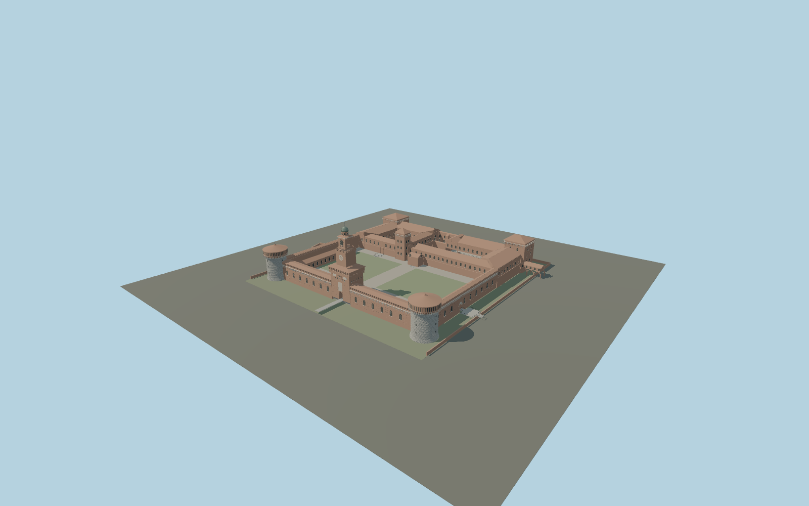

# Sforza Castle

Mapped Milan castle compound: Filarete clock tower and lantern, rough stone round city towers, square park towers, Torre di Bona, three open courts, column arcades, tiled museum ranges, wall walks, dry moat and Ponticella.

## Evidence and reconstruction

Published dimensions and reconstructed details are separated in spec.json. Primary references:

- [Reference](https://www.openstreetmap.org/relation/1918)
- [Reference](https://www.lombardiabeniculturali.it/architetture/schede/LMD80-00374/)
- [Reference](https://operanavarra.it/en/project/castello-sforzesco-milano/)
- [Reference](https://www.milanocastello.it/scopri-il-castello/torri-merlate-e-sotterranei)

No third-party geometry, photograph or bitmap texture is embedded. Shared surface graphs come from the central library; vertex tints carry model colors. Glazing uses PBR materials; transparent surfaces are declared per model.

## Model and axes

509,200 triangles; 1,032,360 vertices; 11 material groups; 43,281,340 bytes. Native bounds: -140.610, 0.000, -119.627 to 110.400, 73.000, 118.500. Source hash: `sha256:f5494818b50041d91b1434f110032249bec0d6a312d4eb08e5c36fbcd119faa1`.

{"up":"+Y","longitudinal":"+X toward northeast","front":"+Z toward city and Filarete gate; -Z toward park","origin":"Mapped compound anchor, dry moat Y=0, courts Y=3"}

Signed native map frame keeps the Filarete entrance on the southeast front. Precise terrain fit pending.

## Reproduce

Run `node packages/worldgen/scripts/generate-signature-towers.mjs --ids=N0258` (or add `--check`). The generator preserves manually edited masters by checking their baseline hashes. Import through the standard authored-model workflow with optimization disabled; then capture all QA cameras, including shared-surface views.

## Pending work

- Maximum exterior fidelity pending: carved heraldry, equestrian relief, Saint Ambrose statue, frescoes, inscriptions and individual conservation scars are not reproduced.
- Heights, roof pitches, moat depth and arcade proportions are inferred from photographs, not a measured elevation survey. In-world placement remains draft; replaceFootprint=false.
- Gallery openings and gateways have geometry; enclosed museum interiors, collections and room circulation are outside this exterior model.
- Detailed master and four runtime levels share central procedural materials. Physical laptop/phone measurements remain pending.

This bundle contains source geometry, not a claim of maximum-fidelity completion. Hash-bound visual acceptance is recorded separately after capture inspection.

## Additional geographic data

Map data © OpenStreetMap contributors, ODbL-1.0. Original authored geometry; no reference images or third-party meshes embedded.
