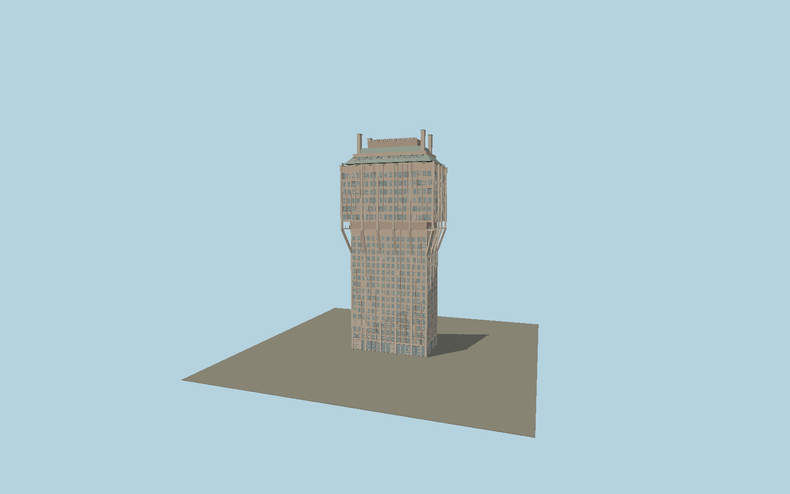

# Torre Velasca

The restored BBPR tower: warm rendered concrete ribs, twenty exterior supports turning into inclined struts, a recessed service belt, an overhanging six-storey apartment block with loggias, stepped copper duplex roofs and tall paired chimneys.

## Identity and geometry

Catalog N0589, [Q1156274](https://www.wikidata.org/wiki/Q1156274). CEAS publishes the 18th-floor structural plan at +60.15 m with a 36.90 × 19.52 m main grid and twenty exterior ribs. The restoration supplier’s archival booklet reproduces upper/lower plans, the complete upper elevation, duplex section and contemporary material descriptions. Exact OSM roof parts confirm the projecting upper envelope and 106 m chimney top. Photographs establish the restored warm render, contrasting aggregate panels and individual loggia/window rhythm.

Exact upper-block mapped center at plaza contact Y=0. −Z is the north-west long elevation with the low entrance pavilion; +X follows the mapped north-east long axis; +Y is up. The geographic proposal identifies its anchor and orientation evidence separately from remaining terrain and azimuth uncertainty.

Source facts and measured references are recorded in spec.json. References: [1](https://www.ceas.it/project/torre-velasca/), [2](https://www.ceas.it/wp-content/uploads/2024/01/Pianta-Strutturale-scaled.webp), [3](https://www.ceas.it/wp-content/uploads/2024/01/Torre-Velasca1%C2%A9Albo-scaled-e1705405835525.webp), [4](https://www.olivari.it/wp-content/uploads/2025/03/Velasca.pdf), [5](https://torrevelasca.it/progetto/), [6](https://www.openstreetmap.org/relation/18238298). Reference pages and images are not redistributed.

## Original source and shared materials

Geometry is authored in `packages/worldgen/scripts/civic-tower-models.mjs`. Shared material graphs with metric repeat UV0 and original vertex tints; GLB PBR fallback remains self-contained. No per-model texture duplication. No third-party mesh or photograph is embedded.

120,144 triangles; 240,288 vertices; 4 material groups; 10,094,908 source bytes. Source hash: `sha256:febee936c5fe6e6bd5393ecb3ee6ad564aa491f050320bcfc5f15e9321747554`. Geometry validation checks finite Float32 coordinates, indices, triangle area and winding before export.

Regenerate with `node packages/worldgen/scripts/generate-heritage-towers.mjs N0589`; add `--check` for reproducibility. The generator refuses to overwrite a master whose hash differs from source.json. Import uses `--no-optimize` to preserve facade recesses.

## Remaining detail and review

- Irregular apartment window/loggia sequencing is reconstructed from the archived elevations and current photographs. Small operable shutter positions are represented consistently rather than as a changing occupancy state.
- The restored exterior is represented; original distressed patches and temporary scaffolding visible in restoration-progress photographs are not reproduced.
- Near/far visual QA, shared-material inspection and maximum-fidelity approval remain pending.

Named near/far cameras are included for lit visual review. A valid export is not maximum-fidelity certification.
