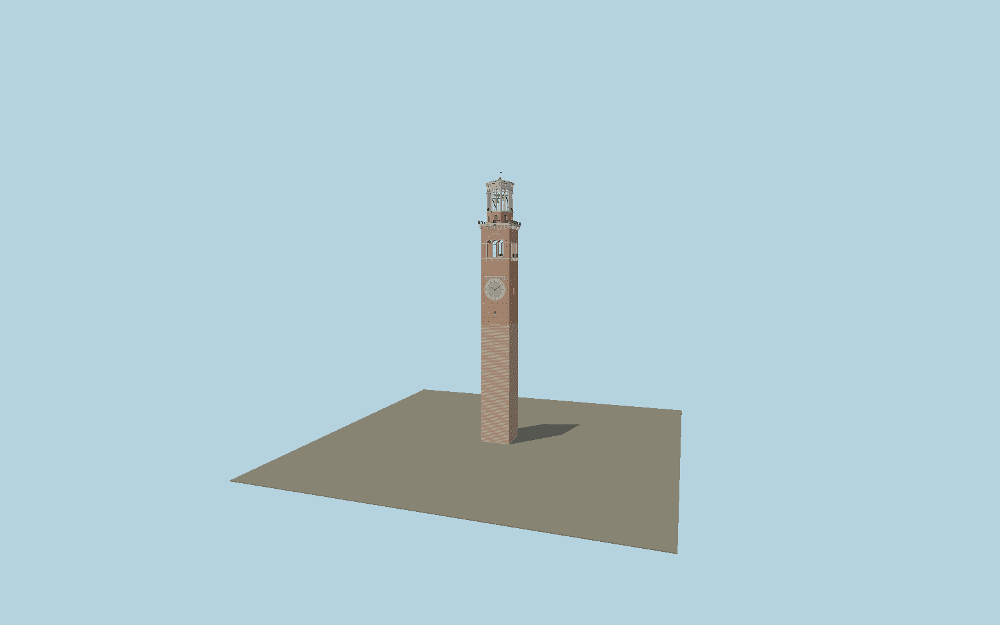

# Torre dei Lamberti

The 84 m Veronese tower with alternating tuff and cotto lower shaft, recessed putlog holes, southwest Roman-numeral clock, four true triple-arched galleries, corbelled terraces, octagonal brick drum, open white-marble belfry, four bells and a pitched copper roof with wind vane.

## Identity and geometry

Catalog N0605, [Q1819804](https://www.wikidata.org/wiki/Q1819804). The operator gives 84 m overall height and 37 m original lower tower, identifies tuff/cotto and the later marble/brick octagonal belfry. Exact mapped tower width/depth sets plan scale. Current operator photographs DSCF8933, R_UD0028 and R_UD0090 establish the clock face, triple arcades, two-light octagonal bays, stone corbels, iron rails, bell supports and shallow pitched roof. Intermediate floor ordinates, opening widths and small relief are proportional reconstructions; they are not represented as surveyed dimensions.

Center of the exact mapped tower footprint, Y=0 at exterior ground. Native +Z faces the southwest clock elevation toward Piazza delle Erbe; +X is southeast; +Y is up. The geographic proposal identifies its anchor and orientation evidence separately from remaining terrain and azimuth uncertainty.

Source facts and measured references are recorded in spec.json. References: [1](https://www.torredeilamberti.it/storia/), [2](https://www.torredeilamberti.it/), [3](https://www.torredeilamberti.it/wp-content/uploads/DSCF8933.jpg), [4](https://www.torredeilamberti.it/wp-content/uploads/R_UD0028.jpg), [5](https://www.torredeilamberti.it/wp-content/uploads/R_UD0090.jpg), [6](https://www.editorialepolis.it/img/notiziario_pdf/palazzoragione.pdf), [7](https://campanologia.org/campanologia/misurazioni), [8](https://www.openstreetmap.org/way/138829597). Reference pages and images are not redistributed.

## Original source and shared materials

Geometry is authored in `packages/worldgen/scripts/lamberti-tower-model.mjs`. Shared material graphs with metric repeat UV0 and original vertex tints; GLB PBR fallback remains self-contained. No per-model texture duplication. No third-party mesh or photograph is embedded.

90,122 triangles; 181,972 vertices; 8 material groups; 7,455,140 source bytes. Source hash: `sha256:4a82a7c12c93d8b83a48daed6cdb26f4f21c956b88910987e7a911dc4e8e6ccb`. Geometry validation checks finite Float32 coordinates, indices, triangle area and winding before export.

Regenerate with `node packages/worldgen/scripts/generate-heritage-towers.mjs N0605`; add `--check` for reproducibility. The generator refuses to overwrite a master whose hash differs from source.json. Import uses `--no-optimize` to preserve facade recesses.

## Remaining detail and review

- Intermediate gallery elevations, individual repaired masonry and minor stone moulding profiles are proportionally reconstructed from current operator photographs. The small coats of arms retain shield relief rather than copied heraldic artwork.
- Clock hands represent a fixed decorative display, not live time. Bell mounting positions are reconstructed from the visible open belfry; the four-bell identity and largest bell mouth diameter are sourced.
- The tower is modeled independently of its attached palace wings; interiors, neighboring palace roofs and Arco della Costa are excluded.
- Near/far visual QA, shared-material inspection and maximum-fidelity approval remain pending.

Named near/far cameras are included for lit visual review. A valid export is not maximum-fidelity certification.
