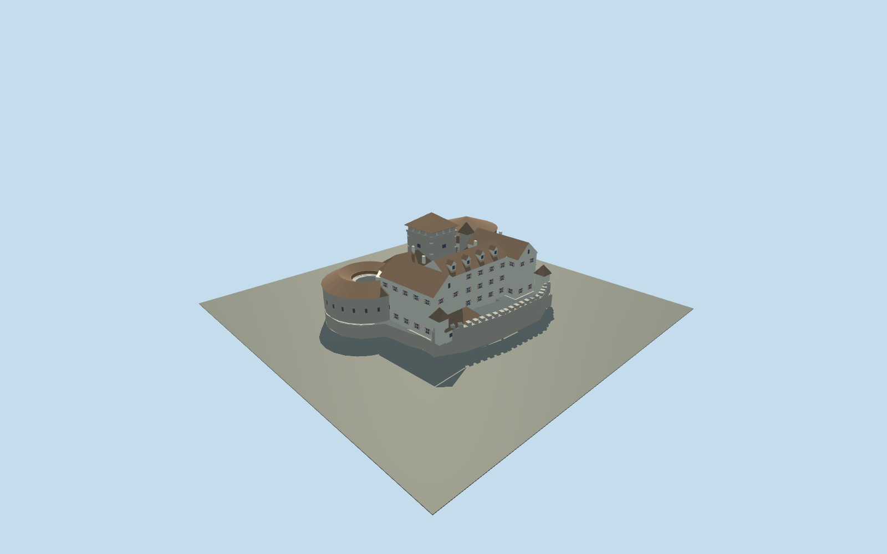

# Vaduz Castle

Present-day Vaduz Castle: square stone keep with pyramidal tile roof, roofed southern roundel with timber hoarding, open northern roundel, cream valley-facing residence and red/white shutters.

## Evidence and reconstruction

Published dimensions and reconstructed details are separated in spec.json. Primary references:

- [Reference](https://www.vaduz.li/en/living-environment/living-building/listed-buildings/schloss-vaduz)
- [Reference](https://schloss-vaduz-erleben.li/en/)
- [Reference](https://historisches-lexikon.li/Vaduz_%28Schloss%29)
- [Reference](https://historisches-lexikon.li/Datei:Schloss_Vaduz_Modell_MA.jpg)
- [Reference](https://www.openstreetmap.org/relation/1252853)

No third-party geometry, photograph or bitmap texture is embedded. Shared surface graphs come from the central library; vertex tints carry model colors. Glazing uses PBR materials; transparent surfaces are declared per model.

## Model and axes

6,623 triangles; 17,361 vertices; 5 material groups; 707,688 bytes. Native bounds: -39.100, 0.000, -29.750 to 38.000, 30.000, 27.500. Source hash: `sha256:14db85eb73fc00da51eab3962f57efe761e7a26c9e60796cd3eb1eae7feaae42`.

{"up":"+Y","longitudinal":"+X north, about1.23degrees east of true north","front":"-Z west toward Vaduz and Rhine valley","origin":"Mapped compound center; west foundationsY=0, internal courtY=4.5m"}

Mapped complete compound establishes anchor and axis. Internal reconstructions and lower foundation skirts require actual terrain review before activation.

## Reproduce

Run `node packages/worldgen/scripts/generate-signature-towers.mjs --ids=N0269` (or add `--check`). The generator preserves manually edited masters by checking their baseline hashes. Import through the standard authored-model workflow with optimization disabled; then capture all QA cameras, including shared-surface views.

## Pending work

- Simplified present exterior; internal wing dimensions and most heights inferred, not surveyed.
- No interiors, mountain mesh, private textures or distant estate grounds.
- Actual hillside seating, continuous-motion shimmer and physical-device performance pending.

This bundle follows the medium-fi standard. Medium-fi appearance and geographic fit are reviewed separately. Hash-bound visual acceptance is recorded separately after capture inspection.

## Additional geographic data

© OpenStreetMap contributors, ODbL-1.0. Official municipal/tourism images and the Amt für Kultur architectural research model used as references.
