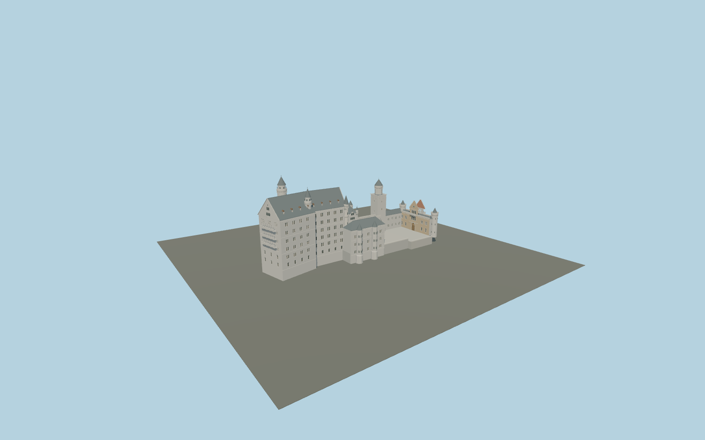

# Neuschwanstein Castle

Individually arranged cranked Palas and Throne Hall, unequal spiral stair towers, open galleries, paired Romanesque windows, copper dormers, Bower, Knights’ House, Square Tower and red-brick/yellow-stone gatehouse around two open courts.

## Evidence and reconstruction

Published dimensions and reconstructed details are separated in spec.json. Primary references:

- [Reference](https://www.neuschwanstein.de/englisch/palace/history.htm)
- [Reference](https://www.neuschwanstein.de/englisch/palace/index.htm)
- [Reference](https://www.neuschwanstein.de/bilder/schloss/grundriss790.png)
- [Reference](https://commons.wikimedia.org/wiki/File:Schloss_Neuschwanstein_2013.jpg)
- [Reference](https://commons.wikimedia.org/wiki/File:Aerial_image_of_Neuschwanstein_Castle_(view_from_the_northwest).jpg)
- [Reference](https://commons.wikimedia.org/wiki/File:Schloss_Neuschwanstein_im_November_2020_(9).jpg)
- [Reference](https://commons.wikimedia.org/wiki/File:Neuschwanstein_pano1.jpg)
- [Reference](https://commons.wikimedia.org/wiki/File:Neuschwanstein_pano2.jpg)
- [Reference](https://www.openstreetmap.org/way/221601969)

No third-party geometry, photograph or bitmap texture is embedded. Shared surface graphs come from the central library; vertex tints carry model colors. Glazing uses PBR materials; transparent surfaces are declared per model.

## Model and axes

234,177 triangles; 477,805 vertices; 11 material groups; 20,017,068 bytes. Native bounds: -76.307, 0.000, -27.000 to 77.000, 65.000, 24.050. Source hash: `sha256:c78849de7780d2383656cb12873fabfc55a14e03a6ec92bc96be18d2d7ed3c8f`.

{"up":"+Y","longitudinal":"+X from western Palas toward eastern gatehouse","front":"+Z toward the southern Marienbrücke view","origin":"Cached OSM precinct rectangle center at provisional lowest structural base"}

Geographic draft: the steep ridge, structural-base datum and individual occupied bounds need contextual review before world activation. The studio catalog model and its LODs remain inspectable.

## Reproduce

Run `node packages/worldgen/scripts/generate-signature-towers.mjs --ids=N0237` (or add `--check`). The generator preserves manually edited masters by checking their baseline hashes. Import through the standard authored-model workflow with optimization disabled; then capture all QA cameras, including shared-surface views.

## Pending work

- Maximum exterior fidelity remains pending: plan transcription, floor heights, narrow roofs and tower profiles are photographic reconstructions, not measured elevations. The cached 65 m height has no cited source.
- The unbuilt central keep and chapel are excluded. Current gatehouse and later Bower/Square Tower are represented; scaffolding and temporary conservation work are not architectural features.
- Palas painted murals, heraldic portal relief, human/animal statues, carved capitals and exact tracery require dedicated sculptural/painting work. No substituted generic figure is claimed accurate.
- No natural mountain, moat, forest or interiors are included. The retained court levels and basement walls require sloped-terrain integration; the model is a geographic draft.
- All geometry is original. Reference images are linked, never embedded or copied into texture maps. Limestone, raw limestone, weathered limestone, sandstone, slate, copper, brick, painted metal and wood use canonical shared materials.

This bundle contains source geometry, not a claim of maximum-fidelity completion. Hash-bound visual acceptance is recorded separately after capture inspection.
