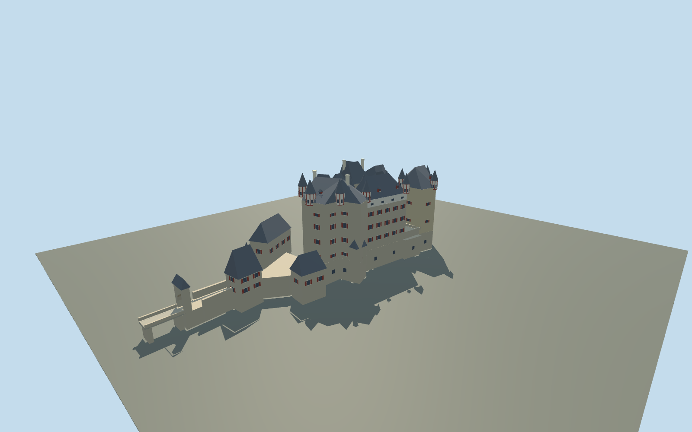

# Eltz Castle

Eight adjoining houses around a narrow open court, steep slate roofs, red-and-cream timber oriels, pale chimneys and the lower northern outer bailey.

## Evidence and reconstruction

Published dimensions and reconstructed details are separated in spec.json. Primary references:

- [Reference](https://burg-eltz.de/en/the-castle)
- [Reference](https://burg-eltz.de/en/history)
- [Reference](https://burg-eltz.de/files/Unterschriften%20und%20anderes/kernburg_lageplan.pdf)
- [Reference](https://www.openstreetmap.org/way/238981197)

No third-party geometry, photograph or bitmap texture is embedded. Shared surface graphs come from the central library; vertex tints carry model colors. Glazing uses PBR materials; transparent surfaces are declared per model.

## Model and axes

5,356 triangles; 14,976 vertices; 5 material groups; 606,620 bytes. Native bounds: -34.495, 0.000, -18.410 to 85.000, 36.500, 28.625. Source hash: `sha256:21a46ad8431c67f07a0f2a3a1ca066ead258597edccc2378486237d59156c474`.

{"up":"+Y","longitudinal":"+X north toward the outer gate","front":"+Z east","origin":"OSM main-building center, lowest exterior foundations Y=0, inner court Y=8m"}

OSM main-building geometry does not contain the outer bailey. Additional outbuildings are reconstructed from the owner plan. No terrain is authored; the court and lower external walls require a real-site terrain review before activation.

## Reproduce

Run `node packages/worldgen/scripts/generate-signature-towers.mjs --ids=N0266` (or add `--check`). The generator preserves manually edited masters by checking their baseline hashes. Import through the standard authored-model workflow with optimization disabled; then capture all QA cameras, including shared-surface views.

## Pending work

- Exterior only, with simplified window rhythms and timber patterns; no photos or unique textures.
- House boundaries, roof profiles, gate/outbuilding coordinates and height datums are reconstructed, not a survey.
- Real terrain contact, continuous-motion shimmer and physical-device performance are pending.

This bundle follows the medium-fi standard. Medium-fi appearance and geographic fit are reviewed separately. Hash-bound visual acceptance is recorded separately after capture inspection.

## Additional geographic data

© OpenStreetMap contributors, ODbL-1.0; owner plan and photographs used as linked research evidence.
