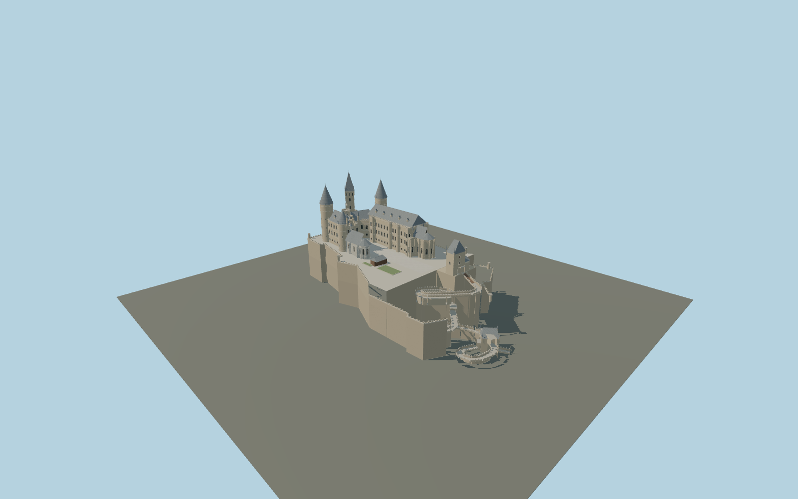

# Hohenzollern Castle

Mapped horseshoe palace and distinct Kaiser, Markgraf, Bishop, Michael and Watch towers, two separately shaped chapels, bastion ring and multilevel open entrance ramps with gate tunnels.

## Evidence and reconstruction

Published dimensions and reconstructed details are separated in spec.json. Primary references:

- [Reference](https://burg-hohenzollern.com/en/)
- [Reference](https://burg-hohenzollern.com/en/about-the-castle/ubersichtsplan-der-burg-kopie)
- [Reference](https://burg-hohenzollern.com/en/about-the-castle/castle-history)
- [Reference](https://commons.wikimedia.org/wiki/File:Colorierter_Entwurf_-_Schloss_Hohenzollern_-_St%C3%BCler.jpg)
- [Reference](https://commons.wikimedia.org/wiki/File:BurgHohenzollernInnenhof02.jpg)
- [Reference](https://www.openstreetmap.org/way/93612350)

No third-party geometry, photograph or bitmap texture is embedded. Shared surface graphs come from the central library; vertex tints carry model colors. Glazing uses PBR materials; transparent surfaces are declared per model.

## Model and axes

349,299 triangles; 718,009 vertices; 9 material groups; 30,044,980 bytes. Native bounds: -87.832, 0.000, -44.520 to 89.028, 79.200, 44.520. Source hash: `sha256:5cb6e4124350dee11d4dd9368b9ae214494f141b73d15c7d050fcf08c45838e7`.

{"up":"+Y","longitudinal":"+X east-southeast, 14.565 degrees south of east","front":"+X entrance; +Z south-southwest","origin":"Mapped enclosure anchor, provisional lower Eagle Gate height"}

Draft placement; the 30 m relative entrance/court datum and ramp connections need topographic verification.

## Reproduce

Run `node packages/worldgen/scripts/generate-signature-towers.mjs --ids=N0252` (or add `--check`). The generator preserves manually edited masters by checking their baseline hashes. Import through the standard authored-model workflow with optimization disabled; then capture all QA cameras, including shared-surface views.

## Pending work

- Maximum fidelity pending: no as-built measured elevations were available. Palace heights, roof ridges, tower crowns, dormers, window modules and chapel details are architectural reconstructions from references.
- The original 1854 elevations are design drawings rather than a current measured survey. The courtyard photograph is from 2005; the model excludes temporary modern scaffolding and does not claim a surveyed 2026 state.
- Spiral road centerlines and covered layers are mapped, but ramp gradients, retaining wall thickness, vault shapes and gate clearances are estimated. Supporting skirts are provisional; actual rock contour, grade and terrain contact remain unfinished.
- The forested mountain, distant water tower, parking buildings, vegetation/ivy, statuary, museum interiors and inaccessible casemates are outside this exterior asset.
- Shared sandstone, raw limestone, limestone, granite, slate, wood and painted metal surfaces carry exterior materials; no embedded photographs. Procedural masonry joints and slate courses are approximations.

This bundle contains source geometry, not a claim of maximum-fidelity completion. Hash-bound visual acceptance is recorded separately after capture inspection.

## Additional geographic data

Map geometry © OpenStreetMap contributors, ODbL-1.0. Official illustration, public-domain architect drawing and CC-BY-SA courtyard photograph are research references only; no third-party images or meshes bundled.
