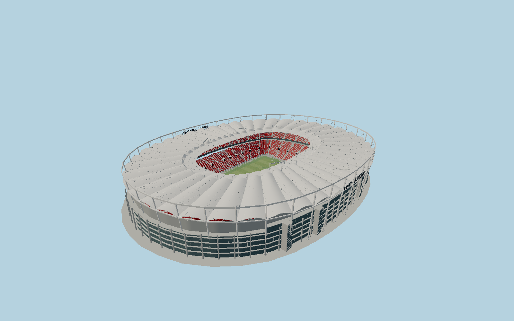

# MHPArena — N0697

Stuttgart arena with inclined white supports and a tall asymmetric outer compression ring,40 double-curved membrane bays, distinct2011 inner roof extension and floating struts. Red two-tier bowl,2024 southwest main stand hospitality terraces, northwestern standing end, opposite white STUTTGART seat lettering, original catwalk,420 floodlights, diagonal stair glazing and integrated southeast SCHARRena form the specific exterior.

## Identity and evidence

Exact catalog identity **Q152349**. Source facts: `{"published":"Operator lists273x224m outer roof ring,47.1m main-stand and38.5m opposite-stand heights,41,750m² PVC-coated polyester roof,105x68m pitch,420 floodlights, two12x5.1m screens and60,058 capacity. Operator2011 history gives1.3m pitch lowering; structural engineer rounds1.5m. Engineer describes40 membrane fields, the original cable wheel,2011 floating-strut inner extension and2024 main-stand reconstruction of about60x160m.","reconstructed":"Directed mapped pitch and individually named stand footprints locate the exterior. OSM ground/stadium outline is290x224m, longer than the published273m roof; ground preserves map length while roof follows operator dimensions. Original field datum is treated as nominal outer contactY0, lowered fieldY-1.3. Cable sag/sections, roof camber, stair subdivisions, row inventories and local room glazing are photograph reconstructions."}`. The source specification keeps published dimensions separate from reconstructed details.

- https://www.mhparena-stuttgart.de/arena/daten-fakten
- https://www.mhparena-stuttgart.de/arena/baugeschichte/
- https://www.mhparena-stuttgart.de/aktuelles/neubau-der-haupttribuene-abgeschlossen/
- https://www.sbp.de/projekt/mhp-arena-umbau/
- https://www.sbp.de/projekt/mercedes-benz-arena-ehemals-gottlieb-daimler-stadion/
- https://www.sbp.de/news/neue-dachhaut-fuer-die-mercedes-benz-arena-in-stuttgart/
- https://www.mhparena-stuttgart.de/aktuelles/neues-dach-fuer-die-mercedes-benz-arena/
- https://www.openstreetmap.org/relation/9207449
- https://www.openstreetmap.org/way/34685362

Original geometry and shared procedural material graphs. Primary photographs are research references, not embedded art. OSM-derived coordinates retain OpenStreetMap contributor attribution under ODbL1.0.

## Authored geometry and materials

1,283,272 triangles, 2,344,904 vertices, 8 surface groups; 97,475,276 source bytes. SHA-256: `sha256:15ee372ebce5536611a247b376b8a78b8bfb08b9e2ab38ed5e14a2144e13ebdc`. Actual bounds: -112.746, -1.300, -146.560 to 112.460, 47.650, 144.654 m.

Shared canonical material graphs with metric UV repeats in extras.molenSurface; portable glTF PBR factors and vertex colors remain. Dark recesses/lantern panels retain local fallback materials. Shared references: `matgraph:molen.worldgen.material.membrane` (4 × 4 m), `matgraph:molen.worldgen.material.metal_painted` (2 × 2 m), `matgraph:molen.worldgen.material.concrete_plain` (2 × 2 m), `matgraph:molen.worldgen.material.gravel` (2 × 2 m). Model-native axes: {"up":"+Y","front":"+Z","origin":"Mapped pitch center,+Z northwest toward Cannstatter Kurve,+X southwest toward the main stand;Y0 surrounding ground, pitchY-1.3."}.

## Placement proposal

Pitch axis directs+Z toward northwest Cannstatter Kurve and+X toward southwest main stand. SCHARRena lies under the southeast end. Published roof dimensions govern its upper ring; mapped ground perimeter governs terrain cutout and lower envelope. Proposed anchor 9.2320788, 48.792253125 (longitude, latitude), heading -2.2536074994349145 radians. Elevation policy: **terrain-contact**. See qa.json for the geographic review status and scope; this placement proposal does not claim surveyed site accuracy. Native ground and pitch datums follow the individual geographic proposal; depressed bowls require their declared terrain cutout.

## Limitations and review

- Current completed exterior, with photograph-reconstructed section sizes, details, row distribution and local elevations. The operator mentions2026 LED renewal but still publishes12x5.1m screen dimensions; those published sizes are retained. No temporary event scenery, enclosed rooms or neighboring independent sports halls.

Portable asset views omit the fixture ground; geographic shared views cut actual terrain using the declared stadium outline so the lowered pitch remains visible.

Near/far fixtures are in `spec.qaCameras`. Float32 finite geometry, triangle degeneracy and winding are checked by the generator. The hash-bound qa.json and capture reports record the scope and status of rendering, shared-material, exterior-fidelity and geographic reviews.

Regenerate with `node packages/worldgen/scripts/generate-stadium-models.mjs --ids=N0697`; add `--check` for reproducibility. Editable component recipes are registered by the imports and study list in `packages/worldgen/scripts/generate-stadium-models.mjs`. The generator protects artist-edited master hashes and preserves import/capture/shared-capture/QA documents.
