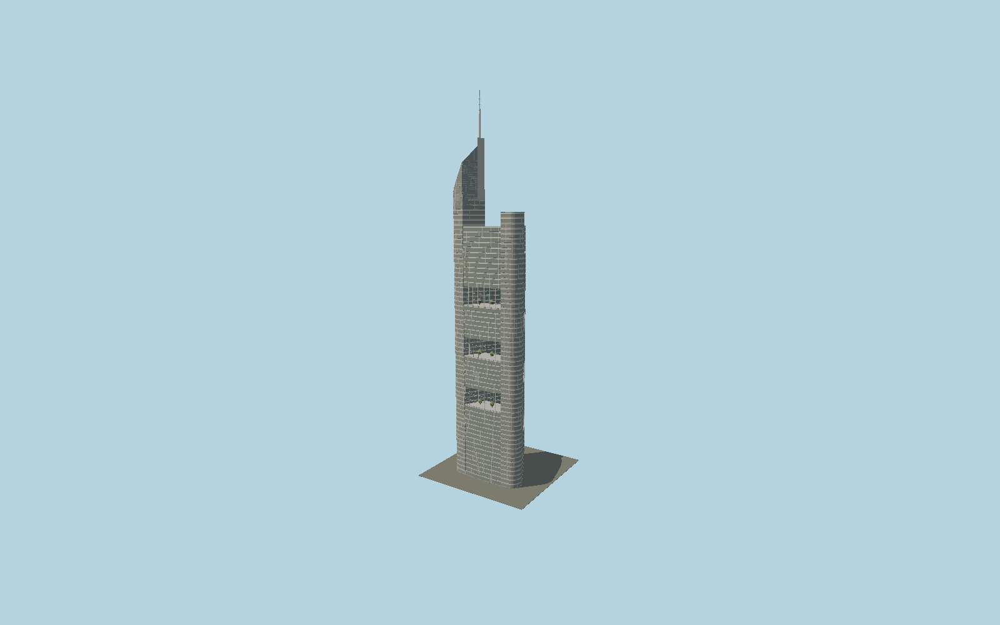

# Commerzbank Tower

Foster’s rounded triangular tower with three corner service cores, a central atrium, nine staggered four-storey sky gardens, dense silver-green curtain wall and asymmetrical sloping mechanical crown with a300 m antenna.

## Evidence and reconstruction

Published dimensions and reconstructed details are separated in spec.json. Primary references:

- [Reference](https://find-an-architect.architecture.com/foster-partners/london/commerzbank-headquarters)
- [Reference](https://www.commerzbank.de/konzern/newsroom/pressemitteilungen/buerogebaeude.html)
- [Reference](https://www.skyscrapercenter.com/frankfurt-am-main/commerzbank-tower/780/)
- [Reference](https://www.openstreetmap.org/way/183060777)

No third-party geometry, photograph or bitmap texture is embedded. Shared surface graphs come from the central library; vertex tints carry model colors. Glass is an opaque PBR approximation.

## Model and axes

214,907 triangles; 632,523 vertices; 5 material groups; 24,720,356 bytes. Native bounds: -30.485, 0.000, -28.080 to 30.485, 300.000, 27.936. Source hash: `sha256:f667faa1bbcef987ca007548993c36bba0a0bf9b961b695f3e9104e43a2152af`.

{"up":"+Y","longitudinal":"+X along the mapped building long axis","front":"+Z","origin":"Ground-level center of exact-QID mapped footprint frame"}

The geographic proposal uses exact-QID OpenStreetMap evidence. Map-derived orientation and estimated architectural details require real-site visual review; preview eligibility is distinct from geographic/fidelity approval. Map attribution: © OpenStreetMap contributors, ODbL-1.0.

## Reproduce

Run `node packages/worldgen/scripts/generate-signature-towers.mjs --ids=N0159` (or add `--check`). The generator preserves manually edited masters by checking their baseline hashes. Import through the standard authored-model workflow with optimization disabled; then capture all QA cameras, including shared-surface views.

## Pending work

- Exterior geometry uses published overall dimensions and map evidence; panel subdivision, connection dimensions and local entrance details are reconstructed. Glazing uses opaque PBR with explicit geometry; no copied facade photograph is embedded.
- Garden frames and representative planting are explicit; outer garden glass is represented by open framed bays to retain visibility with opaque daylight materials. Exact tree species, louvre construction and top mechanical-wall slope are reconstructed.

This bundle contains source geometry, not a claim of maximum-fidelity completion. Hash-bound visual acceptance is recorded separately after capture inspection.
