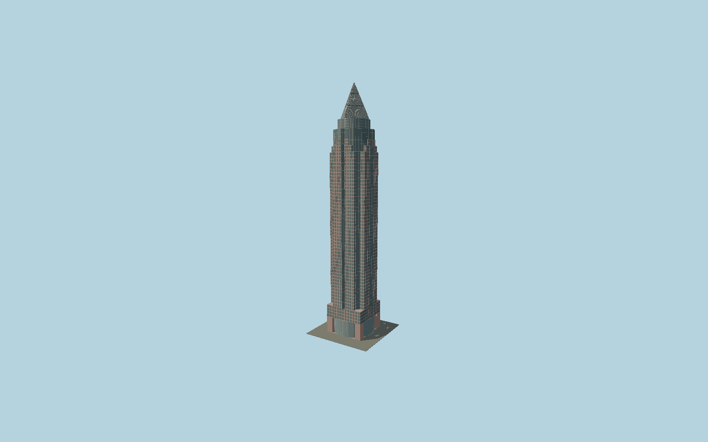

# Messeturm

Jahn’s red-granite skyscraper with four stepped steles around an exposed glass cylinder, pointed central window bays, reconstructed2022 curved-glass lobby and the distinctive three-stage diamond-oriented pyramid.

## Evidence and reconstruction

Published dimensions and reconstructed details are separated in spec.json. Primary references:

- [Reference](https://jahn.studio/work/messeturm/)
- [Reference](https://messeturm.com/en/)
- [Reference](https://messeturm.com/fileadmin/user_upload/MESSETURM_Image_Book_25082022.pdf)
- [Reference](https://www.hochtief.de/ueber-hochtief/geschichte/messeturm-in-frankfurt-am-main)
- [Reference](https://www.skyscrapercenter.com/building/messeturm/796)

No third-party geometry, photograph or bitmap texture is embedded. Shared surface graphs come from the central library; vertex tints carry model colors. Glass is an opaque PBR approximation.

## Model and axes

243,716 triangles; 571,814 vertices; 4 material groups; 22,940,908 bytes. Native bounds: -22.700, 0.000, -22.936 to 22.838, 256.517, 22.700. Source hash: `sha256:9b4c07a30fe25a13673382b58e4ca7b7e016d490afd91bfb384f0486e541602a`.

{"up":"+Y","longitudinal":"+X along the mapped building long axis","front":"+Z","origin":"Ground-level center of exact-QID mapped footprint frame"}

The geographic proposal uses exact-QID OpenStreetMap evidence. Map-derived orientation and estimated architectural details require real-site visual review; preview eligibility is distinct from geographic/fidelity approval. Map attribution: © OpenStreetMap contributors, ODbL-1.0.

## Reproduce

Run `node packages/worldgen/scripts/generate-signature-towers.mjs --ids=N0170` (or add `--check`). The generator preserves manually edited masters by checking their baseline hashes. Import through the standard authored-model workflow with optimization disabled; then capture all QA cameras, including shared-surface views.

## Pending work

- Exterior geometry uses published overall dimensions and map evidence; panel subdivision, connection dimensions and local entrance details are reconstructed. Glazing uses opaque PBR with explicit geometry; no copied facade photograph is embedded.
- Individual granite panel joints, curtain-wall bay pitch and pyramid tier datums are reconstructed from the owner brochure and architect description. The separate Hammering Man sculpture and surrounding exhibition halls are excluded.

This bundle contains source geometry, not a claim of maximum-fidelity completion. Hash-bound visual acceptance is recorded separately after capture inspection.
