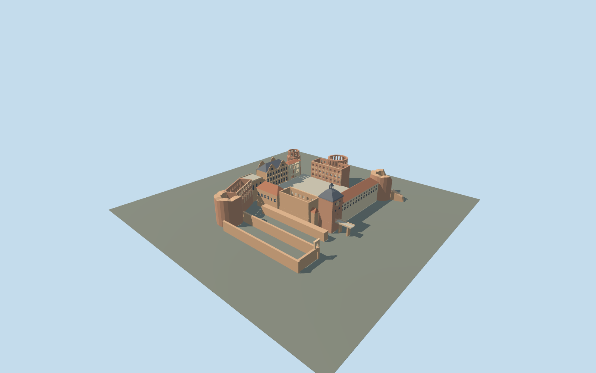

# Heidelberg Castle

Present-day red-sandstone palace ruins around an open court: restored twin-gabled Friedrich wing, roofless Ottheinrich and English wings, broken defensive towers and52m gate.

## Evidence and reconstruction

Published dimensions and reconstructed details are separated in spec.json. Primary references:

- [Reference](https://www.schloss-heidelberg.de/en/visitor-experience/castle-garden/buildings)
- [Reference](https://www.schloss-heidelberg.de/fileadmin/Broschueren/Abrissplaene/ssg_schloss-heidelberg_kunstfuehrer-lageplan.pdf)
- [Reference](https://www.schloss-heidelberg.de/wissenswert-amuesant/geschichtshaeppchen)
- [Reference](https://www.openstreetmap.org/way/254154168)

No third-party geometry, photograph or bitmap texture is embedded. Shared surface graphs come from the central library; vertex tints carry model colors. Glazing uses PBR materials; transparent surfaces are declared per model.

## Model and axes

6,948 triangles; 18,500 vertices; 5 material groups; 752,596 bytes. Native bounds: -78.750, 0.000, -102.815 to 92.555, 52.000, 101.150. Source hash: `sha256:77bfb5237eecc8345fb236d8b46393444ec611bbdf372bb565245b35b65ea180`.

{"up":"+Y","longitudinal":"+X approximately south","front":"+Z approximately west","origin":"Mapped site center; lowest moat foundations Y=0, court Y=12m"}

Site envelope includes gardens and is not a building footprint. Component coordinates and elevations are reconstructed and require real-site fit review before activation.

## Reproduce

Run `node packages/worldgen/scripts/generate-signature-towers.mjs --ids=N0267` (or add `--check`). The generator preserves manually edited masters by checking their baseline hashes. Import through the standard authored-model workflow with optimization disabled; then capture all QA cameras, including shared-surface views.

## Pending work

- Simplified current exterior, not a historical reconstruction or measured survey.
- No unique textures, sculptures in full detail, palace interiors, terrain or distant gardens.
- Hillside contact, continuous-motion shimmer and physical-device performance pending.

This bundle follows the medium-fi standard. Medium-fi appearance and geographic fit are reviewed separately. Hash-bound visual acceptance is recorded separately after capture inspection.

## Additional geographic data

© OpenStreetMap contributors, ODbL-1.0; owner plans and photographs used as research.
