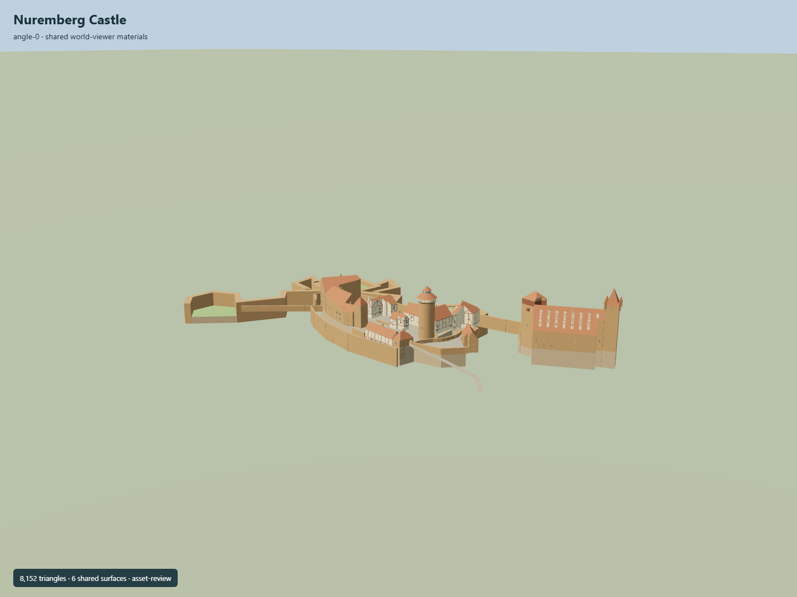

# Nuremberg Castle

Three adjoining castle precincts: cylindrical Sinwell with flared observation floor and pointed Renaissance helm,Palas/Kemenate/double chapel/Heidenturm around open court,half-timbered forecourt ranges and well,Hasenburg and three physical passages,Walburgis/Pentagonal Tower,eastern Kaiserstallung with tiered dormers and Luginsland corner oriels,mapped bastions and original schematic gardens.

## Evidence and reconstruction

Published dimensions and reconstructed details are separated in spec.json. Primary references:

- [Reference](https://api.openstreetmap.org/api/0.6/map?bbox=11.0712,49.4567,11.0801,49.4601)
- [Reference](https://www.kaiserburg-nuernberg.de/englisch/castle/plan.htm)
- [Reference](https://www.kaiserburg-nuernberg.de/englisch/castle/sinwell.htm)
- [Reference](https://www.kaiserburg-nuernberg.de/englisch/castle/palas.htm)
- [Reference](https://www.kaiserburg-nuernberg.de/englisch/castle/bower.htm)
- [Reference](https://www.kaiserburg-nuernberg.de/bilder/burg/plaene/gesamtplan_dt.pdf)
- [Reference](https://www.nuernberg.de/internet/stadtportal/nh_kaiserburg.html)
- [Reference](https://www.nuernberg.de/imperia/md/stadtportal/dokumente/nh98_burg.pdf)
- [Reference](https://www.kaiserburg-nuernberg.de/bilder/burg/brunnenhaus-sinwell-slider/luftbild_www.kreativ-instinkt.de_DI026142-575.jpg)
- [Reference](https://www.kaiserburg-nuernberg.de/bilder/burg/brunnenhaus-sinwell-slider/vorhof_DI020537-575.jpg)
- [Reference](https://www.kaiserburg-nuernberg.de/bilder/burg/brunnenhaus-sinwell-slider/brunnenhaus-sinwellturm_socialmedia-575.jpg)
- [Reference](https://www.kaiserburg-nuernberg.de/bilder/burg/brunnenhaus-sinwell-slider/brunnenhaus_DI020982-575.jpg)
- [Reference](https://www.kaiserburg-nuernberg.de/bilder/burg/modell_nuernberg575a.jpg)

Six existing256-square shared graphs with linear tints and central metric UV repeats; flat glass/grass. No embedded/new image,photo texture,downloaded model or traced printed drawing. Roofs clip to actual footprints and courts remain physically open.

## Model and axes

8,152 triangles; 24,456 vertices; 8 material groups; 982,804 bytes. Native bounds: -144.420, 0.300, -84.781 to 212.824, 60.600, 77.690. Source hash: `sha256:5ad45217b302e304fd1b7347d0a17d31431279146c7640c842d53b8d1a762ed0`.

{"up":"+Y","front":"South-facing city prospect with Palas/double chapel and Sinwell in native East/South coordinates","longitudinal":"+X east along castle complex","origin":"Exact-QID map point; native Y0 is provisional terrain-grid minimum320.29m,castle attachment planeY17.2. Native geometry remains East/South; heading0."}

Geometry is native +X east/+Z south with heading0. Exact-QID map point anchors separately attributed physical components. Native Y0 is provisional terrain-grid minimum320.29m,attachment planeY17.2; real rock/terraced ground and vertical datum need review.

## Reproduce

Run `node packages/worldgen/scripts/generate-signature-towers.mjs --ids=N0297` (or add `--check`). The generator preserves manually edited masters by checking their baseline hashes. Import through the standard authored-model workflow with optimization disabled; then capture all QA cameras, including shared-surface views.

## Pending work

- Exact-QID identity is a node; nearby physical parts remain separately attributed. Some mapped outlines are explicitly extrapolated rather than surveyed.
- Primary city guide gives Sinwell41m from plinth to weather vane. Other tower heights,body/roof partitions,apertures and restored details are estimates. OSM Heidenturm35m/Fünfeckturm44m are raw map values,not verified surveyed vertical dimensions.
- Three historic precincts belong to the overall castle complex; Kaiserstallung note that it is not part of the imperial castle is preserved. No composite placement for a distant site.
- Native provisional datum320.29m and attachmentY17.2 are original terrain/reference estimates. Coarse Terrarium DEM does not resolve the castle rock,wall bases,terraced courts or correct survey datum. Real terrain/approach/current-site fit remains pending.
- Full double-chapel interior,well shaft beyond50m,roof structures,museum interiors,exact heraldry/sculpture/current exhibits and walkable circulation/collision are not complete. Selected exterior rhythm and simplified reconstructed roofs are represented.
- Northern/western bastion volumes and simplified lawns follow mapped fortification ribbons; garden beds and circulation are original schematic geometry,not a copied historic garden plan.
- Six existing256-square shared graphs with linear tints and metric repeats; no unique/embedded textures,downloaded model or copied reference photograph/drawing.
- Synthetic Earth captures do not verify actual geographic fit,continuous streaming or physical laptop/phone performance.

This bundle follows the medium-fi standard. Medium-fi appearance and geographic fit are reviewed separately. Hash-bound visual acceptance is recorded separately after capture inspection.

## Additional geographic data

© OpenStreetMap contributors; Bayerische Schlösserverwaltung; Stadt Nürnberg; Mapzen/SRTM, NASA/USGS.
