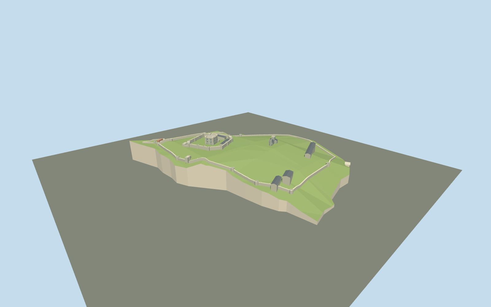

# Dover Castle

Current multi-period hilltop fortress:square flint-and-pale-stone Great Tower with east forebuilding,14inner mural towers,lowered outer defenses,northern spur,Constable gate,church/octagonal Roman pharos and selected later barracks.

## Evidence and reconstruction

Published dimensions and reconstructed details are separated in spec.json. Primary references:

- [Reference](https://www.english-heritage.org.uk/visit/places/dover-castle/history-and-stories/history-dover/)
- [Reference](https://www.english-heritage.org.uk/siteassets/home/visit/places-to-visit/dover-castle/schools/ocr-gcse_history-around-us_dover-castle_final_updated.pdf)
- [Reference](https://historicengland.org.uk/listing/the-list/list-entry/1019075)
- [Reference](https://www.english-heritage.org.uk/siteassets/home/visit/places-to-visit/dover-castle/history-and-stories/history/dover-castle-phased-plan.pdf)
- [Reference](https://www.openstreetmap.org/way/26658038)
- [Reference](https://github.com/tilezen/joerd/blob/master/docs/data-sources.md)

No third-party geometry, photograph or bitmap texture is embedded. Shared surface graphs come from the central library; vertex tints carry model colors. Glazing uses PBR materials; transparent surfaces are declared per model.

## Model and axes

4,590 triangles; 13,770 vertices; 5 material groups; 554,036 bytes. Native bounds: -248.335, 0.000, -277.412 to 255.931, 112.505, 362.386. Source hash: `sha256:6f3aa14c0637ae25dbfb156d7353cea9ccef608e768230e35396ca2f21b5ed1b`.

{"up":"+Y","lateral":"+X east","longitudinal":"+Z south","origin":"Cached whole-site map rectangle center;relative terrain datum is the minimum sampled boundary elevation,declared by recipe."}

Compound study with qualified DEM and estimated internal plan;inactive pending real-site/terrain review.

## Reproduce

Run `node packages/worldgen/scripts/generate-signature-towers.mjs --ids=N0284` (or add `--check`). The generator preserves manually edited masters by checking their baseline hashes. Import through the standard authored-model workflow with optimization disabled; then capture all QA cameras, including shared-surface views.

## Pending work

- Approximate current exterior compound reconstruction. Individual footprints,wall lines,church orientation and barrack lengths are author estimates;live OSM footprint requests returned429. Cached OSM boundary is retained exactly,not extruded as a building.
- Documented keep25.3m and surviving pharos19m are above their estimated pads. All other heights and topography corrections estimated. Coarse DEM cannot resolve deep moat profiles,cliff faces or narrow terrace levels. Host terrain,vertical datum,heading and internal plan fit pending.
- Selected14inner square mural towers and northern gate/barbican;outer wall follows an approximate reduced circuit. Only surviving broad crowns,not a complete medieval crenellation reconstruction. Later earthen-backed east walls remain lower.
- Underground medieval/wartime tunnels and buried structures,interiors,thin railings,individual masonry joints,parked cars,trees and minor modern visitor fixtures excluded. Moats are dry ground,not a water feature.
- Shared256² limestone,granite,slate and brick graphs;no unique textures or copied research images. No baked shading or AO.
- Synthetic English terrace context is a style comparison,not Dover surroundings. Physical devices and actual adaptive-streaming transitions unmeasured. Inactive geographic draft,replaceFootprint=false.

This bundle follows the medium-fi standard. Medium-fi appearance and geographic fit are reviewed separately. Hash-bound visual acceptance is recorded separately after capture inspection.

## Additional geographic data

© OpenStreetMap contributors;Mapzen Terrain Tiles/contributing agencies;English Heritage and Historic England factual architectural references.
