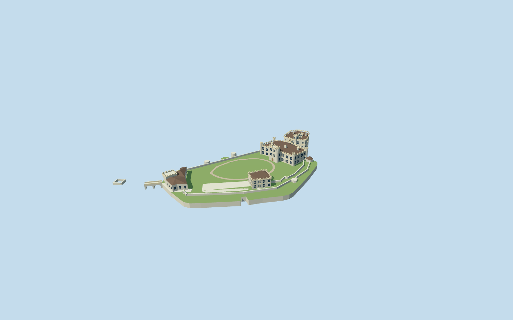

# Leeds Castle

Current two-island Leeds Castle: Tudor-style New Castle/octagonal turrets, D-shaped hollow Gloriette with bell tower, two-storey covered bridge over open pointed arches, Maidens Tower/bath arches, medieval southwest gatehouse, low curtain/island and entrance bridge.

## Evidence and reconstruction

Published dimensions and reconstructed details are separated in spec.json. Primary references:

- [Reference](https://api.openstreetmap.org/api/0.6/map?bbox=0.6267,51.2465,0.6333,51.2510)
- [Reference](https://www.leeds-castle.com/)
- [Reference](https://www.leeds-castle.com/her-castle/history-of-the-castle/)
- [Reference](https://www.leeds-castle.com/news/stonework-restoration-of-leeds-castle/)
- [Reference](https://www.leeds-castle.com/wp-content/uploads/2022/10/Thomas-Alexander-Castle-scaled.jpg)
- [Reference](https://www.leeds-castle.com/wp-content/uploads/2025/07/history-of-castle.jpg)
- [Reference](https://www.leeds-castle.com/wp-content/uploads/2023/07/IMG_5960-scaled.jpg)
- [Reference](https://historicengland.org.uk/listing/the-list/list-entry/1039919)

Five existing shared256-square masonry/raw stone/clay tile/timber/gravel graphs with metric repeats and linear tints. Flat glass/lawn. No embedded/new image, downloaded mesh or copied photo texture.

## Model and axes

11,749 triangles; 35,247 vertices; 7 material groups; 1,413,956 bytes. Native bounds: -127.916, 0.000, -86.626 to 55.786, 20.650, 74.419. Source hash: `sha256:a10423a135cedf41c195722ffcc0de7e7dd7d1235674b8a4983e219e09db78a8`.

{"up":"+Y","longitudinal":"Native +X east,+Z south; original NE/SW authoring-axis rotation is baked into vertices, runtime heading0.","origin":"Horizontal exact-QID map anchor. Y0 is provisional visible moat plane; island/bailey floorY4.4. Water surface and natural terrain belong to host."}

Attributed current map components retain native East/South heading0. Water planeY0 and bailey floorY4.4 are provisional source controls; facade fit and actual water/shore datum remain pending.

## Reproduce

Run `node packages/worldgen/scripts/generate-signature-towers.mjs --ids=N0304` (or add `--check`). The generator preserves manually edited masters by checking their baseline hashes. Import through the standard authored-model workflow with optimization disabled; then capture all QA cameras, including shared-surface views.

## Pending work

- Native East/South traces bake runtime heading0. Coordinate arithmetic is not an approval of actual-site placement or facade orientation.
- All metric heights, roof sections, window proportions, bridge/gateway apertures and bailey/water attachment are original photographic estimates. No primary numeric architectural heights verified.
- The model has island architecture and original bailey surfacing but no embedded moat, natural terrain, vegetation, garden or lake texture. Host supplies water and terrain.
- Gloriette courtyard, covered-bridge water arches and mapped gateway route are open geometry. Window panes are stylized blue-grey. Walkable collision is not certified.
- Fairfax Courtyard, detached service buildings, parkland, fine tracery/heraldry/interiors and full outer barbican archaeology are separate or excluded. The model includes the mapped nearby fragment only.
- Five existing shared256-square masonry, raw stone, flat clay tile, timber and gravel graphs; linear palette tints and metric repeats. No unique embedded image, downloaded mesh or copied printed plan.
- Operator photographs remain private visual references. Only attribution and original numerical controls ship.
- Actual lake elevation, shore/approach contacts, architectural accuracy and physical ordinary-laptop/phone measurements remain pending.

This bundle follows the medium-fi standard. Medium-fi appearance and geographic fit are reviewed separately. Hash-bound visual acceptance is recorded separately after capture inspection.

## Additional geographic data

© OpenStreetMap contributors; Historic England; Leeds Castle Foundation/Thomas Alexander.
