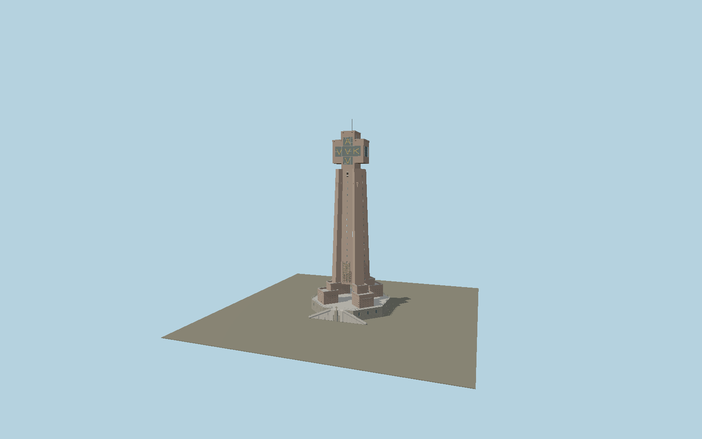

# Yser Tower

The current 1965 IJzertoren: octagonal Ourthe-stone platform, double external stair entrance, stepped brick pavilions, six-lobed tapering shaft, recessed slit windows, four balconies, glazed cross crown with original AVV/VVK letter geometry, open roof terraces and the 37-bell northeast carillon.

## Identity and geometry

Catalog N0604, [Q1708620](https://www.wikidata.org/wiki/Q1708620). The museum establishes the 84 m current tower and 2.5 m letters. The official management plan pp.32–35 supplies the six-lobed shaft, floor sections and crown; its pp.36–49 documents terraces, cladding, windows and entrance. The construction-history paper places the cantilever at 69.50 m. Exact mapped ground footprint supplies scale and the entry projection supplies the directed northeast phase. Secondary heights, small panel widths, bell arrangement and stone relief are proportional reconstructions from these drawings and current operator photographs.

Mapped current tower platform center; Y=0 exterior ground. Native +Z northeast toward the current entrance and exterior carillon; +X northwest; +Y is up. The geographic proposal identifies its anchor and orientation evidence separately from remaining terrain and azimuth uncertainty.

Source facts and measured references are recorded in spec.json. References: [1](https://www.museumaandeijzer.be/nl/over-de-organisatie/), [2](https://plannen.onroerenderfgoed.be/plannen/219/bestanden/908), [3](https://inventaris.onroerenderfgoed.be/erfgoedobjecten/78242), [4](https://biblio.ugent.be/publication/8716312/file/8738740.pdf), [5](https://www.museumaandeijzer.be/nl/home/het-klokkenspel-van-de-ijzertoren/?lid=39220), [6](https://www.diksmuide.be/erfgoeddag-game-on), [7](https://www.museumaandeijzer.be/swfiles/files/DJI_0295.jpg), [8](https://www.openstreetmap.org/way/89482810). Reference pages and images are not redistributed.

## Original source and shared materials

Geometry is authored in `packages/worldgen/scripts/yser-tower-model.mjs`. Shared material graphs with metric repeat UV0 and original vertex tints; GLB PBR fallback remains self-contained. No per-model texture duplication. No third-party mesh or photograph is embedded.

48,463 triangles; 97,931 vertices; 6 material groups; 4,012,888 source bytes. Source hash: `sha256:38011b1d0c851b71220a51855a9c23839d8d4daf8e84e01a567749dcf47d87dc`. Geometry validation checks finite Float32 coordinates, indices, triangle area and winding before export.

Regenerate with `node packages/worldgen/scripts/generate-heritage-towers.mjs N0604`; add `--check` for reproducibility. The generator refuses to overwrite a master whose hash differs from source.json. Import uses `--no-optimize` to preserve facade recesses.

## Remaining detail and review

- This models the current 1965 tower, not the demolished 1930 tower. Facade plans and gross dimensions are sourced; individual stone positions, exact brick repair patches, small terrace equipment and bell attachment details are reconstructed.
- The roof flag is a plain variable banner; no heraldic image, downloaded mesh or photograph is embedded.
- Interiors and the independent Pax gate/old-tower crypt are outside this exterior model.
- Near/far visual QA, shared-material inspection and maximum-fidelity approval remain pending.

Named near/far cameras are included for lit visual review. A valid export is not maximum-fidelity certification.
