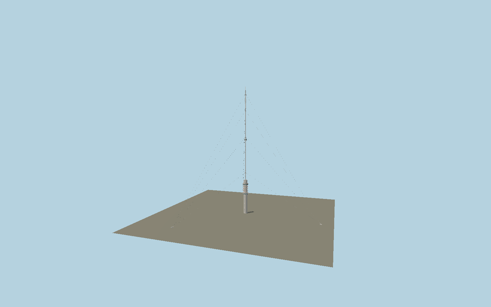

# Gerbrandy Tower

Current hybrid broadcast tower: 100 m concrete shaft, two glazed balcony rings, six open equipment galleries, 2 m steel pipe mast, reportage cabin, individual antenna arrays and twelve guys to the three mapped anchor blocks.

## Identity and geometry

Catalog N0615, [Q778390](https://www.wikidata.org/wiki/Q778390). Current owner Cellnex and fire-system installer Saval give 372 m total, approximately 100 m concrete and a 2 m diameter steel tube. RCE confirms the concrete shaft and two glazed balconies. Contemporary contractor photographs determine balcony rhythm, cabin, arrays and intermediate guy bands. Exact-QID OSM shaft and surveyed connected anchor-block footprints supply independent horizontal geometry.

Center of the exact-QID concrete shaft footprint, Y=0 at local terrain contact. +X east, +Z south; the three unequal mapped guy-anchor vectors determine site orientation; +Y is up. The geographic proposal identifies its anchor and orientation evidence separately from remaining terrain and azimuth uncertainty.

Source facts and measured references are recorded in spec.json. References: [1](https://www.cellnex.com/nl-nl/sections/locaties/), [2](https://www.saval.nl/cases/gerbrandytoren/), [3](https://www.volkerwessels.com/nl/projecten/gerbrandytoren), [4](https://zoek.officielebekendmakingen.nl/blg-216282.pdf), [5](https://monumentenregister.cultureelerfgoed.nl/monumenten/532229), [6](https://radiowereld.nl/medianieuws/2002/12/tuidraden-televisietoren-ijsselstein-vervangen/), [7](https://www.openstreetmap.org/way/54688034). Reference pages and images are not redistributed.

## Original source and shared materials

Geometry is authored in `packages/worldgen/scripts/gerbrandy-tower-model.mjs`. Shared material graphs with metric repeat UV0 and original vertex tints; GLB PBR fallback remains self-contained. No per-model texture duplication. No third-party mesh or photograph is embedded.

140,946 triangles; 267,316 vertices; 3 material groups; 11,317,080 source bytes. Source hash: `sha256:7e2a95aff5e04df38ab7155c2242d79390814e5c959deaeddfb12c1c2d9f4505`. Geometry validation checks finite Float32 coordinates, indices, triangle area and winding before export.

Regenerate with `node packages/worldgen/scripts/generate-heritage-towers.mjs N0615`; add `--check` for reproducibility. The generator refuses to overwrite a master whose hash differs from source.json. Import uses `--no-optimize` to preserve facade recesses.

## Remaining detail and review

- Uses the current operator/installer height of 372 m. The maintenance contractor says 374 m and older map tags say 367 m; these conflicting figures are recorded rather than silently combined.
- Balcony elevations, small antenna count and phase, shaft-window compass phase and guy bands at 122/302/350 m are photographic reconstructions. The 226 m guy band, approximately 220 m cabin, 2 m mast diameter and twelve-guy topology are separately published.
- The 2002 operator statement describes one 309 m cable, 225 m anchor distance and 226 m attachment height. These rounded figures do not form an exact right triangle; model follows the actual mapped anchor positions and photographic attachment bands, with modest illustrative cable sag.
- Three guy foundations share the tower local ground datum across the nearly flat polder. Below-ground concrete, independent generator buildings and seasonal Christmas light strings are excluded from the permanent tower asset.
- Near/far visual QA, shared-material inspection and maximum-fidelity approval remain pending.

Named near/far cameras are included for lit visual review. A valid export is not maximum-fidelity certification.
