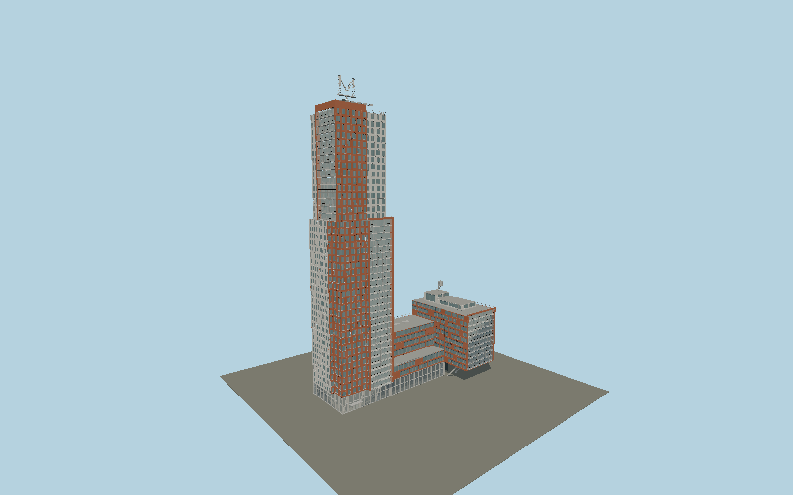

# Montevideo

Rotterdam’s Montevideo: offset brick and pale tower volumes, an upper fifteen-level glazed balcony frame, lower circular windows, a stepped connecting block, the braced quay cantilever, rooftop water-tank sculpture and open lattice M weather vane.

## Evidence and reconstruction

Published dimensions and reconstructed details are separated in spec.json. Primary references:

- [Reference](https://www.mecanoo.nl/Projects/project/33/Montevideo-Residential-Tower?yr=0)
- [Reference](https://www.mecanoo.nl/News/ID/142/M-for-Rotterdam--10-years-of-Montevideo)
- [Reference](https://abt.eu/en/projects/montevideo/)
- [Reference](https://www.besix.com/en/projects/montevideo-tower)
- [Reference](https://vaneerdenconstructieadvies.nl/wp-content/uploads/2021/02/Montevideo-BMS.pdf)
- [Reference](https://www.skyscrapercenter.com/building/montevideo/5382)
- [Reference](https://api.3dbag.nl/collections/pand/items/NL.IMBAG.Pand.0599100000750601)
- [Reference](https://docs.3dbag.nl/en/copyright/)
- [Reference](https://www.openstreetmap.org/way/26545811)

No third-party geometry, photograph or bitmap texture is embedded. Shared surface graphs come from the central library; vertex tints carry model colors. Glazing uses PBR materials; transparent surfaces are declared per model.

## Model and axes

493,066 triangles; 982,340 vertices; 7 material groups; 41,285,012 bytes. Native bounds: -46.085, 0.000, -21.985 to 46.000, 152.317, 21.960. Source hash: `sha256:d81f191ad09fb5ecc6d550b879b931a8a0a6a6f70c22bd53769f0b630d700066`.

{"up":"+Y","longitudinal":"+X northeast along the quay","front":"+Z southeast toward the water","origin":"BAG plan envelope center; Y0 is terrain contact."}

The geographic proposal uses exact-QID OpenStreetMap evidence. Map-derived orientation and estimated architectural details require real-site visual review; preview eligibility is distinct from geographic/fidelity approval. Map attribution: © OpenStreetMap contributors, ODbL-1.0.

## Reproduce

Run `node packages/worldgen/scripts/generate-signature-towers.mjs --ids=N0619` (or add `--check`). The generator preserves manually edited masters by checking their baseline hashes. Import through the standard authored-model workflow with optimization disabled; then capture all QA cameras, including shared-surface views.

## Pending work

- Maximum-fidelity approval requires measured facade and floor schedules, exact pale-panel composition, current window arrangements, loggia depths and roof-equipment/sculpture dimensions. Photo-derived modules and the 43/44-level convention remain explicit approximations.
- 3DBAG LoD2.2 roof evidence has 2.20 m RMSE; roof boundaries are regularized. The 152.317 m tip is established independently from the roof survey.
- Interior fit-out, underground parking, the surrounding quay, moored vessels and adjacent buildings are outside this exterior model. Balcony and entrance glazing is transparent; ordinary windows use opaque reflective PBR.
- Geographic approval requires actual terrain and quay contact, signed facade alignment and scene-level attribution verification. Footprint overlay captures alone do not establish those conditions.

This bundle contains source geometry, not a claim of maximum-fidelity completion. Hash-bound visual acceptance is recorded separately after capture inspection.

## Additional geographic data

© 3DBAG by tudelft3d and 3DGI, [CC BY 4.0](https://docs.3dbag.nl/en/copyright/). The source bundle retains the 2022 CityJSON response and coordinate operation. Molen regularizes roof and facade geometry and authors original architectural details. This is a reconstruction, not a survey or an endorsement.
