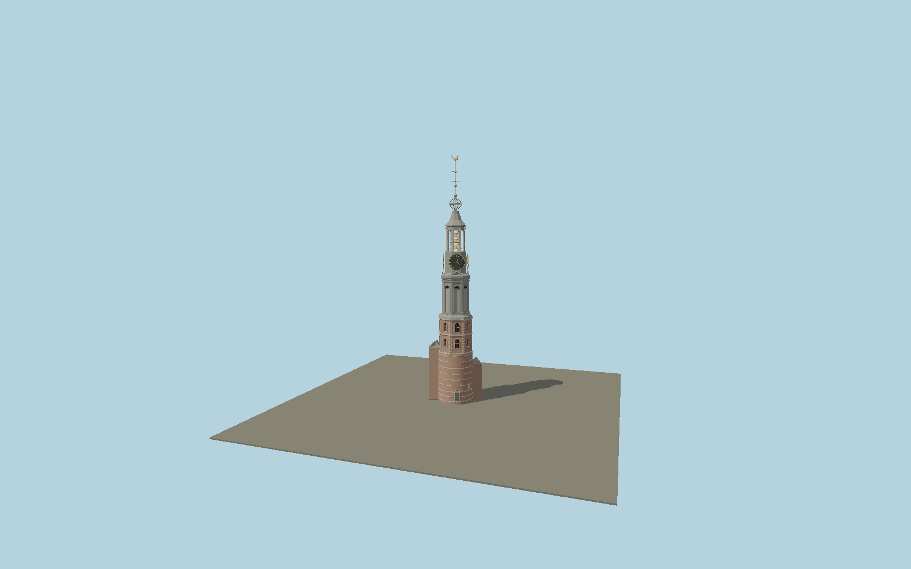

# Munttoren

Amsterdam’s surviving round gate tower with pale stone courses, upper octagonal brick stage, lead-clad Renaissance arches, four gilt clocks, an open carillon lantern, slender roof, open orb and gilded weathercock. Two mapped narrow lower projections retain the real asymmetric plan.

## Identity and geometry

Catalog N0585, [Q1429748](https://www.wikidata.org/wiki/Q1429748). The Amsterdam Bureau of Monuments and Archaeology report reproduces Dik de Roon’s measured sections/elevation with a 10 m scale on page 126. Its proportions are combined with the 41 m finial height recorded by the monument researcher, original current photographs and concentric mapped octagonal parts. Legacy OSM part heights omit the upper finial and do not set the overall elevation.

Concentric mapped octagonal tower center, pavement Y=0; the separate nineteenth-century guard house is outside this tower asset. Clock frame follows the mapped octagonal parts; +X follows the southeast projection and −X the northwest stair projection; +Y is up. The geographic proposal identifies its anchor and orientation evidence separately from remaining terrain and azimuth uncertainty.

Source facts and measured references are recorded in spec.json. References: [1](https://pure.uva.nl/ws/files/2809631/178913_Historisch_hout_in_Amsterdamse_monumenten.pdf), [2](https://amsterdam-monumentenstad.nl/database/grachtenboek_objecten.php?id=3085), [3](https://amsterdam-monumentenstad.nl/database/pics/3/20200902-8.jpg), [4](https://amsterdam-monumentenstad.nl/database/uploads/3/20200902-11.jpg), [5](https://amsterdam-monumentenstad.nl/database/uploads/3/20200902-12.jpg), [6](https://amsterdam-monumentenstad.nl/database/uploads/3/munttoren-tek.jpg), [7](https://www.amsterdam.nl/stadsarchief/stukken/grachten-torens/munttoren/), [8](https://www.openstreetmap.org/way/57862728). Reference pages and images are not redistributed.

## Original source and shared materials

Geometry is authored in `packages/worldgen/scripts/heritage-towers-580-models.mjs`. Shared material graphs with metric repeat UV0 and original vertex tints; GLB PBR fallback remains self-contained. No per-model texture duplication. No third-party mesh or photograph is embedded.

58,509 triangles; 116,399 vertices; 6 material groups; 4,896,084 source bytes. Source hash: `sha256:98d1051803b19c3eec7012c054dce862fad6d940efe0497607f8d590e412e9c5`. Geometry validation checks finite Float32 coordinates, indices, triangle area and winding before export.

Regenerate with `node packages/worldgen/scripts/generate-heritage-towers.mjs N0585`; add `--check` for reproducibility. The generator refuses to overwrite a master whose hash differs from source.json. Import uses `--no-optimize` to preserve facade recesses.

## Remaining detail and review

- The measured municipal drawing establishes main proportions; individually weathered masonry, tiny clock lettering and lead seams are represented by original geometric detail and shared metric materials.
- Open visible carillon bells are modeled; hidden clockwork and occupied internal rooms are outside this exterior asset.
- Near/far visual QA, shared-material inspection and maximum-fidelity approval remain pending.

Named near/far cameras are included for lit visual review. A valid export is not maximum-fidelity certification.
