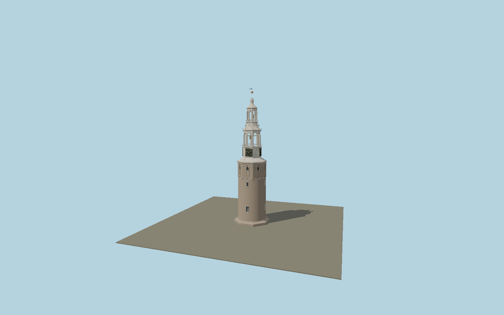

# Montelbaanstoren

Amsterdam’s round brick defensive tower with broad 1610 foot, octagonal upper masonry, four black-and-gold Roman clock faces, two genuinely open lead-clad timber stages, bells, balustrades, curved Renaissance scrolls and slender crown/finial.

## Identity and geometry

Catalog N0622, [Q1946061](https://www.wikidata.org/wiki/Q1946061). The municipal measured section’s 0–10 m bar gives approximately 42.05 m above its ground line. AHN4 surface peak 43.5 m NAP and nearby pavement around 2.02 m NAP independently support a roughly 42 m exterior, but raster sampling can miss the narrow finial. The catalog’s 48 m historical figure is retained as conflicting evidence, not silently used to stretch the drawing.

Tower axis at surrounding pavement; foundations below street level excluded. +Z is the provisional principal clock/window face; signed site orientation pending; +Y is up. The geographic proposal identifies its anchor and orientation evidence separately from remaining terrain and azimuth uncertainty.

Source facts and measured references are recorded in spec.json. References: [1](https://monumentenregister.cultureelerfgoed.nl/monumenten/4025), [2](https://www.amsterdam.nl/stadsarchief/stukken/grachten-torens/montelbaanstoren/), [3](https://pure.uva.nl/ws/files/2809631/178913_Historisch_hout_in_Amsterdamse_monumenten.pdf), [4](https://www.amsterdam-monumentenstad.nl/database/grachtenboek_objecten.php?id=5391), [5](https://service.pdok.nl/rws/actueel-hoogtebestand-nederland/wcs/v1_0?SERVICE=WCS&REQUEST=GetCapabilities), [6](https://www.openstreetmap.org/way/57864086). Reference pages and images are not redistributed.

## Original source and shared materials

Geometry is authored in `packages/worldgen/scripts/montelbaanstoren-model.mjs`. Shared material graphs with metric repeat UV0 and original vertex tints; GLB PBR fallback remains self-contained. No per-model texture duplication. No third-party mesh or photograph is embedded.

123,692 triangles; 242,248 vertices; 5 material groups; 10,208,500 source bytes. Source hash: `sha256:05dce3adc1f5a954268c16e586be94b49d5c569879b5fb1b5ab33c4f382f38de`. Geometry validation checks finite Float32 coordinates, indices, triangle area and winding before export.

Regenerate with `node packages/worldgen/scripts/generate-heritage-towers.mjs N0622`; add `--check` for reproducibility. The generator refuses to overwrite a master whose hash differs from source.json. Import uses `--no-optimize` to preserve facade recesses.

## Remaining detail and review

- Initial measured-section reconstruction; not approved for maximum fidelity or geographic placement.
- Fine window distribution, masonry repairs, stone cross-frames, lead seams, corner scrolls and crown profiles require additional facade comparison. Details are original reconstructions within the section envelope.
- The 48 m historical height discrepancy remains documented; 42.05 m is an explicit section-derived working scale, not a new survey measurement.
- Clock hands are a static 10:10 illustration; working mechanisms, inaccessible internal framing, buried foundations and the surrounding quay are excluded.
- Near/far visual QA, shared-material inspection and maximum-fidelity approval remain pending.

Named near/far cameras are included for lit visual review. A valid export is not maximum-fidelity certification.
