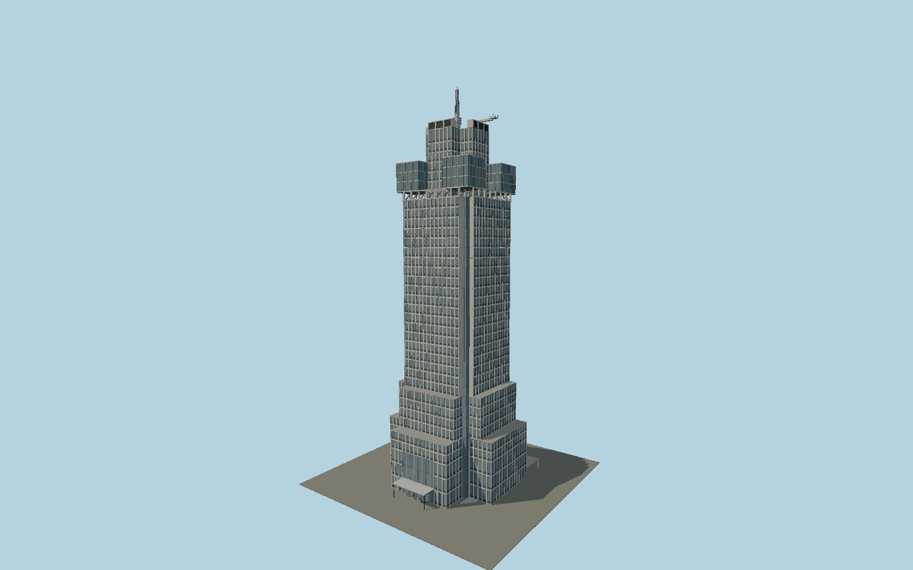

# Rembrandt Tower

Amsterdam’s granite-clad Rembrandt Tower: stepped cross-shaped podium, fourteen-bay facades with deeply recessed glazed corners, seven-bay open crown galleries, four glazed corner towers, a cross-shaped mechanical cap, ringed beacon and parked maintenance crane. The southern entrance has three revolving doors and a projecting canopy.

## Evidence and reconstruction

Published dimensions and reconstructed details are separated in spec.json. Primary references:

- [Reference](https://www.zzdp.nl/nl/project/de-omval)
- [Reference](https://arcam.nl/architectuur-gids/rembrandttoren/)
- [Reference](https://www.rembrandttower.nl/nl/)
- [Reference](https://repository.tudelft.nl/file/File_22b7fccf-7ca6-4d29-aa2d-6d47cf923d6c)
- [Reference](https://api.3dbag.nl/collections/pand/items/NL.IMBAG.Pand.0363100012113758)
- [Reference](https://docs.3dbag.nl/en/copyright/)
- [Reference](https://www.openstreetmap.org/way/44451577)

No third-party geometry, photograph or bitmap texture is embedded. Shared surface graphs come from the central library; vertex tints carry model colors. Glazing uses PBR materials; transparent surfaces are declared per model.

## Model and axes

641,134 triangles; 1,280,028 vertices; 8 material groups; 53,779,084 bytes. Native bounds: -23.660, 0.000, -23.920 to 24.380, 150.000, 29.500. Source hash: `sha256:e338bb2296879f88c91fd591cd616757b9859e17bc0d69790f4218a530f165a7`.

{"up":"+Y","longitudinal":"+X east-northeast along the BAG rear wall","front":"+Z south-southeast toward the entrance square","origin":"Center of the BAG ground-envelope rectangle; Y0 uses terrain contact. The upper shaft is offset0.36m east and0.10m south in this frame."}

The geographic proposal uses exact-QID OpenStreetMap evidence. Map-derived orientation and estimated architectural details require real-site visual review; preview eligibility is distinct from geographic/fidelity approval. Map attribution: © OpenStreetMap contributors, ODbL-1.0.

## Reproduce

Run `node packages/worldgen/scripts/generate-signature-towers.mjs --ids=N0623` (or add `--check`). The generator preserves manually edited masters by checking their baseline hashes. Import through the standard authored-model workflow with optimization disabled; then capture all QA cameras, including shared-surface views.

## Pending work

- Facade dimensions, storey elevations, podium returns, roof parapets, canopy and maintenance equipment require measured drawings and current site comparison before maximum-fidelity approval. The35/36storey source discrepancy is retained.
- 3DBAG roof mesh reports1.10mRMSE and validation flags104/203. Its reconstructed maximum differs from its roof attribute; the published150mtip is modeled independently of the noisy survey extrema.
- Glazing uses reflective opaque PBR except the transparent entrance cylinders. Interior fit-out, basement, neighboring towers and mobile street furniture are outside this exterior asset.
- The southern orientation is supported by Arcam and the retained footprint. Precise sidewalk contact, canopy projection and scene-level attribution display remain to be verified in the actual geographic viewer.

This bundle contains source geometry, not a claim of maximum-fidelity completion. Hash-bound visual acceptance is recorded separately after capture inspection.

## Additional geographic data

© 3DBAG by tudelft3d and 3DGI, [CC BY4.0](https://docs.3dbag.nl/en/copyright/). The source bundle retains the2023 CityJSON response, converted footprint, roof measurements and coordinate operation. Molen regularizes architectural modules and roof levels and authors new facade geometry; it does not claim a surveyed reconstruction. Identity evidence: © OpenStreetMap contributors, ODbL1.0.
