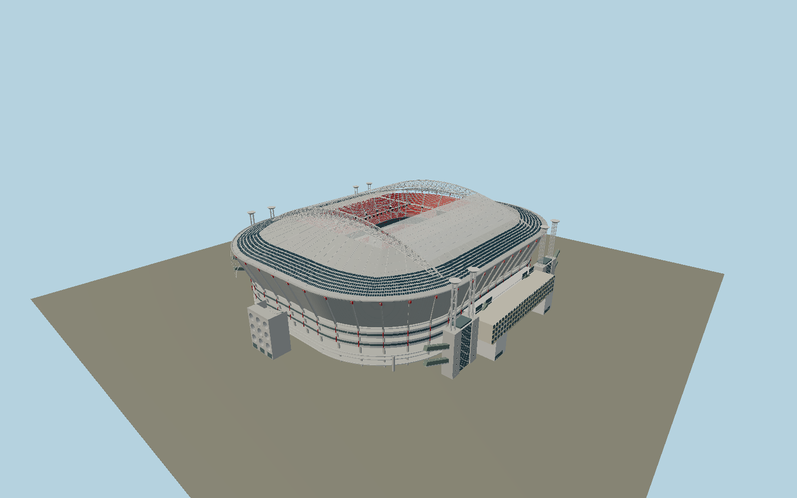

# Johan Cruyff Arena — N0699

Amsterdam stadium in open-roof configuration: twin177m transverse triangular arches,118m separation, four paired dish-topped support towers, suspended50-girder roof, parked transparent sliding panels, roof solar fields, two red Ajax seating tiers, nine-hole end staircases, laced concrete cores, raised10.5m pitch above open Stramanweg portals, gold/silver west entrance and completed east-only diamond ETFE expansion with oval tower cutouts.

## Identity and evidence

Exact catalog identity **Q207109**. Source facts: `{"published":"Operator:78m maximum height, pitch10.5m above street,4200 solar panels,15 escalators and55,000+seats. Iv roof designer gives71x107m operating opening. Arcadis/TU Delft original structure description gives50 secondary girders and50 concrete frames,11m CHS portal supports and37x118m sliding panels. Original appendixed drawings give177m arch span and118m panel/arch separation. PPHP and Ballast Nedam document east ETFE expansion, original nine-hole stairs, gold/silver entrance and2007–12 eight-floor west addition.","reconstructed":"Pitch direction/anchor from exact OSM way57853514, outer footprint way57853253 and relation1458682. This mapped grass envelope112.36x74.52m includes pitch margins; play markings remain105x68m. Current roof/bowl sections use the published original section plus current red seats and east expansion photographs. Member profiles, tower dish heights, solar-module arrangement, row inventory and façade sub-divisions are reconstructed. Original sheet drawings are used only for the existing H-frame, not the thesis proposed replacement roof."}`. The source specification keeps published dimensions separate from reconstructed details.

- https://www.johancruijffarena.nl/en/discover-the-arena/school-presentation/
- https://www.iv.nl/en/projects/design-and-life-extension-of-the-roof-and-retractable-roof-structure-of-the-johan-cruijff-arena/
- https://books.scia.net/scia-contest-2005/96/
- https://repository.tudelft.nl/file/File_d6e9789b-e7ae-48b8-b19d-cb58e5a5d889
- https://www.ballast-nedam.com/what-we-do/projects/2020/johan-cruijff-arena
- https://pphp.nl/project/amsterdam-arena/
- https://pphp.nl/project/entreegebouw-amsterdam-arena/
- https://pphp.nl/project/hoofdgebouw-amsterdam-arena/
- https://arcam.nl/architectuur-gids/johan-cruijff-arena/
- https://group.vattenfall.com/nl/newsroom/archive/nieuws/2014/eerste-zonnepanelen-op-dak-amsterdam-arena
- https://www.nationalestaalprijs.nl/sites/default/files/Meint%20Smith/Johan%20Cruijff%20ArenA%202020_0.pdf
- https://www.openstreetmap.org/relation/1458682
- https://www.openstreetmap.org/way/57853514

Original geometry, no reference photos or drawings embedded. Primary research stays under source-owner rights. OSM coordinates carry OpenStreetMap contributor attribution, ODbL1.0.

## Authored geometry and materials

1,267,214 triangles, 2,455,320 vertices, 7 surface groups; 101,146,700 source bytes. SHA-256: `sha256:80ce76988e90dcf8d88be93f9fb9b08d6b82bb4f2be5a2034ef9a8876bf933cd`. Actual bounds: -102.020, -0.104, -128.165 to 112.270, 78.030, 128.165 m.

Shared canonical material graphs with metric UV repeats in extras.molenSurface; portable glTF PBR factors and vertex colors remain. Dark recesses/lantern panels retain local fallback materials. Shared references: `matgraph:molen.worldgen.material.etfe_film` (2 × 2 m), `matgraph:molen.worldgen.material.metal_painted` (2 × 2 m), `matgraph:molen.worldgen.material.concrete_plain` (2 × 2 m). Model-native axes: {"up":"+Y","front":"+Z","origin":"Exact mapped pitch center. +Z northwest/north end, +X southwest/main entrance. Street contactY0; operator-published pitchY10.5."}.

## Placement proposal

Directed pitch fixes northwest north end, southwest main entrance and northeast ETFE façade. Distinct west portal resolves180-degree ambiguity. The operator10.5m pitch elevation is authored above streetY0, leaving the underlying road passage open; no terrain cutout is required. Cached outer footprint predates east expansion, represented as a modest upper façade projection. Proposed anchor 4.941796457468165, 52.31432905254159 (longitude, latitude), heading -2.633624986845313 radians. Elevation policy: **terrain-contact**. See qa.json for the geographic review status and scope; this placement proposal does not claim surveyed site accuracy. Native ground and pitch datums follow the individual geographic proposal; depressed bowls require their declared terrain cutout.

## Limitations and review

- Current permanent exterior with roof parked open, no operating roof animation. Sections, glazing subdivisions, seat inventory, photovoltaics layout and structural profiles are photograph reconstructions.2026 tower paint maintenance is temporary and omitted. Independent Rainbow Offices and neighboring shopping blocks are separate map buildings. No enclosed rooms, crowds, event rigging or photographic branding.

Portable review uses a flat ground contact fixture.

Near/far fixtures are in `spec.qaCameras`. Float32 finite geometry, triangle degeneracy and winding are checked by the generator. The hash-bound qa.json and capture reports record the scope and status of rendering, shared-material, exterior-fidelity and geographic reviews.

Regenerate with `node packages/worldgen/scripts/generate-stadium-models.mjs --ids=N0699`; add `--check` for reproducibility. Editable component recipes are registered by the imports and study list in `packages/worldgen/scripts/generate-stadium-models.mjs`. The generator protects artist-edited master hashes and preserves import/capture/shared-capture/QA documents.
