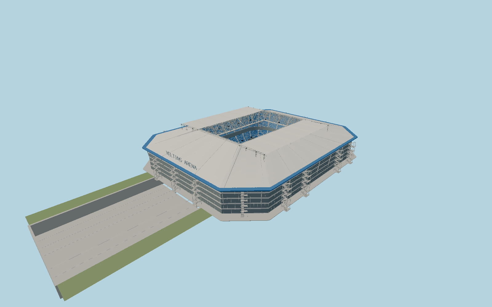

# Arena AufSchalke — N0688

Schalke’s blue-edged glazed arena, circular-tube space roof with two parked sliding halves, giant central four-screen cube, two blue spectator tiers, exterior stair cages, asymmetric western entry and southern sliding-pitch channel.

## Identity and evidence

Exact catalog identity **Q150961**. Source facts: `{"basis":"The roof fabricator SEH gives 226×186m, round tubular trusses and movable halves. HPP’s published project sheet gives 225×187×53.5m; the city brochure independently confirms 53.5m above the concrete floor. Operator documentation establishes twelve movable membrane fields, 118×79m pitch tray and 10.6×7.2m video screens. Original roof and facade geometry follows eight inspected operator/fabricator/chamber photographs. The 10.7m concourse-to-field level and smaller member/stair dimensions are reconstructed from the exterior profile; the roof envelope is centered independently of the asymmetric west entry."}`. The source specification keeps published dimensions separate from reconstructed details.

- https://seh-engineering.de/referenzen/veltins-arena-gelsenkirchen
- https://www.baukunst-nrw.de/objekte/125-veltins-arena-arena-auf-schalke
- https://veltins-arena.de/veltins-arena/zahlen-und-fakten/
- https://schalke04.de/veltins-arena/s04-erneuert-dach-membranen-der-veltins-arena/
- https://www.baukunst-nrw.de/objekte/125-veltins-arena-arena-auf-schalke
- https://www.gelsenkirchen.de/de/stadtprofil/stadtthemen/freizeit_und_kultur/_doc/Gelsenkirchen_entdecken.pdf
- https://cdn-s-www.dna.fr/pdf/7d9f37f6-6fc1-433c-8c79-9705f05f29f7/la-presentation-des-candidats-retenus.pdf
- https://www.openstreetmap.org/way/147192563
- https://www.openstreetmap.org/way/331441037

Original authored geometry; public photographs and project dimensions are architectural evidence only. No photographic pixels or downloaded model are embedded. Mapped outline and pitch route are © OpenStreetMap contributors, ODbL1.0.

## Authored geometry and materials

865,090 triangles, 1,667,820 vertices, 7 surface groups; 70,426,616 source bytes. SHA-256: `sha256:69acad6855a376d2bd3bfc80f10191a7845484994e097ac04d5cc09587d00ea7`. Actual bounds: -108.000, -11.700, -120.400 to 101.400, 43.170, 232.000 m.

Shared canonical material graphs with metric UV repeats in extras.molenSurface; portable glTF PBR factors and vertex colors remain. Dark recesses/lantern panels retain local fallback materials. Shared references: `matgraph:molen.worldgen.material.membrane` (4 × 4 m), `matgraph:molen.worldgen.material.metal_standing_seam` (2.5 × 3 m), `matgraph:molen.worldgen.material.metal_painted` (2 × 2 m), `matgraph:molen.worldgen.material.concrete_plain` (2 × 2 m). Model-native axes: {"up":"+Y","front":"+Z","origin":"Center of the published roof envelope; +Z points southwest along the mapped pitch rollout route. Native Y0 is the public concourse; field Y−10.7 is a photo-reconstructed level below it."}.

## Placement proposal

The exact stadium footprint and southwest pitch parking polygon establish identity, anchor and directed axis. The main roof center removes the offset caused by the asymmetric western entrance. Native +Z follows the southwest route; native −X is the western hospitality/entry side. The static football configuration has the pitch inside and roof halves parked open. Proposed anchor 7.067601615603831, 51.55459927970328 (longitude, latitude), heading -0.720148292643355 radians. Elevation policy: **terrain-contact**. See qa.json for the geographic review status and scope; this placement proposal does not claim surveyed site accuracy. Native ground and pitch datums follow the individual geographic proposal; depressed bowls require their declared terrain cutout.

## Limitations and review

- Static open-roof football configuration, with no animated hydraulics. Member diameters, minor roof subdivisions, stair details, glazing divisions, seat distribution and local grade profile are photographic reconstructions. The 10.7m public-concourse offset is reconstructed rather than surveyed. Current advertising and transient screen content are omitted; no enclosed room inventory or exact fabrication bolt certification is claimed.

The asset review has no artificial ground plane: the field and pitch rollout channel lie below the public concourse. Geographic review uses the explicit terrain cutout.

Near/far fixtures are in `spec.qaCameras`. Float32 finite geometry, triangle degeneracy and winding are checked by the generator. The hash-bound qa.json and capture reports record the scope and status of rendering, shared-material, exterior-fidelity and geographic reviews.

Regenerate with `node packages/worldgen/scripts/generate-stadium-models.mjs --ids=N0688`; add `--check` for reproducibility. Editable component recipes are registered by the imports and study list in `packages/worldgen/scripts/generate-stadium-models.mjs`. The generator protects artist-edited master hashes and preserves import/capture/shared-capture/QA documents.
