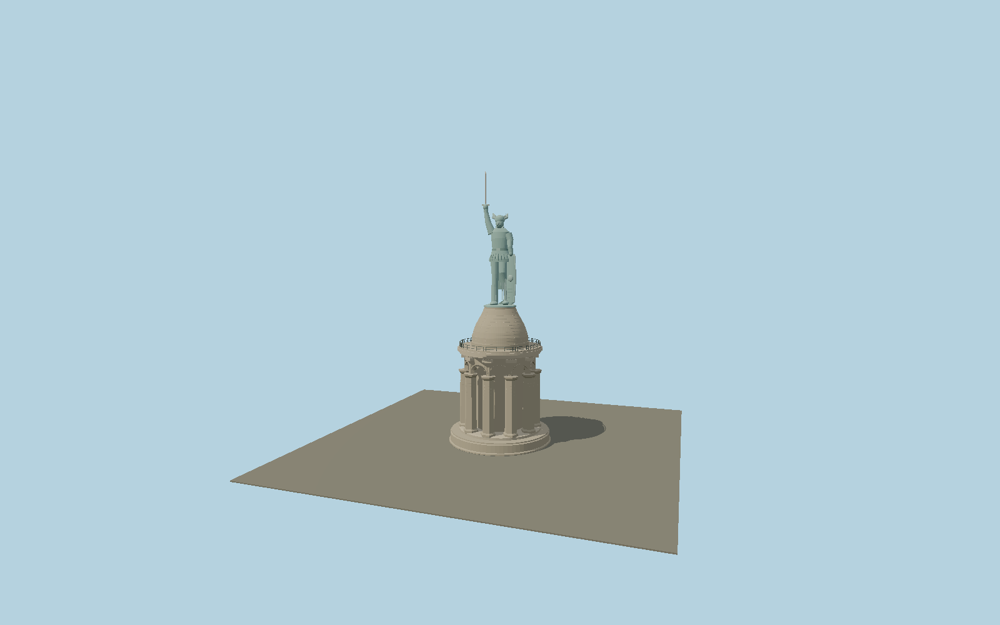

# Hermannsdenkmal

The ten-pier Osning sandstone monument with open round arcade, circular viewing gallery, masonry cupola and a fully modeled copper Arminius: winged helmet, folded cape, raised sword, bent leg, long shield and broken Roman standards.

## Identity and geometry

Catalog N0571, [Q664245](https://www.wikidata.org/wiki/Q664245). The operator publishes the complete vertical dimension chain and a historical construction elevation/plan. Concentric mapped foundation, arcade and cupola outlines constrain their diameters. Current operator photographs determine statue pose, folded clothing, winged helmet, shield and sandstone/copper colors; the western facing is explicitly described by the regional cultural authority.

Center of the mapped circular ground plinth, Y=0 at the lower sandstone foundation. +Z faces west, as the statue and raised sword do in the published regional account; +Y is up. The geographic proposal identifies its anchor and orientation evidence separately from remaining terrain and azimuth uncertainty.

Source facts and measured references are recorded in spec.json. References: [1](https://www.hermannsdenkmal.de/wissenswertes/zahlen-und-fakten/), [2](https://www.hermannsdenkmal.de/wp-content/uploads/sites/4/2023/04/Flyer-HD-Fremdsprachen-2023.pdf), [3](https://www.hermannsdenkmal.de/wp-content/uploads/sites/4/2017/05/hermannsdenkmal_historie_skizze.jpg), [4](https://www.westfalen-regional.de/de/hermann_externsteine/), [5](https://www.openstreetmap.org/way/207366382). Reference pages and images are not redistributed.

## Original source and shared materials

Geometry is authored in `packages/worldgen/scripts/final-heritage-tower-models.mjs`. Shared material graphs with metric repeat UV0 and original vertex tints; GLB PBR fallback remains self-contained. No per-model texture duplication. No third-party mesh or photograph is embedded.

46,316 triangles; 96,276 vertices; 2 material groups; 4,023,692 source bytes. Source hash: `sha256:15d47b3b543a15af1678d3e1568b4751ee492ec0f7d0a3d4fa69e72bb57e30f2`. Geometry validation checks finite Float32 coordinates, indices, triangle area and winding before export.

Regenerate with `node packages/worldgen/scripts/generate-heritage-towers.mjs N0571`; add `--check` for reproducibility. The generator refuses to overwrite a master whose hash differs from source.json. Import uses `--no-optimize` to preserve facade recesses.

## Remaining detail and review

- The copper figure is an original detailed polygonal reconstruction of the published silhouette, pose, clothing and attributes rather than a scan of the sculpture. Shield text and sword inscription are represented by shallow relief fields without fabricated readable lettering.
- Stone course rhythm and minor carved capitals are reconstructed from the operator photographs; the main ten-pier construction and all published vertical dimensions are retained.
- Near/far visual QA, shared-material inspection and maximum-fidelity approval remain pending.

Named near/far cameras are included for lit visual review. A valid export is not maximum-fidelity certification.
