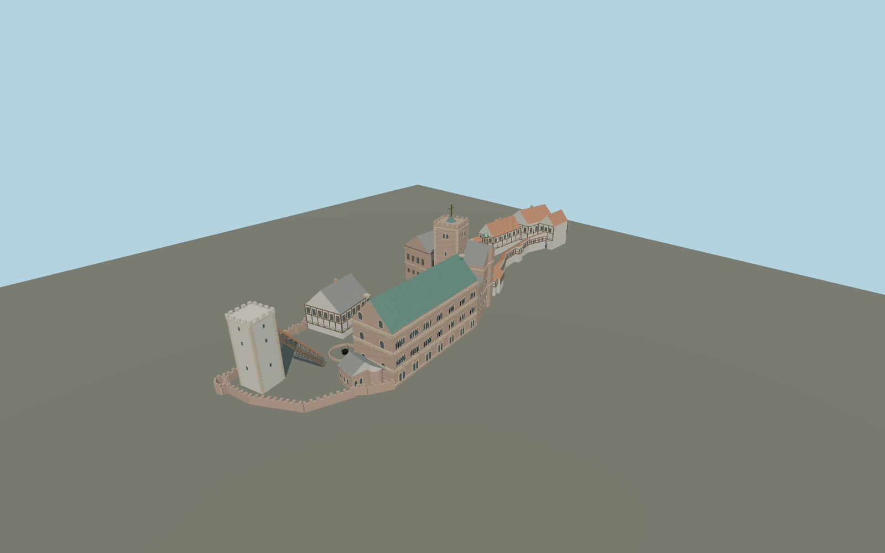

# Wartburg

The long two-court Wartburg complex: Romanesque Palas with green copper roof and grouped round-arched windows; sandstone Bergfried and gilded cross; white South Tower; half-timbered Gadem, Vogtei and Ritterhaus; bent covered galleries, open gate passages, Neue Kemenate and Ritterbad.

## Evidence and reconstruction

Published dimensions and reconstructed details are separated in spec.json. Primary references:

- [Reference](https://www.openstreetmap.org/node/2272817622)
- [Reference](https://www.wartburg.de/lageplan)
- [Reference](https://www.wartburg.de/gebaeude/bergfried)
- [Reference](https://www.wartburg.de/objekt-des-monats-archiv/das-kreuz-auf-dem-bergfried)
- [Reference](https://commons.wikimedia.org/wiki/File:Wartburg-Courtyard.01.JPG)
- [Reference](https://commons.wikimedia.org/wiki/File:Eisenach_Wartburg_18.JPG)
- [Reference](https://commons.wikimedia.org/wiki/File:Eisenach_Wartburg_17.jpg)
- [Reference](https://commons.wikimedia.org/wiki/File:Wartburg_Vogtei.jpg)

No third-party geometry, photograph or bitmap texture is embedded. Shared surface graphs come from the central library; vertex tints carry model colors. Glazing uses PBR materials; transparent surfaces are declared per model.

## Model and axes

227,673 triangles; 446,281 vertices; 10 material groups; 18,803,828 bytes. Native bounds: -60.471, -0.065, -31.194 to 91.585, 34.000, 25.458. Source hash: `sha256:573bd5f665c287318d5bc4323cdfdba84ca83ffc8cb37f4139dd2bfe4e2e6372`.

{"up":"+Y","longitudinal":"+X from Suedturm toward Torhaus (north)","front":"+Z toward eastern Palas exterior","origin":"Exact OSM Q151545 point, provisional terrain-contact datum"}

Draft geographic registration from a signed source-local frame. Terrain fit remains pending; no automatic footprint replacement.

## Reproduce

Run `node packages/worldgen/scripts/generate-signature-towers.mjs --ids=N0241` (or add `--check`). The generator preserves manually edited masters by checking their baseline hashes. Import through the standard authored-model workflow with optimization disabled; then capture all QA cameras, including shared-surface views.

## Pending work

- Maximum fidelity remains pending: exterior reconstruction is not surveyed as-built geometry. Heights, stair elevations, roof junctions, window spacing and weathering require more source comparison.
- Palas heraldic lions and carved capitals, precise Gothic oriel tracery and roof dormers are incomplete. No sculpture is claimed as a faithful individual reproduction.
- The keep height is deliberately provisional because OSM height tags disagree with the owner description. Cross is 3.8 m; ground and parapet datums need measurement.
- Vogtei roof is represented as a gable instead of its exact half-hip profile. Gadem roof intersections and covered South Tower stair attachment need further review.
- No interiors, landscape hill, trees, temporary works or photographic textures. Open courtyard voids are preserved.
- Shared sandstone, raw limestone, plaster, timber, slate, tile, copper, painted metal and gold-colored stainless graphs; local PBR glazing.

This bundle contains source geometry, not a claim of maximum-fidelity completion. Hash-bound visual acceptance is recorded separately after capture inspection.

## Additional geographic data

Map geometry © OpenStreetMap contributors, ODbL-1.0. Photographs and official plan linked as references only; no copied photographic textures or third-party mesh.
