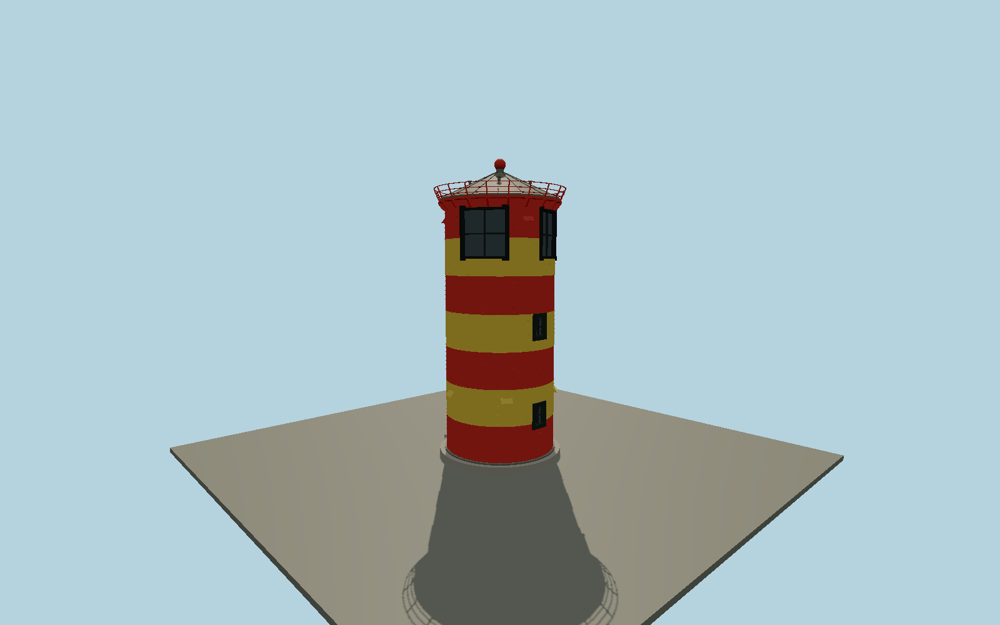

# Pilsum Lighthouse — N0675

Seven horizontal red/yellow steel bands on a cylindrical sector lighthouse; riveted plate joints, north-northeast entrance, small barred rear windows, two broad black-framed sector windows, projecting ventilation hoods, outward leaning roof-edge railing, dark copper cone roof with mushroom vents, red ventilator ball and lightning rod.

## Identity and evidence

Exact catalog identity **Q539709**. Source facts: `{"heritageApproxStructureHeightMeters":12,"modelRoofBallTopMeters":11.92,"modelLightningTopMeters":12.45,"photoApproxShaftDiameterMeters":4.4,"bandCount":7,"rejectedMapHeightMeters":65.3,"basis":"Lower Saxony heritage authority states approximately12m and three storeys, and supplies a clear current exterior photograph. Local tourism quotes approximately11m; the heritage-specific architectural description controls this model. Photo proportions and commonly documented4.4m shaft width govern component scale, while OSM5.2m footprint includes the foundation. The65.3m OSMheight belongs to a different tower and is rejected."}`. The source specification keeps published dimensions separate from reconstructed details.

- https://denkmalatlas.niedersachsen.de/viewer/metadata/34661935/1/-/
- https://denkmalatlas.niedersachsen.de/viewer/rest/image/5e90d7a0-32d9-4dde-b4b6-ad7746d07939/52319607.jpeg/full/!1800,1800/0/default.jpg
- https://www.greetsiel.de/ferienregion-krummhoern/pilsumer-leuchtturm
- https://www.greetsiel.de/fileadmin/_processed_/6/d/csm_Foto_13.05.20__19_26_51_3cb923bae1.jpg
- https://www.openstreetmap.org/way/243297523
- https://www.openstreetmap.org/node/8949335764

Original geometry and shared procedural materials. Official photographs are research references only; no reference imagery or third-party mesh is embedded or redistributed.

## Authored geometry and materials

67,226 triangles, 156,654 vertices, 4 surface groups; 6,449,060 source bytes. SHA-256: `sha256:983b206dc81f708b080cd1dcc909c8c88e2f047b975994f1af3952d5ac9f27f0`. Actual bounds: -2.630, 0.000, -2.630 to 2.630, 12.450, 2.960 m.

Shared canonical material graphs with metric UV repeats in extras.molenSurface; portable glTF PBR factors and vertex colors remain. Dark recesses/lantern panels retain local fallback materials. Shared references: `matgraph:molen.worldgen.material.brick` (1.92 × 0.9 m), `matgraph:molen.worldgen.material.metal_painted` (2 × 2 m), `matgraph:molen.worldgen.material.stone_granite` (2 × 2 m). Model-native axes: {"up":"+Y","front":"+Z","origin":"Authored main tower center at local base level; attached ensembles are offset from this origin."}.

## Placement proposal

Exact-QIDcircleway243297523 fixes the tower center; surveyed main-entrance node8949335764 and two-stepway967353310 fix the native+Z entrance bearing north-northeast. Ground plane is the top of the dyke, with only the immediate circular plinth/door steps included. Optical window sectors are photograph-reconstructed on the seaward face; no claim of preserving historic navigational bearings. Proposed anchor 7.045705623, 53.497985478 (longitude, latitude), heading 2.7044851587053764 radians. Elevation policy: **terrain-contact**. This is a reviewable proposal, not a completed site-fit certification. Ground models require terrain contact; offshore models also require water-datum and base-height checks.

## Limitations and review

- The modeled exterior follows the cited published facts and inspected photographs. Unpublished dimensions and local fittings are explicitly photo-proportioned; no claim of engineering survey accuracy is made.
- Portable PBR and shared metric surfaces are provided. Surface weathering, material color under local lighting and fine facade relief require close render review before maximum-detail acceptance.
- The heritage height is approximate and the lightning rod extends above the modeled roof/ventilator; minor window, hood, rivet and roof-vent dimensions are photo-derived. Shaft diameter and foundation are not survey measurements. Current red/yellow daymark and dark metal roof follow heritage/tourism photographs; transient scaffolding and graffiti are excluded. The separate love-lock structure and dyke terrain belong to map context.

Near/far fixtures are in `spec.qaCameras`. Float32 finite geometry, triangle degeneracy and winding are checked by the generator. Current rendering, shared-material, maximum-fidelity and geographic review results are recorded in `qa.json` and the readiness ledger; source generation alone does not approve a model.

Regenerate with `node packages/worldgen/scripts/generate-lighthouse-models.mjs --ids=N0675`; add `--check` for reproducibility. Editable component recipes are in `packages/worldgen/scripts/lighthouse-baltic-next-models.mjs`. The generator protects artist-edited master hashes and preserves import/capture/shared-capture/QA documents.
