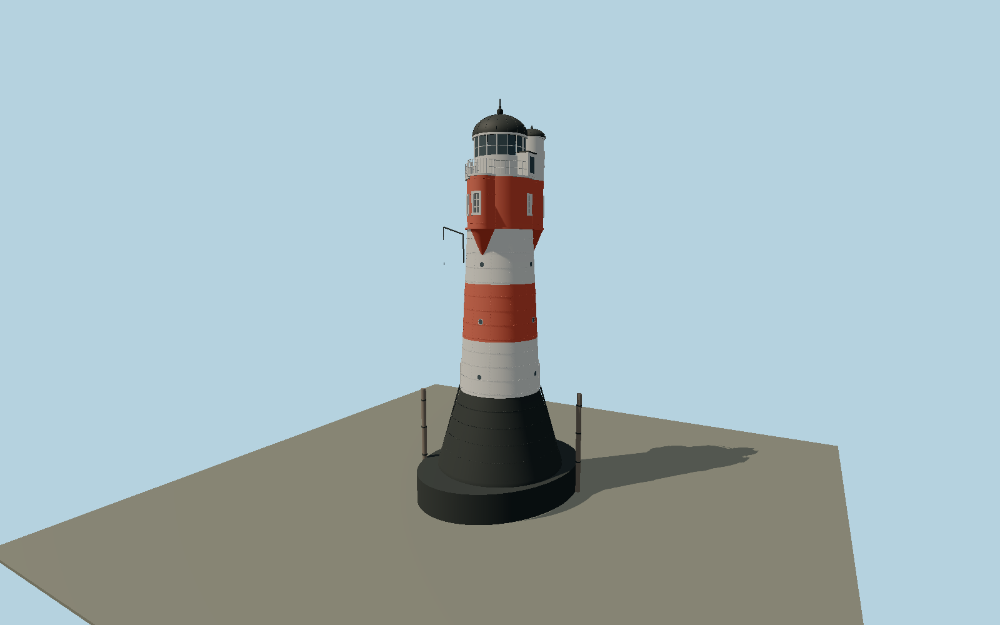

# Roter Sand — N1007

Offshore riveted taper with black plinth, white/red/white shaft, red service room and three unequal-height round bays; white lantern, black domes, scalloped gallery, portholes, rivets, ladders, davit and mooring dolphins.

## Identity and evidence

Exact catalog identity **Q220034**. Source facts: `{"survey":"GMG GA218014, 14 June 2019, section 1.02 pp I-5–7; field visits October 2018 and May 2019","plinthHeightMeters":6.1,"plinthDiametersMeters":[10.1,6.4],"shaftHeightMeters":12.7,"shaftDiametersMeters":[6.4,5.1],"bayDiameterMeters":1.9,"bayBearingsDegrees":[180,292.5,45],"lanternDiameterMeters":4,"baseLadderRungs":19,"aboveLowWaterMeters":30.95,"verticalDatum":"GMG III-9 uses low water = NN -2.05 m; tower tip NN +28.90 m"}`. The source specification keeps published dimensions separate from reconstructed details.

- https://www.denkmalschutz.de/fileadmin/media/Bilder/Denkmal/Leuchtturm_Roter_Sand/Gutachten_Sanierung_Juni2019.pdf
- https://urn.dsm.museum/DSA/DSA08_1985_199216_Peters.pdf
- https://www.denkmalschutz.de/denkmale-erhalten/stiftungseigene-denkmale/leuchtturm-roter-sand/chronik-und-zukunft-des-leuchturms.html
- https://www.openstreetmap.org/node/635484478

Original geometry uses published dimensional facts. Source photographs and drawings retain their rights and are not redistributed.

## Authored geometry and materials

208,672 triangles, 448,508 vertices, 3 surface groups; 18,652,708 source bytes. SHA-256: `sha256:266c5b5a60e6815673ecd1dc2e0de61dab764367c46e5cb26b5549878207a5ce`. Actual bounds: -6.087, 0.000, -6.894 to 6.087, 30.950, 6.894 m.

Shared canonical material graphs with metric UV repeats in extras.molenSurface; portable glTF PBR factors and vertex colors remain. Dark recesses/lantern panels retain local fallback materials. Shared references: `matgraph:molen.worldgen.material.metal_painted` (2 × 2 m), `matgraph:molen.worldgen.material.wood_plain` (2 × 0.25 m). Model-native axes: {"up":"+Y","front":"+Z south; +X east","origin":"Tower axis at historic low-water reference; no buried caisson geometry."}.

## Placement proposal

Exact-identity OSM node 635484478 agrees within 0.1 m with the 2019 engineering report WGS84 coordinate 53°51′11.4″ N / 8°04′55.81″ E; the older DSD 2010 and candidate coordinates are about 207 m north. Survey compass directions fix bay orientation. GMG III-9 places historic low water at NN -2.05 m; sea-level preview assumes the viewer zero approximates NN, with tidal/water-datum review pending. Owner’s 2026 chronology describes a future relocation, not a completed move. Proposed anchor 8.0821686, 53.8531662 (longitude, latitude), heading 0 radians. Elevation policy: **sea-level**. This is a reviewable proposal, not a completed site-fit certification. Ground models require terrain contact; offshore models also require water-datum and base-height checks.

## Limitations and review

- Initial detailed offshore exterior study of the 2018–2019 surveyed appearance; not yet approved for maximum fidelity or geographic activation.
- Plinth plan, seam/rivet spacing, small fittings, porthole positions and battery cupboard are reconstructed within published principal dimensions; not a fabrication survey.
- Shaft portholes use recessed-looking disks; their wall apertures, bay-wall intersections and gallery junctions need close-up refinement. Hidden interiors, underwater foundations, exact corrosion patterns and working lamp optics are not modeled.
- Offshore anchor and compass orientation are evidence-backed; viewer NN/sea-level equivalence, tides, footprint fit and any later relocation still require geographic review.

Near/far fixtures are in `spec.qaCameras`. Float32 finite geometry, triangle degeneracy and winding are checked by the generator. Current rendering, shared-material, maximum-fidelity and geographic review results are recorded in `qa.json` and the readiness ledger; source generation alone does not approve a model.

Regenerate with `node packages/worldgen/scripts/generate-lighthouse-models.mjs --ids=N1007`; add `--check` for reproducibility. Editable component recipes are in `packages/worldgen/scripts/roter-sand-model.mjs`. The generator protects artist-edited master hashes and preserves import/capture/shared-capture/QA documents.
