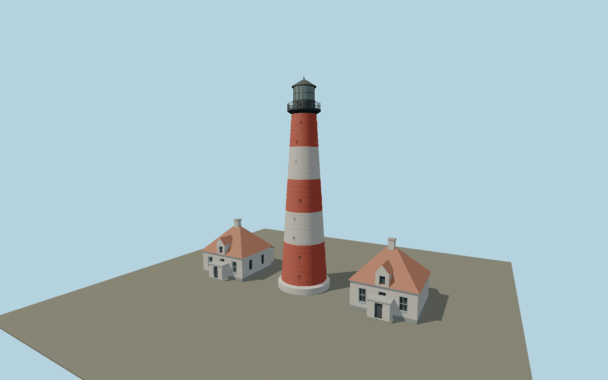

# Lighthouse Westerheversand — N0650

Red-white striped bolted cast-iron tower between its separate twin pale keeper houses with steep tiled hip roofs, dormers, chimneys and lower front/rear service extensions.

## Identity and evidence

Exact catalog identity **Q454681**. Source facts: `{"heightMeters":40,"basis":"40m structural tower in mapped heritage record; local visitor operator reports41.5m above mean tide, a separate datum.","construction":"1906-1908;608 bolted castironplates; twin identical houses form the site ensemble.","ensemblePlan":{"houseCenterX":[-17,16.95],"houseMainSize":[10.9,10.12],"headingRadians":1.706,"sourceWays":[87534169,93732524,93732526],"basis":"OSM full building outlines plus parts retrieved2026-09-27; +X north, +Z east. Tower entrance node1393406995 confirms east-facing front."}}`. The source specification keeps published dimensions separate from reconstructed details.

- https://westerhever-nordsee.de/leuchtturm/das-wahrzeichen/
- https://www.schutzstation-wattenmeer.de/unsere-stationen/westerhever/
- https://www.schutzstation-wattenmeer.de/fileadmin/_processed_/3/4/csm_Westerhever-Header_20240625_1354fdfd9b.jpg
- https://www.openstreetmap.org/way/87534169
- https://www.openstreetmap.org/way/93732524
- https://www.openstreetmap.org/way/93732526

Original geometry and shared procedural materials. Official photographs are research references only; no reference imagery or third-party mesh is embedded or redistributed.

## Authored geometry and materials

79,820 triangles, 168,754 vertices, 6 surface groups; 6,867,944 source bytes. SHA-256: `sha256:c06b50c837b6d2639cd91f86de51bc1bf2732fd6e1c1f64ad5fb544ffd35c769`. Actual bounds: -22.720, 0.000, -8.550 to 22.670, 40.000, 6.870 m.

Shared canonical material graphs with metric UV repeats in extras.molenSurface; portable glTF PBR factors and vertex colors remain. Dark recesses/lantern panels retain local fallback materials. Shared references: `matgraph:molen.worldgen.material.plaster_lime` (2 × 2 m), `matgraph:molen.worldgen.material.tile_ceramic` (2.4 × 2.4 m), `matgraph:molen.worldgen.material.metal_painted` (2 × 2 m), `matgraph:molen.worldgen.material.stone_granite` (2 × 2 m), `matgraph:molen.worldgen.material.wood_plain` (2 × 0.25 m). Model-native axes: {"up":"+Y","front":"+Z","origin":"Authored main tower center at local base level; attached ensembles are offset from this origin."}.

## Placement proposal

Round tower centered on exact mapped core. +X follows mapped north-house baseline (north with small west component); +Z faces east, corroborated by the mapped tower entrance. Keeper houses use measured separation and main plan, with photo-proportioned roof features. Base level is mound contact, not sea level. Proposed anchor 8.639917851, 54.37336145 (longitude, latitude), heading 1.706 radians. Elevation policy: **terrain-contact**. This is a reviewable proposal, not a completed site-fit certification. Ordinary ground models use terrain contact; Kiipsaare requires an offshore water/base-height check.

## Limitations and review

- The modeled exterior follows the cited published facts and inspected photographs. Unpublished dimensions and local fittings are explicitly photo-proportioned; no claim of engineering survey accuracy is made.
- Portable PBR and shared metric surfaces are provided. Surface weathering, material color under local lighting and fine facade relief require close render review before maximum-detail acceptance.
- Main house plans, separation and bearing follow mapped outlines; roof details and annex elevations are photo-proportioned. Plate seams are modeled but do not assert an exact608-piece reconstruction. Current light lens, museum signs and footpaths outside the immediate ensemble are excluded.

Near/far fixtures are in `spec.qaCameras`. Float32 finite geometry, triangle degeneracy and winding are checked by the generator. Rendering, shared-material alignment, maximum-fidelity and geographic reviews remain pending until their hash-bound reports exist.

Regenerate with `node packages/worldgen/scripts/generate-lighthouse-models.mjs --ids=N0650`; add `--check` for reproducibility. Editable component recipes are in `packages/worldgen/scripts/lighthouse-models.mjs`. The generator protects artist-edited master hashes and preserves import/capture/shared-capture/QA documents.
