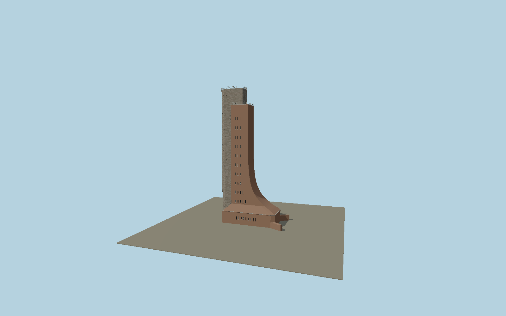

# Laboe Naval Memorial

Distinctive curved red-clinker naval memorial tower with the seaward pointed granite spine, two observation terraces, recessed slit windows, separate inland entrance doors, short splayed entrance walls and fine metal roof guards.

## Identity and geometry

Catalog N0600, [Q538382](https://www.wikidata.org/wiki/Q538382). The owner distinguishes 72 m above the tower foot from 85 m above sea level. The exact-Q538382 OSM outline fixes the ground plan and small splayed wings. The published 1929 contractor section establishes the curved profile and vertically grouped slit windows; owner shore and courtyard photographs establish present granite cladding, terraces, railings and the directed seaward spine. Intermediate heights and small opening widths are proportional exterior reconstructions tied to the published overall height.

Exact mapped tower footprint frame; Y=0 is the tower foot, not mean sea level. Native +X inland southeast; -X seaward northwest; +Z southwest; +Y is up. The geographic proposal identifies its anchor and orientation evidence separately from remaining terrain and azimuth uncertainty.

Source facts and measured references are recorded in spec.json. References: [1](https://deutscher-marinebund.de/service/haeufige-fragen-faq/), [2](https://deutscher-marinebund.de/aktuelles/presseservice/), [3](https://deutscher-marinebund.de/berichtedmb/rettungscrew-gesucht-mission-marine-ehrenmal-erhalten/), [4](https://commons.wikimedia.org/wiki/File:Marinehrenmal-laboe-schnittzeichnungen-turm.gif), [5](https://www.openstreetmap.org/way/23039799). Reference pages and images are not redistributed.

## Original source and shared materials

Geometry is authored in `packages/worldgen/scripts/laboe-memorial-model.mjs`. Shared material graphs with metric repeat UV0 and original vertex tints; GLB PBR fallback remains self-contained. No per-model texture duplication. No third-party mesh or photograph is embedded.

47,862 triangles; 95,722 vertices; 7 material groups; 4,024,500 source bytes. Source hash: `sha256:0c4c7dbf292dc6727cd83a0c10a27bc90223d80b5b5c36f750e4dc59511559ac`. Geometry validation checks finite Float32 coordinates, indices, triangle area and winding before export.

Regenerate with `node packages/worldgen/scripts/generate-heritage-towers.mjs N0600`; add `--check` for reproducibility. The generator refuses to overwrite a master whose hash differs from source.json. Import uses `--no-optimize` to preserve facade recesses.

## Remaining detail and review

- Exterior terrace elevations, rail spacing, mortar joints and slit widths are proportioned from the section and owner photographs; individual blocks are original reconstructions.
- Temporary scaffolding, staining and repair marks vary by maintenance campaign. Interior memorial rooms and stairs are outside this exterior asset.
- The adjoining courtyard galleries, memorial hall and submarine are separate assets, not part of this tower footprint.
- Near/far visual QA, shared-material inspection and maximum-fidelity approval remain pending.

Named near/far cameras are included for lit visual review. A valid export is not maximum-fidelity certification.
