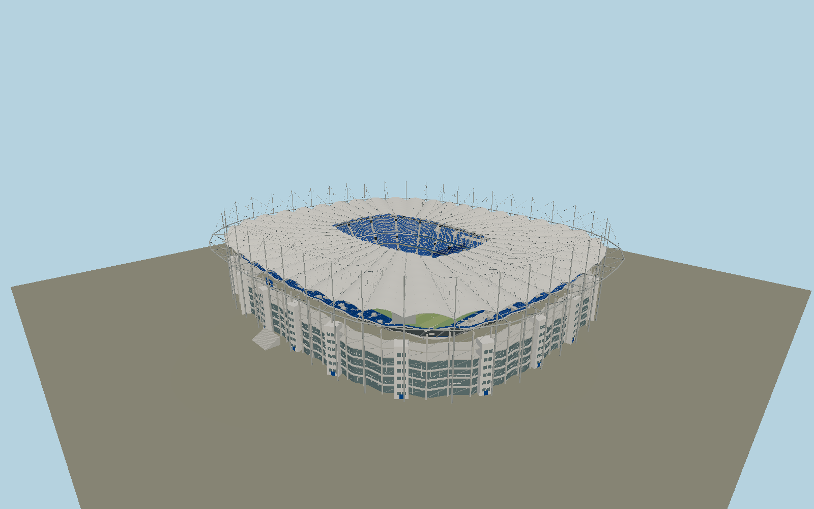

# Volksparkstadion — N0696

Hamburg stadium with forty barrel-shaped membrane roof fields on a cable-wheel, forty tall masts and external triangular compression brackets. Three blue seating tiers with white HSV lettering, north standing terrace, western diamond seat pattern,21 white staircase cores, exposed grandstand undersides, five glazed façade levels, diagonal screens,300 ten-cell roof lights and30 hanging audio arrays distinguish the completed2024 exterior.

## Identity and evidence

Exact catalog identity **Q150933**. Source facts: `{"published":"Structural engineer sbp specifies40 radial cable trusses and40 masts for the original roof; its2024 refurbishment dimensions are240x200m overall,59.5m high and about62m roof depth. The operator states44m roof above pitch,105x68m field, three tiers at20/30/35degrees,21 staircases,45cm seats with5cm gaps, two62m² video screens,300 lights with ten LED units each,30 audio arrays and a~1m catwalk at40m. Current capacity57,000; approved60,000 expansion is planned to startOctober2026 and is not yet modeled.","reconstructed":"Exact OSM roof envelope, inner aperture and directed pitch axis set geometry. Mast anchors follow alternate mapped roof scallops. Cable sag, mast sections, barrel curvature, row counts, staircase spacing, glazing subdivisions, core sizes and local façade details follow engineer/operator photographs; they are not fabrication drawings. Native ground is nominal stadium contact, without surrounding landscaped grades."}`. The source specification keeps published dimensions separate from reconstructed details.

- https://www.sbp.de/projekt/volksparkstadion-hamburg/
- https://www.sbp.de/en/project/modernisation-volksparkstadion-hamburg/
- https://www.hsv.de/volkspark/geschichte-des-volksparkstadions
- https://nachhaltigkeitsbericht.hsv.de/2023-24/hoch-hinaus/
- https://www.hsv.de/en/stadium/volksparkstadion
- https://www.hsv.de/en/news/more-space-for-fans-expansion-of-volksparkstadion-gets-underway
- https://www.hsv.de/fileadmin/user_upload/Bilder_HSV.de/Volksparkstadion/Stadionplan_Volksparkstadion.pdf
- https://www.openstreetmap.org/relation/1686446
- https://www.openstreetmap.org/way/123124326

Original geometry and canonical shared procedural surfaces; reference photographs are research only. OpenStreetMap contributors, ODbL1.0, for plan coordinates.

## Authored geometry and materials

1,435,304 triangles, 2,637,928 vertices, 6 surface groups; 112,192,616 source bytes. SHA-256: `sha256:41ef0459a8756ac72071655c15f2e895bd19d8d8e8eb9de7fb1c7855009d8e67`. Actual bounds: -115.115, 0.000, -123.838 to 105.654, 59.540, 131.143 m.

Shared canonical material graphs with metric UV repeats in extras.molenSurface; portable glTF PBR factors and vertex colors remain. Dark recesses/lantern panels retain local fallback materials. Shared references: `matgraph:molen.worldgen.material.membrane` (4 × 4 m), `matgraph:molen.worldgen.material.metal_painted` (2 × 2 m), `matgraph:molen.worldgen.material.concrete_plain` (2 × 2 m). Model-native axes: {"up":"+Y","front":"+Z","origin":"Mapped football pitch center, +Z toward the north stand, +X west; Y0 field and exterior ground."}.

## Placement proposal

Actual pitch long edge directs+Z north. The exact roof multipolygon supplies outer scallops and inner aperture; white HSV seating is west, standing terrace north and principal entrance facade east. Proposed anchor 9.89863045, 53.58714995 (longitude, latitude), heading 3.005757450750277 radians. Elevation policy: **terrain-contact**. See qa.json for the geographic review status and scope; this placement proposal does not claim surveyed site accuracy. Native ground and pitch datums follow the individual geographic proposal; depressed bowls require their declared terrain cutout.

## Limitations and review

- Completed2024 exterior in shared Molen style; cable sizes/sag, façade subdivision and seat/core inventories are photo reconstructions. Changing event graphics, roof sponsor lettering, enclosed rooms, future October2026 capacity works and the surrounding transport/park district are excluded.

Portable review uses a flat ground contact fixture.

Near/far fixtures are in `spec.qaCameras`. Float32 finite geometry, triangle degeneracy and winding are checked by the generator. The hash-bound qa.json and capture reports record the scope and status of rendering, shared-material, exterior-fidelity and geographic reviews.

Regenerate with `node packages/worldgen/scripts/generate-stadium-models.mjs --ids=N0696`; add `--check` for reproducibility. Editable component recipes are registered by the imports and study list in `packages/worldgen/scripts/generate-stadium-models.mjs`. The generator protects artist-edited master hashes and preserves import/capture/shared-capture/QA documents.
