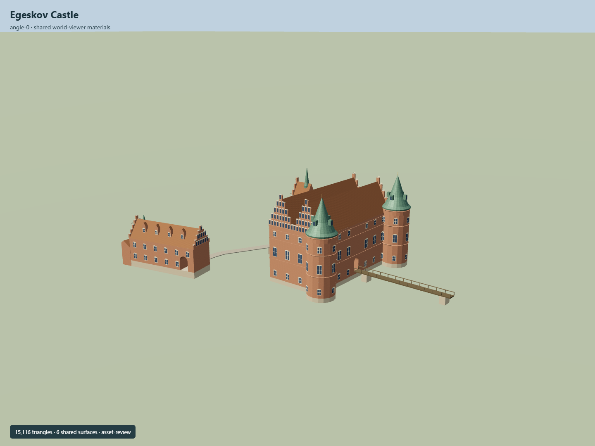

# Egeskov Castle

Twin red-brick longhouses with parallel steep red roofs and four stepped gables,two copper-helmed eastern round towers,west square clock/stair tower,current gate wing with physical arched passage,west entrance approach and east footbridge.

## Evidence and reconstruction

Published dimensions and reconstructed details are separated in spec.json. Primary references:

- [Reference](https://api.openstreetmap.org/api/0.6/map?bbox=10.4877,55.1755,10.4914,55.1772)
- [Reference](https://egeskov.dk/en/experiences/the-castle)
- [Reference](https://egeskov.dk/en/experiences/the-castle/castle-architecture)
- [Reference](https://www.danskeherregaarde.dk/nutid/egeskov)
- [Reference](https://www.danskeherregaarde.dk/uploads/egeskov-fra-luften.jpg)
- [Reference](https://www.danskeherregaarde.dk/uploads/egeskov-4.jpg)
- [Reference](https://www.danskeherregaarde.dk/uploads/egeskov-5.jpg)
- [Reference](https://www.danskeherregaarde.dk/uploads/egeskov-6.jpg)

Six existing shared256-square graphs,linear tints and central metric UV repeats. Flat glass. No embedded/new images,photo texture,downloaded model or traced printed drawing.

## Model and axes

15,116 triangles; 45,348 vertices; 7 material groups; 1,818,116 bytes. Native bounds: -62.840, 0.000, -22.635 to 43.778, 33.200, 35.210. Source hash: `sha256:bf3387f77e0e719b436a4455a8e96a126c6ebaced229ae156f812cd9d232ca24`.

{"up":"+Y","front":"West stair tower and portal; native +X east/+Z south with plan rotation baked","longitudinal":"+Z approximately south along twin longhouses","origin":"Exact-QID mapped footprint reference anchor; provisional visible water attachment Y0.3,foundation Y0. Actual lake vertical datum unverified."}

Native East/South geometry bakes heading0. Exact-QID footprint reference anchor. Provisional visible water attachmentY0.3 and bottomY0 are not surveyed lake elevation. Separate current gatehouse and bridge traces remain attributed.

## Reproduce

Run `node packages/worldgen/scripts/generate-signature-towers.mjs --ids=N0298` (or add `--check`). The generator preserves manually edited masters by checking their baseline hashes. Import through the standard authored-model workflow with optimization disabled; then capture all QA cameras, including shared-surface views.

## Pending work

- Exact-QID way supplies current main outline; adjacent gatehouse/annex/entrance/bridge/moat traces retain separate attribution. OSM geometry is mapping evidence,not a surveyed architectural plan.
- Primary operator confirms twin longhouses,separating thick wall,water-surrounded foundations and current copper spires/restoration. No verified primary numeric height found. All heights,roof partitions,window/arcade rhythm and bridge sections are photographic estimates.
- Current gatehouse tower removed in1920s is excluded. Gatehouse annex and turret forms are original estimates from separately mapped footprints and primary photos. Exact sculpture,heraldry,inscriptions and fine clock dial are simplified.
- Native provisional water attachmentY0.3 and foundationY0 are not surveyed lake elevation. Real lake/shore/terrain,entrance approach and bridge vertical fit remain pending. Moat water is map data and is not embedded in model geometry.
- Selected exterior only; twin-house interior stairs/well,rooms,museum exhibits,underwater timber piles and walkable circulation/collision are not modeled. Physical main/gate passages remain open.
- Six existing shared256-square brick,raw limestone,lime plaster,copper,ceramic tile and gravel graphs use linear tints and central metric UVs. No new/embedded texture,photo texture or downloaded mesh.
- Synthetic Earth/portable captures do not prove actual geographic fit,continuous upgrades or physical laptop/phone timing.

This bundle follows the medium-fi standard. Medium-fi appearance and geographic fit are reviewed separately. Hash-bound visual acceptance is recorded separately after capture inspection.

## Additional geographic data

© OpenStreetMap contributors; Egeskov; Dansk Center for Herregårdsforskning.
