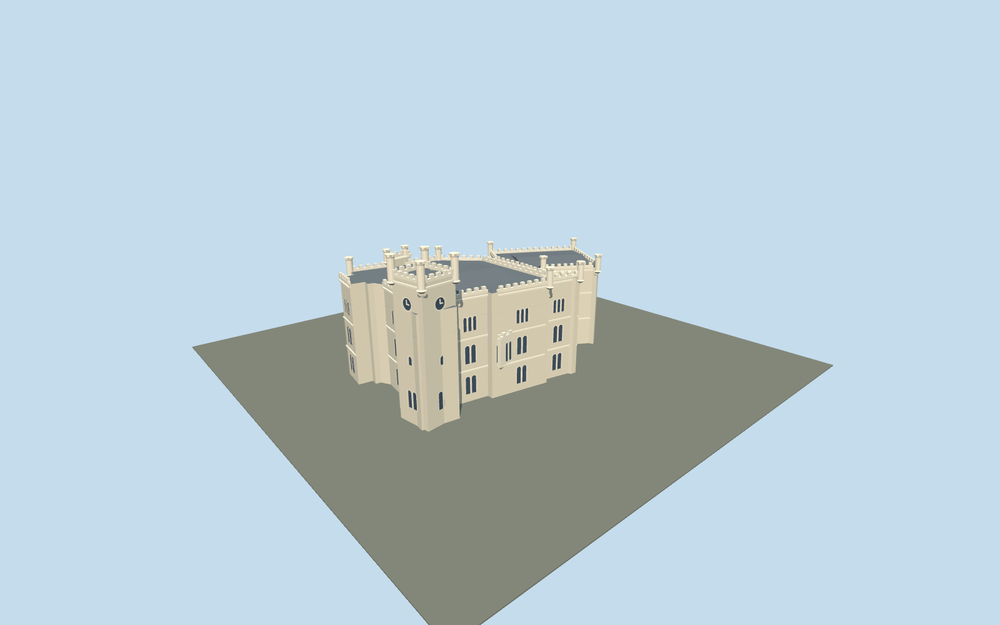

# Miramare Castle

Ivory Istrian stone Miramare Castle: angled eastern and taller western crenellated wings, recessed stair hall, paired/triple round-headed windows, projecting sea-side bay and square southwest clock tower with four corner turrets.

## Evidence and reconstruction

Published dimensions and reconstructed details are separated in spec.json. Primary references:

- [Reference](https://miramare.cultura.gov.it/en/the-castle/)
- [Reference](https://www.movio.beniculturali.it/pmfvg/viverelottocentoatrieste/it/8/lo-stile-architettonico)
- [Reference](https://www.movio.beniculturali.it/pmfvg/viverelottocentoatrieste/it/101/galleria-fotografica)
- [Reference](https://miramare.cultura.gov.it/concorso-art-bonus-il-restauro-della-torretta-del-castello-la-costruzione/)
- [Reference](https://miramare.cultura.gov.it/wp-content/uploads/2020/09/CS_25-SETTEMBRE-2020.pdf)
- [Reference](https://www.openstreetmap.org/way/361092895)

No third-party geometry, photograph or bitmap texture is embedded. Shared surface graphs come from the central library; vertex tints carry model colors. Glazing uses PBR materials; transparent surfaces are declared per model.

## Model and axes

9,918 triangles; 25,590 vertices; 3 material groups; 1,042,572 bytes. Native bounds: -31.515, 0.000, -17.657 to 31.106, 29.000, 17.657. Source hash: `sha256:293f7a85a18c1adfebe199f966807d004023cfac4b6a5074768d47d0c0f0532d`.

{"up":"+Y","longitudinal":"+X almost east,0.478 degrees north of east","front":"-Z landward parterre; +Z sea terrace; square clock tower at southwest(-X,+Z)","origin":"Exact mapped building footprint center, provisional terrace attachment Y=0; not sea level"}

Exact footprint and exterior views establish orientation; terrain and terrace contact require geographic review before activation. Synthetic captures establish appearance only.

## Reproduce

Run `node packages/worldgen/scripts/generate-signature-towers.mjs --ids=N0276` (or add `--check`). The generator preserves manually edited masters by checking their baseline hashes. Import through the standard authored-model workflow with optimization disabled; then capture all QA cameras, including shared-surface views.

## Pending work

- Original medium-fi exterior interpretation, not a conservation or cadastral survey.
- The museum publishes35m above sea for the tower. SourceY0 is the local terrace plane;29m tower top is inferred from photographs with an approximate6m sea-to-terrace offset, not a surveyed conversion.
- All other elevations, facade subdivisions, turrets and openings are inferred from primary museum photographs.
- Exact OSM building footprint fixes plan extent/anchor; wall height transitions and roof subdivision are interpreted.
- Fine masonry joints, arcature carving, coats of arms, balustrades, glazing bars, interior rooms and flag/guy wires omitted.
- Park, Castelletto, sea terrace retaining cliff and neighboring buildings excluded from the building footprint asset.
- Actual sloping terrain contact, approaches, geographic activation, continuous-motion shimmer and physical-device performance remain pending.

This bundle follows the medium-fi standard. Medium-fi appearance and geographic fit are reviewed separately. Hash-bound visual acceptance is recorded separately after capture inspection.

## Additional geographic data

© OpenStreetMap contributors, ODbL-1.0. Italian Ministry of Culture / Miramare Museum primary photographs and architectural notes used as research only.
