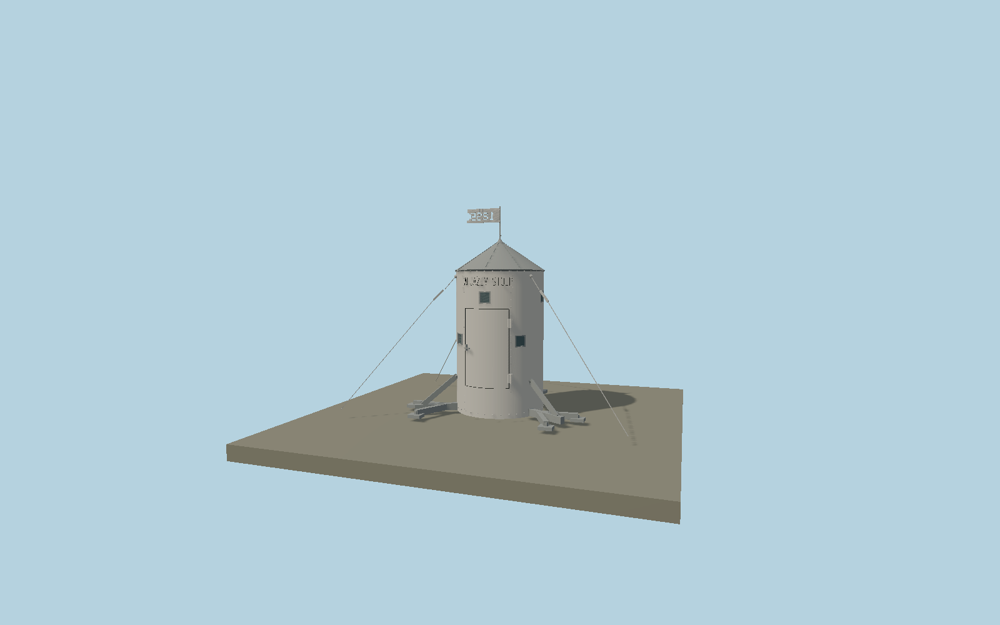

# Aljaž Tower

The restored Triglav summit shelter: riveted pale-gray cylindrical shell, eight small viewing windows, closed raised door with hinges and latch, dark conical cap, readable Slovenian plaque, stencil-cut 1895 flag, Y anchors and guy ropes.

## Identity and geometry

Catalog N0602, [Q650987](https://www.wikidata.org/wiki/Q650987). The heritage authority publishes the 1.25 m cylinder diameter, 2 m body and 2.90 m total including the flag support. Its 2025 conservation photographs establish the restored palette, raised door, eight windows, rivet seams, label, stencil flag and anchors. The 2018 intervention preserved all three original Y anchors, original site elevation and rotation. Small fittings and the visible shell/roof proportions are photographic reconstructions.

Cylinder axis at the rock-anchor contact plane. +Z is the door and ALJAŽEV STOLP plaque; final compass registration remains unresolved; +Y is up. The geographic proposal identifies its anchor and orientation evidence separately from remaining terrain and azimuth uncertainty.

Source facts and measured references are recorded in spec.json. References: [1](https://www.zvkds.si/wp-content/uploads/2024/04/sto_let_net.pdf), [2](https://www.zvkds.si/wp-content/uploads/2024/03/vs_porocila_54_web-1.pdf), [3](https://www.zvkds.si/montaza-triglavske-panorame/), [4](https://planinskivestnik.pzs.si/arhiv/pdf/pv_1895_08.pdf), [5](https://www.openstreetmap.org/way/388344086). Reference pages and images are not redistributed.

## Original source and shared materials

Geometry is authored in `packages/worldgen/scripts/aljaz-tower-model.mjs`. Shared material graphs with metric repeat UV0 and original vertex tints; GLB PBR fallback remains self-contained. No per-model texture duplication. No third-party mesh or photograph is embedded.

23,236 triangles; 48,260 vertices; 2 material groups; 1,969,796 source bytes. Source hash: `sha256:564680c26f5d071bfac1e76ef5baf493a58e501689d4e8f2c545fc2df56b001c`. Geometry validation checks finite Float32 coordinates, indices, triangle area and winding before export.

Regenerate with `node packages/worldgen/scripts/generate-heritage-towers.mjs N0602`; add `--check` for reproducibility. The generator refuses to overwrite a master whose hash differs from source.json. Import uses `--no-optimize` to preserve facade recesses.

## Remaining detail and review

- Door is shown closed. The external inscription uses original polygonal letter strokes and the 1895 flag uses a simplified cut stencil; no historical lettering bitmap or the newly painted interior panorama is copied.
- Rock anchor positions, turnbuckles, rivet pitch and cable endpoints are reconstructed from conservation photographs. The natural summit rock and interior fixtures belong outside this static exterior asset.
- Exact entrance compass phase remains unresolved and is recorded independently of the verified model dimensions and mapped anchor.
- Near/far visual QA, shared-material inspection and maximum-fidelity approval remain pending.

Named near/far cameras are included for lit visual review. A valid export is not maximum-fidelity certification.
