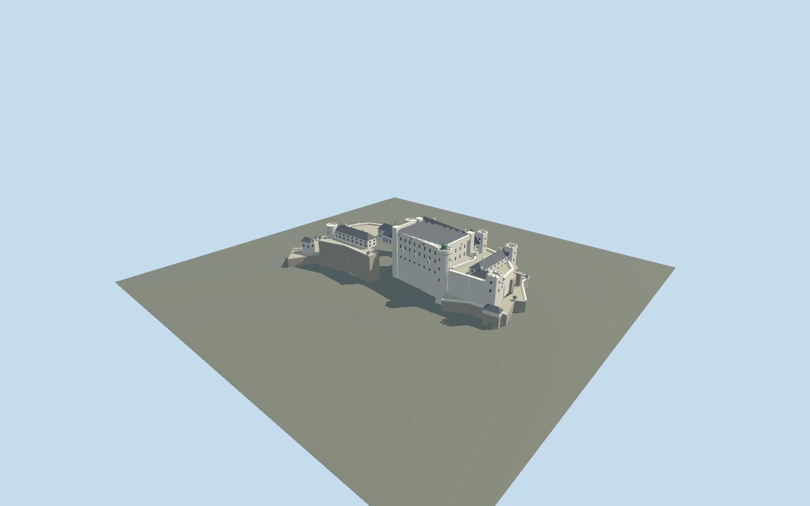

# Hohensalzburg Fortress

Salzburg hilltop fortress: broad white high palace under eight shallow parallel roofs, green Krautturm lantern, chapel spire, open courts and stepped artillery bastions.

## Evidence and reconstruction

Published dimensions and reconstructed details are separated in spec.json. Primary references:

- [Reference](https://www.festung-hohensalzburg.at/en/the-fortress)
- [Reference](https://www.stadt-salzburg.at/festung-hohensalzburg)
- [Reference](https://sammlung-online.salzburgmuseum.at/detail/collection/f0ee88fa-68c2-4ced-bde8-b4c337e1c59c)
- [Reference](https://hdbg.eu/burgen/detail/burgschloss-hohensalzburg/237?lang=de&p=1)
- [Reference](https://www.openstreetmap.org/way/58379993)

No third-party geometry, photograph or bitmap texture is embedded. Shared surface graphs come from the central library; vertex tints carry model colors. Glazing uses PBR materials; transparent surfaces are declared per model.

## Model and axes

5,419 triangles; 12,813 vertices; 5 material groups; 529,524 bytes. Native bounds: -133.627, 0.000, -72.000 to 131.100, 60.000, 85.608. Source hash: `sha256:b71ddaa869e602e7492f2b0d5a3a73d5e22b7f561ef3e5952ba2b3b025fd6156`.

{"up":"+Y","longitudinal":"+X east-northeast","front":"-Z north-northwest toward old town","origin":"Site bounds center; lowest retaining baseY=0, main courtY=30m"}

Site boundary is a precinct, not a building footprint. Correct anchor and signed axis do not prove individual massing or terrain fit.

## Reproduce

Run `node packages/worldgen/scripts/generate-signature-towers.mjs --ids=N0268` (or add `--check`). The generator preserves manually edited masters by checking their baseline hashes. Import through the standard authored-model workflow with optimization disabled; then capture all QA cameras, including shared-surface views.

## Pending work

- Simplified current exterior; most individual dimensions inferred, not surveyed.
- No mountain pedestal, interiors, private images or distant ramparts.
- Hillside contact, continuous-motion shimmer and physical-device performance pending.

This bundle follows the medium-fi standard. Medium-fi appearance and geographic fit are reviewed separately. Hash-bound visual acceptance is recorded separately after capture inspection.

## Additional geographic data

© OpenStreetMap contributors, ODbL-1.0; owner, city and museum references used as research.
