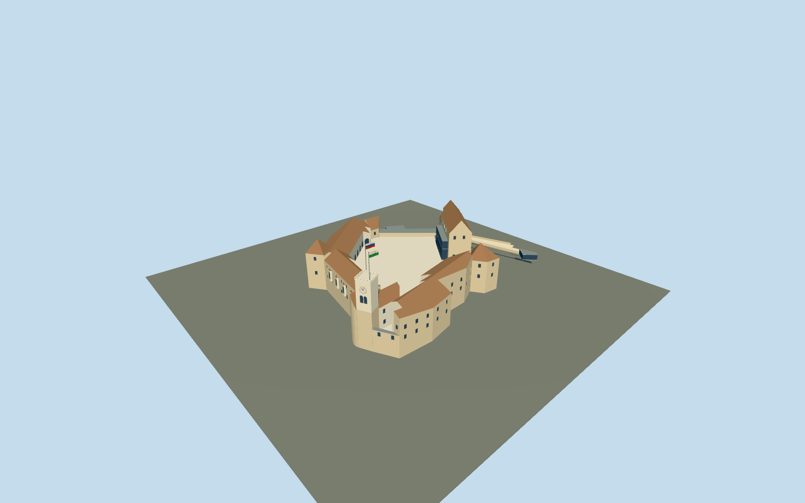

# Ljubljana Castle

Complete current castle exterior: fifteen actual mapped building parts, irregular open courtyard, white clock/viewing tower, round and pentagonal towers, brown pitched roofs, projecting bays, chapel, modern glazed halls and mapped eastern entrance/bridge.

## Evidence and reconstruction

Published dimensions and reconstructed details are separated in spec.json. Primary references:

- [Reference](https://api.openstreetmap.org/api/0.6/map?bbox=14.5068,46.0477,14.5106,46.0500)
- [Reference](https://www.ljubljanskigrad.si/en/)
- [Reference](https://www.ljubljanskigrad.si/en/map/)
- [Reference](https://www.ljubljanskigrad.si/en/experiences/viewing-tower-and-pipers-tower/)
- [Reference](https://www.ljubljanskigrad.si/en/why-to-the-castle/castle-spaces/)
- [Reference](https://www.ljubljanskigrad.si/assets/00-Vstopna-stran/Ljubljanski-grad.jpg)
- [Reference](https://www.ljubljanskigrad.si/mysite/images/map/Map-big.png)
- [Reference](https://www.ljubljanskigrad.si/assets/Uploads/Gallery/_resampled/FillWyIxNDAwIiwiNzgwIl0/STOLP-galerija-1.jpg)

Six existing shared 256-square stone/lime-plaster/roof-tile/painted-metal/timber/gravel graphs with metric repeats and linear palette tints. Flat blue-grey glass and colored flags. No new/embedded texture or downloaded mesh.

## Model and axes

5,691 triangles; 17,073 vertices; 8 material groups; 687,424 bytes. Native bounds: -47.173, 0.000, -57.420 to 70.510, 43.000, 44.181. Source hash: `sha256:0698f5f9812c27937dc561ada53b47f1b812391d90b8f99369643b87d7a81346`.

{"up":"+Y","longitudinal":"Native+X east,+Z south; mapped components and passage, heading0.","origin":"Mapped castle horizontal anchor; exterior foundationY0 and provisional inner courtY6. Intended terrain attachment samples the inner court plane, not the tower roof."}

Native East/South component traces use heading0. Provisional inner court attachment modelY6; primary 400m platform altitude is not a relative tower-height measurement. Geographic/section approval remains pending.

## Reproduce

Run `node packages/worldgen/scripts/generate-signature-towers.mjs --ids=N0307` (or add `--check`). The generator preserves manually edited masters by checking their baseline hashes. Import through the standard authored-model workflow with optimization disabled; then capture all QA cameras, including shared-surface views.

## Pending work

- Exact-QID castle way5821190 and building relation2326426 use the actual courtyard hole174281987. Fifteen building-part footprints and entrance passage retain native East/South heading0.
- The operator gives the viewing platform altitude as400m above sea level, not a32m relative tower height. Component32/29/25/24/23/21/20/17m totals are mapper tags. The6m court/exterior-base offset is a provisional inference; actual hill grades and common vertical datum are not surveyed.
- Current exterior includes viewing/pipers, round archers/erasmus and pentagonal/Frederick towers, four roofed wings, chapel, modern glazed halls, north flat terrace, east entrance bridge, upper station shell and ticket office. Historic drawbridges and removed floors are not reconstructed.
- Roof axes, pitches, clock positions/hands, arches, openings, projecting bays, parapet and flags are original photo-derived estimates; no engineering plan, copied mesh or bitmap is shipped.
- Six existing256-square graphs: stone, lime plaster, ceramic roof tile, painted metal, timber and gravel. Glass and flags are flat materials. Linear tints and metric repeats; no unique embedded/new texture.
- Current operator images and diagram are research references only. Images, diagrams and the operator PDF are not redistributed or used as textures.
- Interiors, exhibits, heraldic paintings, spiral stairs, event furniture, vegetation, surrounding city, natural hill, funicular rail/vehicle and surveyed bridge piers remain excluded or separate.
- Geographic/section, medium-fi and fidelity acceptance require inspected current renders. Placement stays inactive until real-site ground/height attachment is resolved; physical laptop/phone measurements remain pending.

This bundle follows the medium-fi standard. Medium-fi appearance and geographic fit are reviewed separately. Hash-bound visual acceptance is recorded separately after capture inspection.

## Additional geographic data

© OpenStreetMap contributors; Ljubljanski grad / Ljubljana Castle and its credited photographers.
