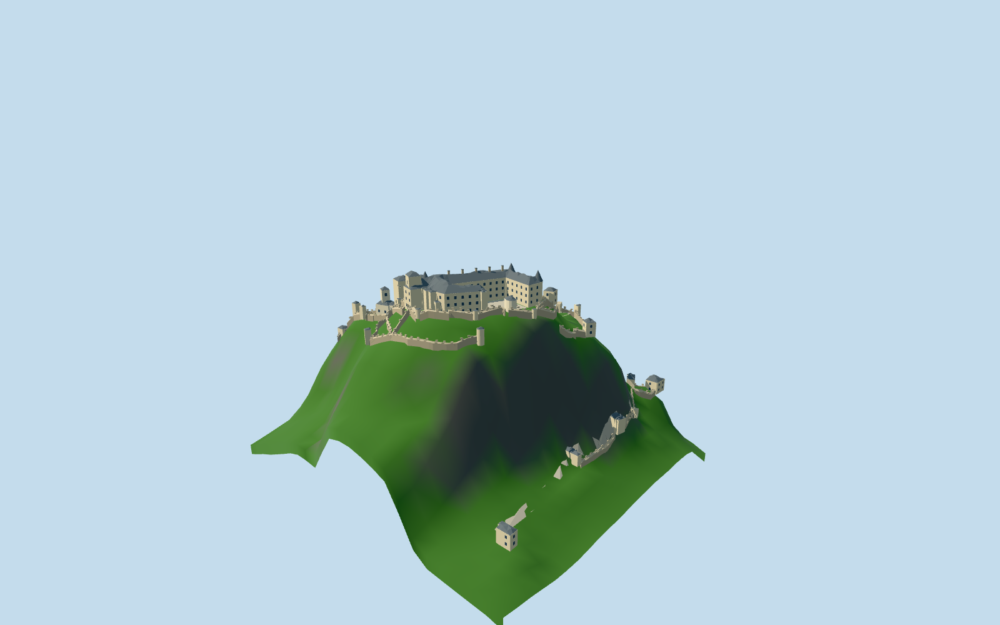

# Hochosterwitz Castle

Complete architectural fortification draft: summit U-shaped castle and open court, slate roofs/round turrets and square entry tower, church/chapel,14 individually mapped gates with open passages,watchtowers and stepped defensive walls on provisional terrain levels.

## Evidence and reconstruction

Published dimensions and reconstructed details are separated in spec.json. Primary references:

- [Reference](https://api.openstreetmap.org/api/0.6/map?bbox=14.448,46.7538,14.456,46.7585)
- [Reference](https://www.burg-hochosterwitz.com/en/castle/)
- [Reference](https://www.burg-hochosterwitz.com/en/castle/hochburg/)
- [Reference](https://www.burg-hochosterwitz.com/en/castle/14-gates/)
- [Reference](https://www.burg-hochosterwitz.com/burganlagen/die-14-tore-der-burg-hochosterwitz/)
- [Reference](https://www.burg-hochosterwitz.com/en/castle/church/)
- [Reference](https://www.burg-hochosterwitz.com/wp-content/uploads/2018/06/Burg-Hochosterwitz-West-hd.jpg)
- [Reference](https://www.burg-hochosterwitz.com/wp-content/uploads/2018/06/Hochosterwitz-adv-11-cont-©-Alex-Devora.jpg)
- [Reference](https://www.burg-hochosterwitz.com/wp-content/uploads/2018/06/Burganlage-aus-der-Luft-BA.jpg)
- [Reference](https://www.burg-hochosterwitz.com/wp-content/uploads/2018/06/Aufgang-zur-Burg-aus-der-Luft-BA.jpg)
- [Reference](https://www.burg-hochosterwitz.com/wp-content/uploads/2018/06/Aufgang-zur-Burg-aus-der-LuftBA.jpg)
- [Reference](https://www.burg-hochosterwitz.com/wp-content/uploads/2018/06/Burgkirche-mit-Aufgang-und-Rosengarten-BA.jpg)
- [Reference](https://www.burg-hochosterwitz.com/wp-content/uploads/2018/06/Aufnahme-Burganlagen02-BA.jpg)
- [Reference](https://www.burg-hochosterwitz.com/wp-content/uploads/2018/06/Eingang-zum-Burghof-BA.jpg)
- [Reference](https://www.burg-hochosterwitz.com/wp-content/uploads/2018/06/Burgkirche-Hochosterwitz-1.jpg)

Five shared256-square graphs and linear tints,flat glass,metric repeats. No embedded/new photo texture or downloaded mesh. Numerical hill heightmap is an isolated preview fixture; runtime architecture has no embedded terrain.

## Model and axes

16,490 triangles; 49,470 vertices; 6 material groups; 1,982,548 bytes. Native bounds: -124.961, -7.070, -135.147 to 78.341, 115.783, 59.589. Source hash: `sha256:37f211ed679641aa23464aedd69cf306fbdf79339cc5d76b680d5ec35fbadfc5`.

{"up":"+Y","front":"West-facing main front; all map bearings baked into native +X east/+Z south","longitudinal":"Summit long wing runs approximately NNE/SSW; authoring plan axis is not facade approval","origin":"Horizontal exact-QID castle research anchor; modelY0 at first-gate coarse terrain datum, summit research contactY 92.0827"}

Native East/South geometry preserves all original map controls with heading0. One coarse terrain datum yields provisional multi-level architecture;source retains gate and passage attribution. No geographic or certified vertical-datum approval.

## Reproduce

Run `node packages/worldgen/scripts/generate-signature-towers.mjs --ids=N0301` (or add `--check`). The generator preserves manually edited masters by checking their baseline hashes. Import through the standard authored-model workflow with optimization disabled; then capture all QA cameras, including shared-surface views.

## Pending work

- Castle way122050909 retains exactQ679248. All14 named gates,church,chapel,watchtowers,walls and separate passage routes retain individual map attribution. Native East/South geometry bakes heading0; an undirected map axis is not orientation approval.
- All architectural heights,roof pitches,turret and spire sections,bay counts,gate apertures,courtyard shapes and grade contacts are original photographic estimates. No primary surveyed architectural dimensions verified.
- Relative ground levels come from coarse bilinear zoom15 Terrarium elevation research. This is not a building survey or a certified vertical datum; it can miss narrow terraces and stairs. Terrain contacts and path gradients require actual-site review.
- Runtime GLB contains architecture only. The hill,rocks,vegetation,gardens and ground are supplied by host terrain; the numerical hill fixture is capture evidence and does not approve geographic fit.
- Court remains open to sky; all14 mapped access gates retain separate passage alignment. Fine heraldry,portrait reliefs,frescos,inscriptions,individual balusters,interior rooms,museum collections and inclined railway machinery are simplified,excluded or separate.
- Five existing shared256-square graphs,linear palette tints,metric UVs; flat glazing. No embedded/new photographic texture,downloaded mesh or copied printed plan.
- Operator images remain private research only; not redistributed. Historical aerial/exterior photographs may differ from current roofs/restoration and need review.
- Synthetic and terrain-research captures do not prove current terrain fit,continuous loading/upgrades,walkable collision or physical laptop/phone performance. Geographic/fidelity status remains pending.

This bundle follows the medium-fi standard. Medium-fi appearance and geographic fit are reviewed separately. Hash-bound visual acceptance is recorded separately after capture inspection.

## Additional geographic data

© OpenStreetMap contributors; Burg Hochosterwitz/Alex Devora/August Zoebl; Mapzen/AWS open elevation provider.
