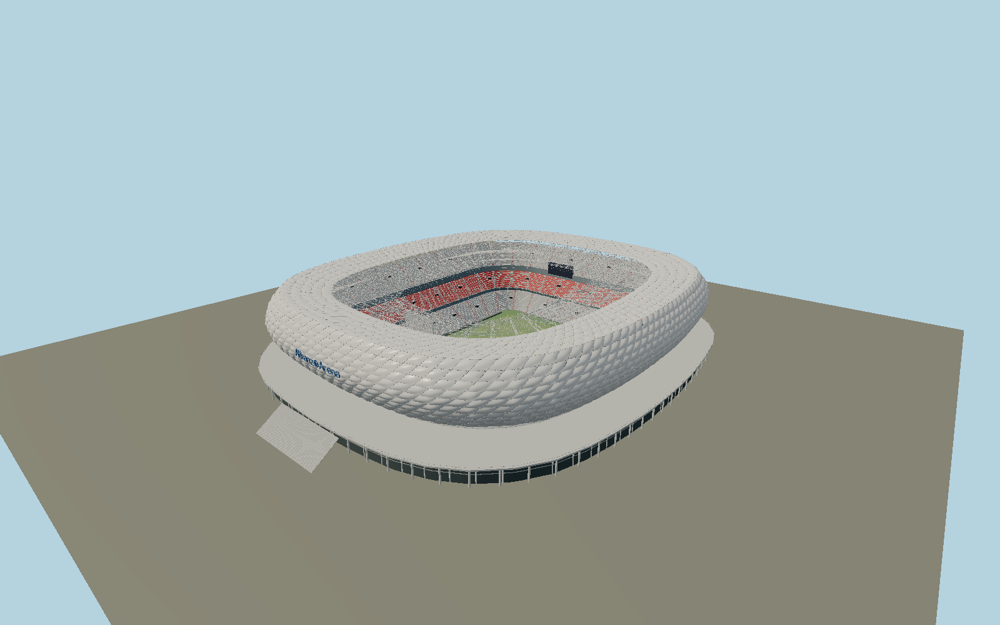

# Allianz Arena — N0683

Munich stadium with individually inflated diagonal ETFE cushions, continuous rounded white envelope, transparent inner-roof and lower facade film, forty-eight lattice roof trusses, exposed inclined concrete columns, fifteen circumferential cascade stairs, raised ring promenade, three steepening gray/red/gray seating tiers, two goal-end screens and a marked105×68m field.

## Identity and evidence

Exact catalog identity **Q127429**. Source facts: `{"publishedEnvelopeMeters":[227,258,52],"pitchMeters":[68,105],"tierAnglesDegrees":[24,30,34],"radialRoofTrusses":48,"nominalPublishedCushions":2784,"authoredCushions":2784,"screenMeters":[21.6,9.2],"basis":"The operator publishes envelope dimensions, pitch, three tier gradients, roof truss count, film construction and display dimensions. Arup photographs establish pillow bulging, diagonal clamp seams, transparent roof, cascaded circulation and roof lattice. Operator2018 history establishes red middle-tier seats with gray retained upper/lower tiers. Exact mapped pitch and outer/opening polygons control plan and rotation; nominal258m published length differs slightly from current mapped261m envelope. Individual cushion schedule, circulation levels and seating row distribution are reconstructions, not panel fabrication inventory."}`. The source specification keeps published dimensions separate from reconstructed details.

- https://allianz-arena.com/en/arena/facts/general-information
- https://allianz-arena.com/en/arena/facts/history/the-history-of-the-allianz-arena
- https://allianz-arena.com/en/news/2018/04/allianz-arena-facelift-this-summer
- https://www.herzogdemeuron.com/projects/205-allianz-arena/
- https://www.arup.com/projects/allianz-arena/
- https://www.arup.com/globalassets/images/projects/a/allianz-arena/gallery1allianz-arena-munichc-ulrich-rossmannarupv2.jpg
- https://www.arup.com/globalassets/images/projects/a/allianz-arena/gallery4allianz-arena-munichc-allianz-arena.jpg
- https://www.arup.com/globalassets/images/projects/a/allianz-arena/gallery6allianz-arena-munichc-ulrich-rossmannarup1v2.jpg
- https://www.openstreetmap.org/way/123121774
- https://www.openstreetmap.org/way/1257847557
- https://www.openstreetmap.org/way/605825026

Public primary photographs are used for architectural analysis only. No photograph, downloaded model or texture is included. All cushion, seat and structural geometry is authored here; shared surfaces are procedural. Mapped plans retain OpenStreetMap contributor attribution under ODbL1.0.

## Authored geometry and materials

1,426,422 triangles, 2,703,604 vertices, 7 surface groups; 114,450,732 source bytes. SHA-256: `sha256:f07ce08f66f05e716982580f0278eadf4769c315ac0ac5fe78e79ee0bdedfcce`. Actual bounds: -120.018, 0.000, -137.537 to 119.565, 51.589, 154.010 m.

Shared canonical material graphs with metric UV repeats in extras.molenSurface; portable glTF PBR factors and vertex colors remain. Dark recesses/lantern panels retain local fallback materials. Shared references: `matgraph:molen.worldgen.material.etfe_film` (2 × 2 m), `matgraph:molen.worldgen.material.metal_painted` (2 × 2 m), `matgraph:molen.worldgen.material.concrete_plain` (2 × 2 m). Model-native axes: {"up":"+Y","front":"+Z","origin":"Mapped pitch center at ground playing-field datum. Native +Z points south-southwest along the pitch; +X points east-southeast."}.

## Placement proposal

Exact68×105m pitch sets center and orientation; north-up mapped aperture and facade align independently. +Z faces the southern esplanade; west technical/team side is-X. GroundY0 is the playing-field/lower structural-foot datum; raised promenade is modeled at10m, consistent with the operator0–12m esplanade description. Host terrain supplies the long esplanade; no claim of survey-grade elevation. Proposed anchor 11.624701997079471, 48.218793999470286 (longitude, latitude), heading 0.26577841384531603 radians. Elevation policy: **terrain-contact**. See qa.json for the geographic review status and scope; this placement proposal does not claim surveyed site accuracy. Native ground and pitch datums follow the individual geographic proposal; depressed bowls require their declared terrain cutout.

## Limitations and review

- Static daylight unlit white-film exterior; the southern facade carries readable original geometric name lettering and circle mark, not a copied corporate font. Programmable colored illumination, changing commercial video and individual seat-mosaic artwork are not baked into the generic surface; seat colors and actual three-tier structure remain. Pillow clamps, inflation depth, individual seat count and staircase small members are reconstructed from primary photographs. Transparent ETFE roof and lower panels keep local alpha PBR because the shared surface replacement contract does not preserve opacity. No enclosed room or underground car-park inventory is claimed.

Portable review uses a flat ground contact fixture.

Near/far fixtures are in `spec.qaCameras`. Float32 finite geometry, triangle degeneracy and winding are checked by the generator. The hash-bound qa.json and capture reports record the scope and status of rendering, shared-material, exterior-fidelity and geographic reviews.

Regenerate with `node packages/worldgen/scripts/generate-stadium-models.mjs --ids=N0683`; add `--check` for reproducibility. Editable component recipes are registered by the imports and study list in `packages/worldgen/scripts/generate-stadium-models.mjs`. The generator protects artist-edited master hashes and preserves import/capture/shared-capture/QA documents.
